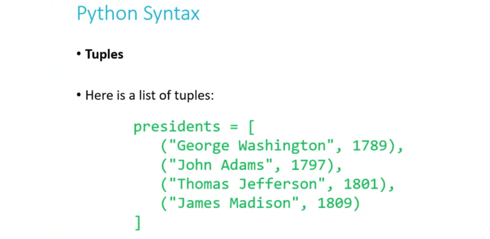
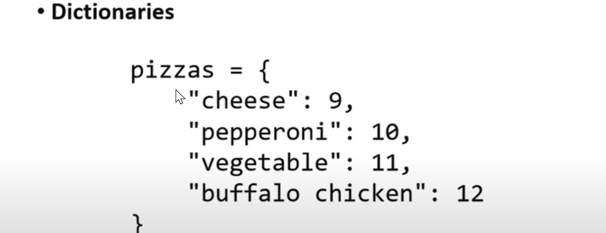
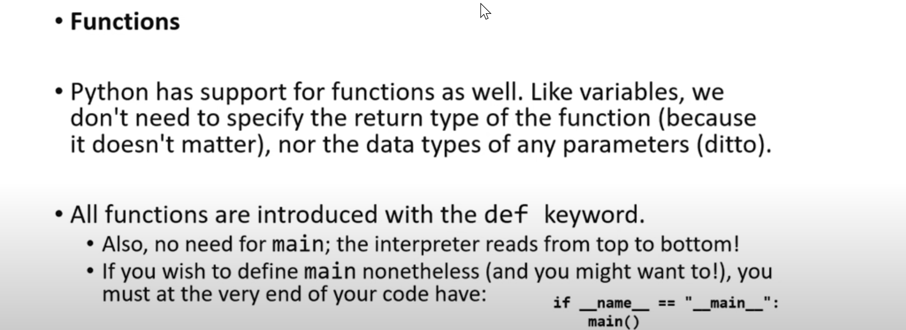
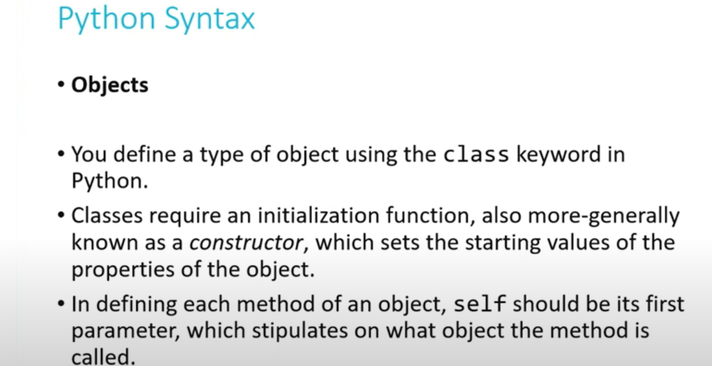

## Python 快速上手

本章节将记录python的基本语法，通过阅读，你可以快速上手读懂简单代码。（当然gpt也是大家的好帮手）

但非常建议大家在有精力时可以体系化的学习学习这门语言

### 判断语句


and 或者 or，后面用冒号，tab分层，`elif`

```python
if course_num == 50:
	# code block1
elif not course_num == 51:
    # code block2
```

> we dont have to use the exclamation point symbol！, the vertical bar|, ampersand&


### bool变量（二元判断符）

```python
letter = True if input().isalpha() else False
```


### Loop循环

```python
counter = 0
while counter < 100:
	print(counter)
	counter += 1
	
for x in range(100):
    print(x)
for x in range(0, 100, 2)
	print(x)
# not include 100
```


#### Loop(redux)

```python
pizza = {
    "cheese": 9,
    "pepperoni": 10,
    "vegetable": 11,
    "chicken": 12
}

for pie in pizza:
    print(pie)
    
for pie,price in pizza.items():
    print(price)
    print("A whole {} pizza costs ${}".format(pie,price))
    print("A whole"+ pie + "pizza costs $" + str(price))
    print("A whole %s pizza costs $%2d" % (pie,price)) # deprecated in python3
```


### List列表

```python
nums = [x for x in range (10)]
nums.append(11)
nums.insert(10,11)
nums[len(nums):] = [11]
```

### Tuple元组



```python
for prez,year in presidents:
    print("In {1}, {0} took office".format(prez,year))
```


### Dictionary




### Function



```python
def square(x):
    return x * x || return x**2
```


### Object



It's similar to c++.

```python
class Student():
    
    def __init__(self, name, id):
        self.name = name
        self.id = id
        
    def change_ID(self, id):
        self.id = id
        
    def print(self):
        print("{} - {}".format(self.name, self.id))
        
jane = Student("Jane", 10)
jane.print()
jane.change_ID(11)
jane.print()
```


### Data structure

[runoob](https://www.runoob.com/python3/python3-data-structure.html)

遍历技巧的函数：items、enumerate、zip、reverse、sorted


