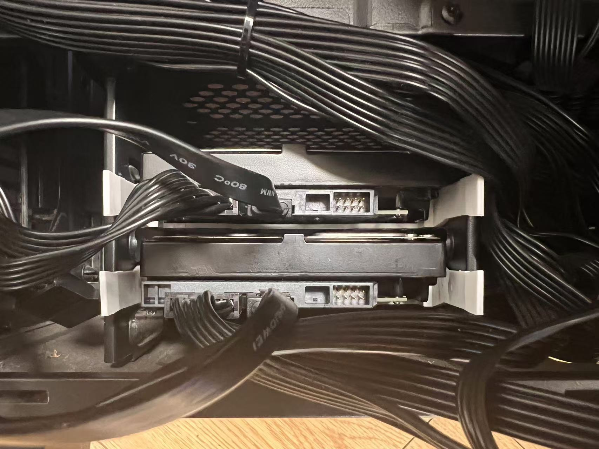
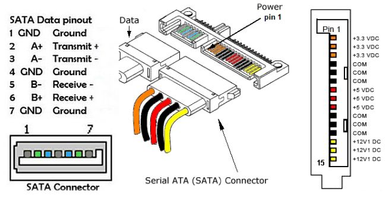

# 自组NAS指南
## 加装机械硬盘
一般我们主机背板后面会有两个机械硬盘的卡槽如下：


现在你需要找到所需的硬件，左边是电源线，右边是SATA线，如下图所示：


<!-- prettier-ignore-start -->
!!! info "注意指南"
    尽量断电操作，插入后需要重启（否则可能识别不到）。

    在命令行使用`sudo fdisk -l`查看硬盘是否被识别，如果没有识别到，可能是硬盘没有插好或者硬盘损坏。
<!-- prettier-ignore-end -->

<!-- prettier-ignore-start -->
!!! example "全新的机械硬盘"
    通过`lsblk`查看硬盘是否被识别，如果没有识别到，可能是硬盘没有插好或者硬盘损坏。

    接下来你需要格式化硬盘，这里以ext4为例，执行以下命令：
    ```shell
    # 检查磁盘类型
    sudo parted /dev/sda print
    # Partition Table: msdos，则说明当前是 MBR 分区表，则无法创建超过 2TB 的分区
    # (parted) mklabel gpt
    # (parted) quit

    sudo fdisk /dev/sda
    Command (m for help): p # 查看分区
    Command (m for help): n # 新建分区
    Command (m for help): w # 保存退出

    # 格式化
    sudo mkfs.ext4 /dev/sda2
    # 之后按照原教程挂载即可
    ```
<!-- prettier-ignore-end -->

## 自动挂载
可以通过编辑/etc/fstab文件来实现开机自动挂载设备。以下是具体步骤：

1.	查看分区的UUID：使用UUID来识别分区，这样即使硬盘设备名改变也不会影响挂载。
    ```shell
    sudo blkid
    ```

    找到/dev/sda2和/dev/sdb2对应的UUID，例如：
    ```
    /dev/sda2: UUID="xxxx-xxxx" ...
    /dev/sdb2: UUID="yyyy-yyyy" ...
    ```

    > /mnt/sda2和/mnt/sdb2是挂载点，确保它们已存在：`sudo mkdir -p /mnt/sda2 /mnt/sdb2`

2.	编辑/etc/fstab文件：
    打开/etc/fstab文件并添加以下内容（用实际的UUID替换xxxx-xxxx和yyyy-yyyy）：
    ```
    sudo vim /etc/fstab

    # 在文件末尾添加：

    UUID=xxxx-xxxx  /mnt/sda2  ext4  defaults  0  2
    UUID=yyyy-yyyy  /mnt/sdb2  ext4  defaults  0  2
    ```
        
    > ext4是文件系统类型，**请根据实际文件系统类型（如ext4、ntfs等）调整**。
    > defaults选项可以指定默认挂载参数，0表示不进行备份，2表示文件系统检查的顺序。

3.	测试挂载：
    执行以下命令，确保没有错误信息输出，来测试挂载配置是否正确。
    ```shell
    sudo mount -a
    ```
    > Anyway,你可以需要赋予权限：`sudo chmod -R 777 /mnt/sda2 /mnt/sdb2`

4.	重启系统：
    重启系统，检查设备是否已自动挂载到/mnt/sda2和/mnt/sdb2。

    这样配置后，/dev/sda2和/dev/sdb2会在每次开机时自动挂载到指定的目录下。

## NFS 指南
<!-- prettier-ignore-start -->
??? info "Tips"
    由于NFS是基于网络的文件系统，因此需要确保网络连接稳定。
    此外由于会涉及到NET网络以及防火墙的问题，只建议实验室内的设备使用。
<!-- prettier-ignore-end -->

### 服务端
1.	安装NFS服务器：
    ```shell
    sudo apt update
    sudo apt install nfs-kernel-server
    ```

2.	配置NFS共享目录：
    编辑/etc/exports文件，添加需要共享的目录：
    ```shell
    sudo vim /etc/exports

    # 在文件末尾添加：
    /mnt/sda2 *(rw,sync,no_root_squash,no_subtree_check)
    /mnt/sdb2 *(rw,sync,no_root_squash,no_subtree_check)

    # 保存并退出
    # 检查状态
    sudo exportfs -ra
    sudo exportfs -v
    ```

    > /mnt/sda2和/mnt/sdb2是需要共享的目录，*表示允许所有主机访问，rw表示读写权限，sync表示同步写入，no_root_squash表示不降低root用户权限，no_subtree_check表示不检查子目录。

3.	重启NFS服务：
    ```shell
    sudo systemctl restart nfs-kernel-server
    sudo systemctl enable nfs-kernel-server
    ```

    > 如果有防火墙，需要开放NFS服务端口（默认是2049）。

### 客户端
[飞书NAS指南即可](https://pq01uwab7j.feishu.cn/docx/VIYfd6sCFoUH2Mxfl1DctkGNnFf?from=from_copylink)


## 使用sshfs挂载远程文件夹

使用 sshfs 挂载远程文件夹可以让您像在本地访问一样访问远程服务器上的文件。下面是使用 sshfs 挂载文件夹的步骤：

### 安装 sshfs

在大多数 Linux 发行版上，您可以使用包管理器安装 sshfs。例如：
```shell
sudo apt update
sudo apt install sshfs
```

> 注意：如果您没有 sudo 权限，可能需要联系系统管理员安装 sshfs。

### 创建挂载目录

在本地创建一个目录用于挂载远程文件夹。这个目录最好放到大家自己的家目录下：
```shell
mkdir ~/remote_folder
sshfs username@remote_host:/remote/path/to/folder ~/remote_folder

•	username：远程服务器上的用户名
•	remote_host：远程服务器的 IP 地址或域名
•	/remote/path/to/folder：远程服务器上您希望挂载的文件夹路径
•	~/remote_folder：本地挂载点目录
```

### 卸载目录
```shell
fusermount -u ~/remote_folder
```

<!-- prettier-ignore-start -->
!!! info "注意事项"

    •	确保网络连接稳定，否则可能会导致挂载失败或中断。
	•	如果您使用密钥认证，可以配置免密码登录，以减少输入密码的次数。

    如果通过 sshfs 挂载远程目录后发现没有修改权限，可能是由于以下原因之一。以下是排查问题并解决的步骤：


    > 启用 allow_other 选项

    原因

    默认情况下，sshfs 只允许挂载用户访问远程文件。其他用户可能被限制写入。

    解决方法

        1.	编辑 /etc/fuse.conf 文件，确保 allow_other 已启用（需要管理员权限）：
        ```shell
        sudo nano /etc/fuse.conf
        ```
        确保以下行没有注释（去掉开头的 #）：`user_allow_other`


        2.	挂载时添加 allow_other 选项：
        ```shell
        sshfs -o allow_other username@remote_host:/path/to/remote/directory ~/host-dzz
        ```
<!-- prettier-ignore-end -->
	


### 开机自动挂载

1. 设置 SSH 密钥登录

    首先，确保配置了免密码的 SSH 密钥认证，以避免系统在启动时需要手动输入密码。以下是生成并配置 SSH 密钥的方法（如果已经设置好，可以跳过）：

    ```shell
    # ssh-keygen -t rsa
    ssh-copy-id username@remote_host # 用来直接复制你的公钥到目的主机
    ```
    这样在启动时，系统可以自动使用 SSH 密钥登录。

2. 添加挂载配置到 /etc/fstab

    编辑 /etc/fstab 文件，添加一行挂载配置。您需要使用 sudo 权限来编辑此文件：

    ```shell
    sudo vim /etc/fstab

    # 将一下内容添加
    sshfs#username@remote_host:/remote/path/to/folder /local/mount/point fuse.sshfs _netdev,users,idmap=user,IdentityFile=/home/your_username/.ssh/id_rsa,allow_other,reconnect 0 0

    •	username：远程服务器上的用户名
    •	remote_host：远程服务器的 IP 地址或域名
    •	/remote/path/to/folder：远程服务器上希望挂载的文件夹路径
    •	/local/mount/point：本地挂载目录路径
    •	IdentityFile=/home/your_username/.ssh/id_rsa：指定使用的 SSH 私钥路径
    •	allow_other：允许其他用户访问挂载的目录
    •	reconnect：如果连接中断，尝试重新连接
    ```


    `sudo mount -a`测试是否成功挂载

    如果挂载成功，则说明配置无误。重启系统后，sshfs 将会自动挂载远程文件夹。
