# CS106L - 24 winter

这里是CS106L的课程资料，包括课程大纲、课程作业、课程讲义等。

## Slide Note

### lec3 Initialization & referrence
1. [初始化](https://en.cppreference.com/w/cpp/language/initialization)
2. [referrence](https://en.cppreference.com/w/cpp/language/reference)
3. [cv-type](https://en.cppreference.com/w/cpp/language/cv)
4. You can’t declare a non-const reference to a const variable
   

### lec4 Stream
1. cerr and clog
> cerr: used to output errors
> clog: used for non-critical event logging

2. getline
   
> 注意getline函数的使用，最好不要和cin混用，否则会出现问题。

### lec5 Class
1. How to write .h and .cpp file
2. To make alias
   ```cpp
   Private:
      /// An example of type aliasing
      using String = std::string;
      String name;
      String state;
      int age;
   ```
3. How to use `this` pointer
   ```cpp
   void Person::set_name(const std::string& name) {
      this->name = name;
   }
   ```
4. Container adapters：例如queue中的deque和list
   ```cpp
   std::queue<int, std::list<int>> q;
   ```

5. virtual 关键词 用于声明虚函数。虚函数是在基类中使用 virtual 关键字声明的成员函数，它可以在派生类中被重写（覆盖）。：
   ```cpp
   class Base {
   public:
      virtual void show() {
         std::cout << "Base::show() called" << std::endl;
      }
   };

   class Derived : public Base {
   public:
      void show() override {
         std::cout << "Derived::show() called" << std::endl;
      }
   };
   ```

   而如果使用纯虚函数，那么每个基类使用都一定要重写这个函数，否则会报错。
   ```cpp
   virtual double area() const = 0;
   ```

   一段示例代码：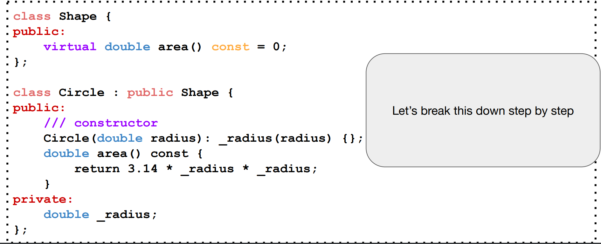
   > 请注意constructor变量名的命名技巧，这样可以避免和成员变量重名。

### lec6 Template class
1. 为什么要使用模板类？
   - 代码复用
   - 类型安全
   - 性能优化
   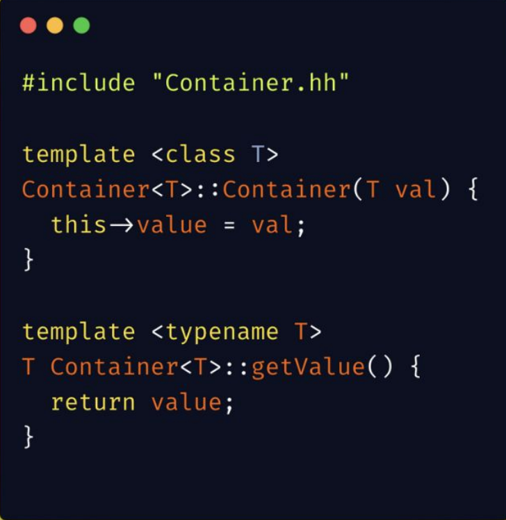

2. 在.h文件中必须包含.h和.cpp文件
   ```cpp
   #include "source.cpp"
   ```
3. const 的使用
   ```cpp
   std::string stringify(const Student& s){
      return s.getName() + " is " + std::to_string(s.getAge()) +
      " years old." ;
   }
   ```
   由于编译器并不知道`getName()`&`getAge()`函数是否会改变s的值，所以我们需要在函数后面加上const关键词。
   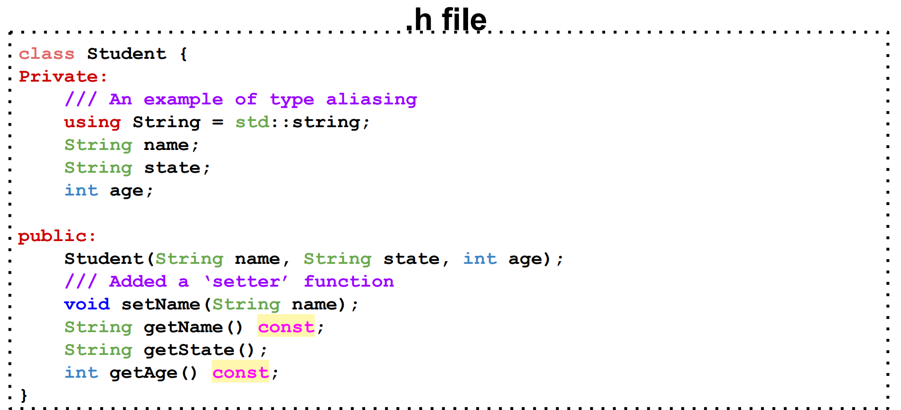
   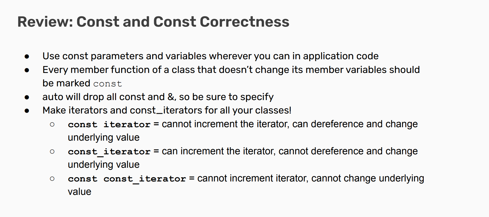

4. throw exception
   ```cpp
   void Student::setAge(int age) {
      if (age < 0) {
         throw std::invalid_argument("Age cannot be negative");
      }
      this->age = age;
   }
   ```
   
   
5. const_cast 使用技巧
   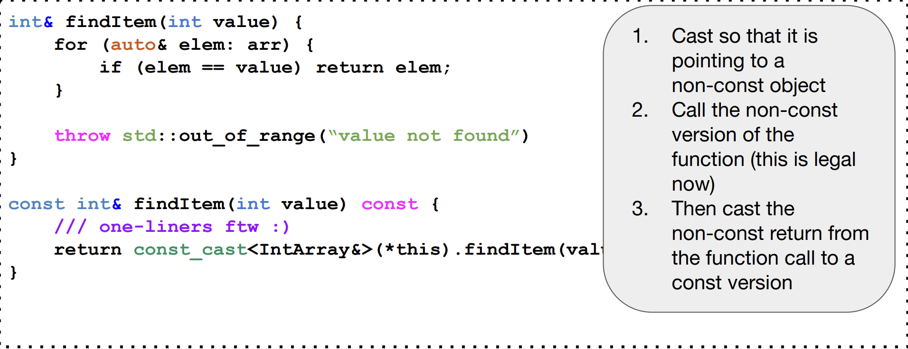

### lec7 template function
1. An example
   
2. Constraints and concepts
   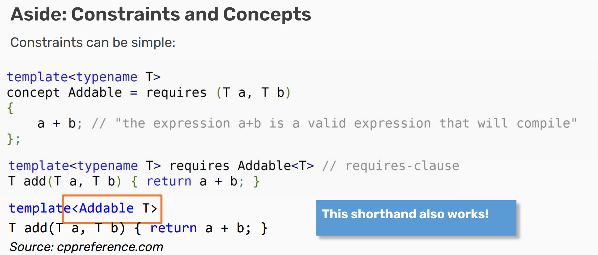

??? note "Complex Reference"
   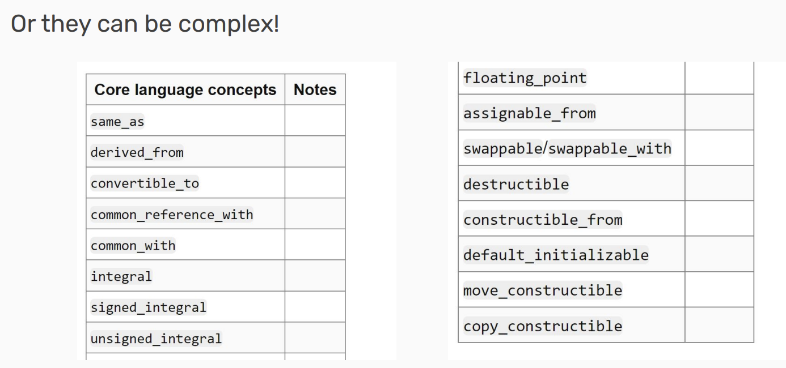
3. 使用template可以更有效率：
   ```cpp
   template<unsigned1>
   struct Factorial {
      enum value =n * Factorial<n - 1>::value };
   };
   template<>// template class "specializationstruct 
   Factorial<0>{enum fvalue=1};
   std::cout <<Factorial<10>::value << endl;//prints 3628800, but run duringcompile time!
   ```
4. constexpr: 用于在编译时计算值
   ```cpp
   constexpr int factorial(int n) {
      return n <= 1 ? 1 : n * factorial(n - 1);
   }
   ```

### lec8 function and lambda
1. function pointer
   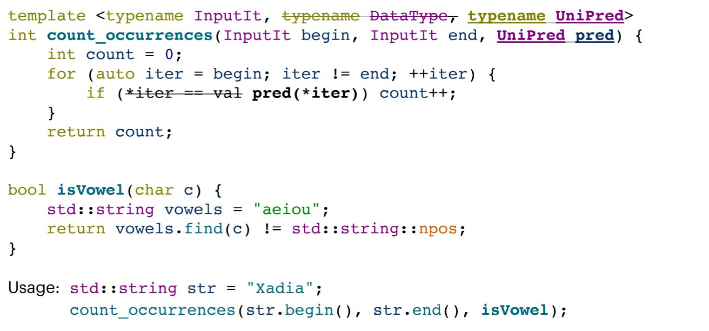
2. lambda expression
   ```cpp
   int limit = 5;
   auto is_greater_than_limit = [limit](int value) {
      return value > limit;
   };
   ```
   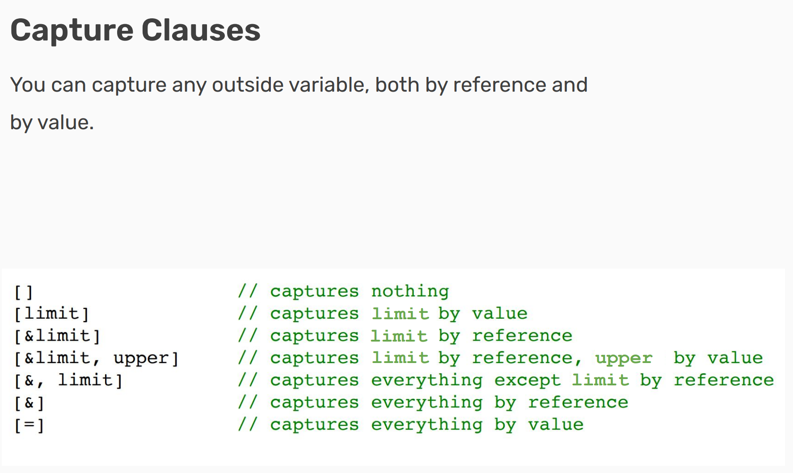
3. Functor
   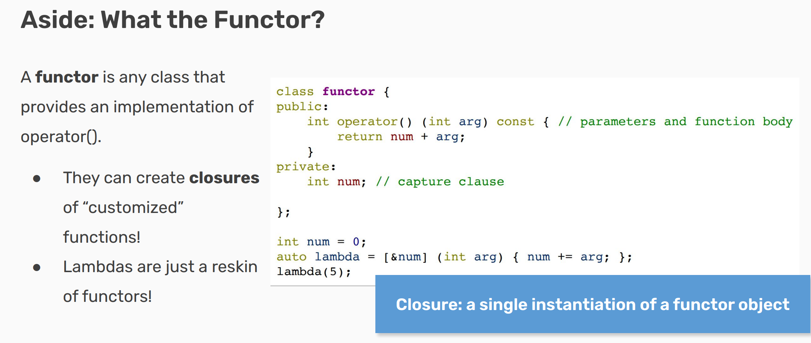
4. virtual function: can be overrided by derived class
   
5. The STL implements tons of cool algorithms that we
can use without rewriting them! 

### lec9 Operator Overloading
1. fraction example： https://replit.com/@havenw/simplefraction

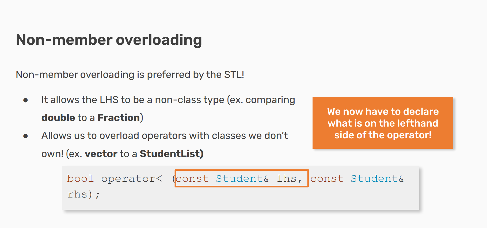

2. friend关键词可以让一个函数访问类的私有成员，它有助于实现重载运算符，但请注意他会**破坏封装性**。
   ```cpp
   class Fraction {
   public:
      friend std::ostream& operator<<(std::ostream& os, const Fraction& f);
   };
   ```
   


> 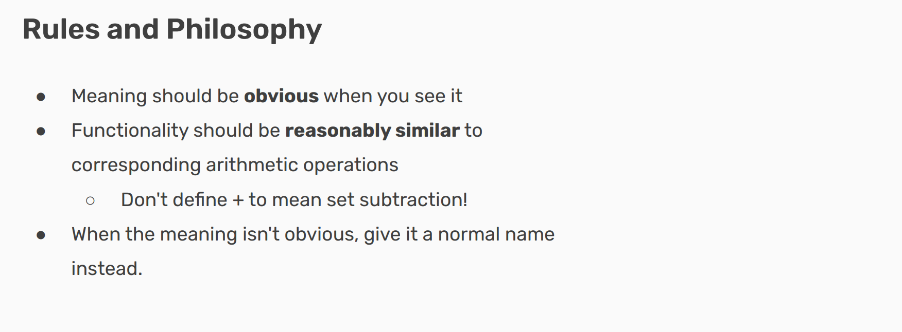