# Terminology
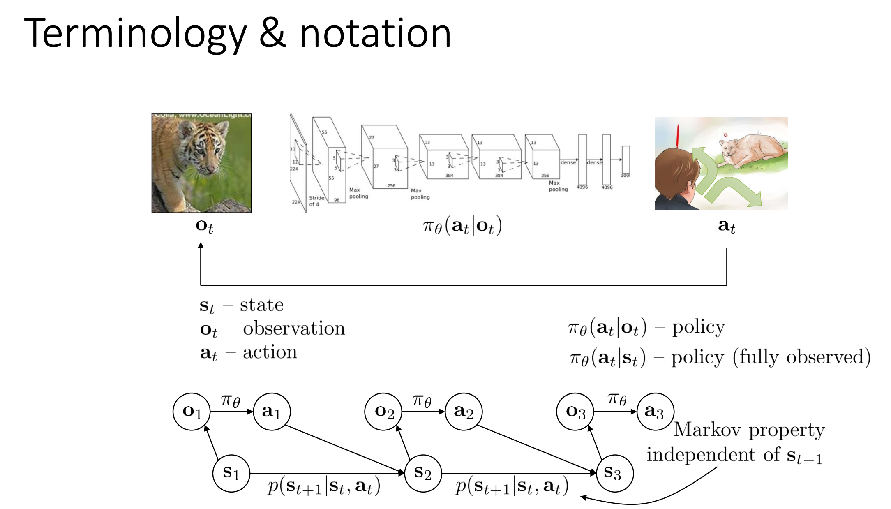

先来回顾一下[Preliminaries](./index.md#preliminaries)中的内容，介绍一些符号——

- $o_t$ : observation at time $t$
- $a_t$ : action at time $t$
- $s_t$ : state at time $t$
- $\pi_\theta(a_t|o_t)$ ：policy

什么是observation呢？这就引入了一个话题——我们有时候并不能观察到全部的state。

比如说，在开车的时候，state应该包含其他所有车辆的位置、速度等等。但从车窗上的摄像头拍一张照片，我们显然不能获得全部的信息；相反，给定state，我们可以完全给出这张照片。这样的照片就是**observation**。

在本笔记的绝大部分时候，我们总是可以忽略state和observation之间的差别；但有少数的情况，我们必须要区分它们，到时候会明确地说明。

我们认为state是**完备的**。什么叫做完备？其实就是说，在已知 $s_t$ 的时候， $s_{t-1}$ 不能提供关于 $s_{t+1}$ 的更多信息。也就是

$$
s_{t-1}\perp s_{t+1}|s_t
$$

满足这样的条件后，我们就可以发现， $s_{t+1}$ 只与 $s_t,a_t$ 有关，而这又只和环境有关（注意和policy无关，因为 $a_t$ 已经给出了）。这可以叫做dynamics，也可以叫做**transition probability**：

$$
s_{t+1}\sim p(s_{t+1}|s_t,a_t) \qquad (\text{determined by env})
$$

我们可以发现，在这样的一系列假设后，我们可以构造一个Markov Chain，满足Markov Property。如图所示。

注意，在给定$a_2$的时候，$a_3$是独立于$a_1$的，并且$s_1$不会提供额外的信息。

请不要confounding $O \& S$, $O$是agent的观察，$S$是agent的状态。

早期的单纯的监督学习并不能很好的在自动驾驶场景上应用的原因是：IID(Independent and Identically Distributed)假设不成立.

> 即当前输出结果可能影响着下一次输出结果的准确性。

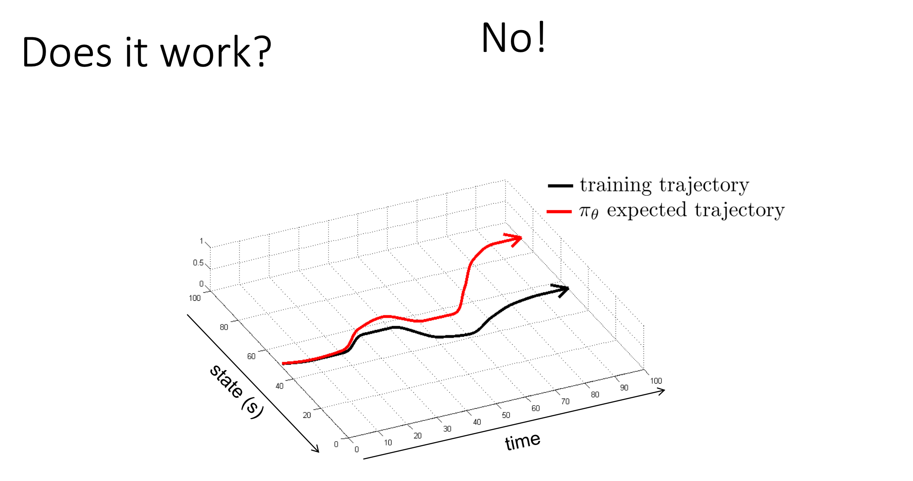

但是当英伟达把数据堆的足够多的时候，还是work了的。

解决的办法可以是：增加数据量，强大的模型，multi-task learning（exotic）。
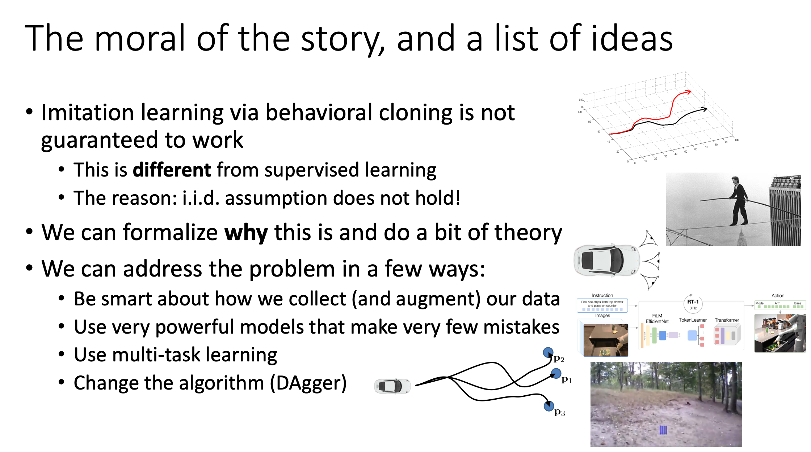

# Imitation Learning

我们来介绍我们的第一个RL“算法”——Imitation Learning。

Imitation Learning 的思路很简单：我们找一个专家来label data，构建一个数据集
$$
\mathcal{D}=\{s,a\}
$$
然后，我们训练一个模型，使得
$$
\theta^\star = \argmax_{\theta}\log \pi_\theta(a=\pi^\star(s)|s)
$$
其中， $\pi^\star$ 是专家的策略。需要注意，这里完全没有RL的知识，只是普通的DL问题。这也有时候被叫做behavior cloning。

模型的实现可以是DL中的很多类型的网络。比如说CNN,VAE,甚至diffusion models。更进一步，有些研究考虑专家的Non-Markov性质，因此使用RNN来建模。当然，很多经验证明有“历史”的模型不一定比“无历史”的模型好。

# Behavior Cloning Analysis

直观上，bahavior cloning应该**失败**。

比如说，一个模型在“走钢丝”，它每一步有98%的概率走在正确的道路上。这样的模型如果从我们训练数据的角度来看，已经是一个很不错的DL模型了。但是假设模型决策100步，那么只有13%左右的概率它依然保持在专家的道路上！

下面给出了一些数学上的分析。它们的主要目的都是为了bound住behavior cloing的模型和专家之间的差距。

## Notations
- $a=\pi^{\star}(s)$ : the expert policy gives $a$ when the state is $s$
- $\pi_\theta$ : the policy we are trying to learn
- $p_{\pi_\theta}(s_t)$ : the probability of being at state $s_t$ at time $t$ if we follow $\pi_\theta$ . 
    - **重要提示**: $p_{\pi_\theta}(s_t)$ 的这个 $p_{\pi_\theta}$ 分布和 $p_{\pi_\theta}(s_{t+1})$ 的这个 $p_{\pi_\theta}$ 分布可不是一个分布！一个是在 $t$ 时的分布，一个是在 $t+1$ 时的分布。 的确——you are on the road 😈
- Use $|p_1-p_2|$ to denote the total variance distance between $p_1$ and $p_2$ : $|p_1-p_2|=\sum_{x}|p_1(x)-p_2(x)|$

## Distribution Distance

> Relax，只是为了证明上界的问题。

**Assumptions.**

- $\forall (a,s), \pi_\theta(a\ne \pi^{\star}(s)|s)\le \epsilon$

**Conclusion**: 对任意的 $t$ ,

$$
\sum_{s_t}|p_{\pi_\theta}(s_t)-p_{\pi^{\star}}(s_t)|\le 2\epsilon t.
$$

**Proof**. **归纳**在这类问题是很常见的方法。我们试着把 $t+1$ 时刻和 $t$ 时刻的表达式联系起来：

$$
\left|p_{\pi_\theta}(s_{t+1})-p_{\pi^\star}(s_{t+1})\right|=\left|\sum_{s_t,a_t}p(s_{t+1}|s_t,a_t)\pi_\theta(a_t|s_t)p_{\pi_\theta}(s_t)-\sum_{s_t}p(s_{t+1}|s_t,\pi^\star(s_t))p_{\pi^\star}(s_t)\right|.
$$

$$
=\left|\sum_{s_t}\left(\sum_{a_t\ne \pi^\star(s_t)}p(s_{t+1}|s_t,a_t)\pi_\theta(a_t|s_t)+p(s_{t+1}|s_t,\pi^\star(s_t))\pi_\theta(\pi^\star(s_t)|s_t)\right)p_{\pi_\theta}(s_t)-\sum_{s_t}p(s_{t+1}|s_t,\pi^\star(s_t))p_{\pi^\star}(s_t)\right|.
$$

$$
\le \epsilon \sum_{s_t}p_{\pi_\theta}(s_t)+\sum_{s_t}p(s_{t+1}|s_t,\pi^\star(s_t))p_{\pi_\theta}(s_t)\cdot \epsilon+\sum_{s_t}p(s_{t+1}|s_t,\pi^\star(s_t))\left|p_{\pi_\theta}(s_t)-p_{\pi^\star}(s_t)\right|
$$

$$
=\epsilon+\epsilon \sum_{s_t}p_{\pi_\theta}(s_t)p(s_{t+1}|s_t,\pi^\star(s_t))+\sum_{s_t}p(s_{t+1}|s_t,\pi^\star(s_t))\left|p_{\pi_\theta}(s_t)-p_{\pi^\star}(s_t)\right|.
$$

对 $s_{t+1}$ 求和即证。

*Side Note.* Homework 1 的 Problem 1 实际上给出了一个弱化的条件，依然可以给出同样的结论：

$$
\mathbb{E}_{s_t\sim p_{\pi^\star}}[\pi_\theta(a_t\ne \pi^{\star}(s_t)|s_t)]\le \epsilon.
$$

## The total cost

**Assumptions.**
- $\mathbb{E}_{s_t\sim p_{\pi^\star}}[\pi_\theta(a_t\ne \pi^{\star}(s_t)|s_t)]\le \epsilon.$

如果我们定义 $c_t$ 是 **cost function**：
$$
c_t(s_t,a_t)=\begin{cases}0&,a_t=\pi^{\star}(s_t)\\1&,\text{otherwise}\end{cases}.
$$

**Conclusion**: 

$$
S=\sum_{t\le T} E_{s_t\sim p_{\pi_\theta}}[c_t(s_t,a_t)]=\mathcal{O}(\epsilon T^2).
$$

（直观上说，这是指我们的模型**失败的步数**是 $\mathcal{O}(T^2)$ 的。虽然这只是一个上界，但 intuitively 它应该是比较准确的。）

**Proof**. 

$$
S=\sum_{t\le T} E_{s_t\sim p_{\pi_\theta}}[c_t(s_t,a_t)]=\sum_{t\le T} \sum_{s_t}p_{\pi_\theta}(s_t)c_t(s_t,a_t)
$$

$$
\le \sum_{t\le T} \sum_{s_t}p_{\pi^\star}(s_t)\pi_\theta(a_t\ne \pi^\star(s_t)|s_t)+\sum_{t\le T} \sum_{s_t}|p_{\pi_\theta}(s_t)-p_{\pi^{\star}}(s_t)|c_t(s_t,a_t)
$$

使用上一个结果，我们就可以得到

$$
S\le \sum_{t\le T} \epsilon+\sum_{t\le T} 2\epsilon t = \mathcal{O}(\epsilon T^2).
$$

<!-- prettier-ignore-start -->
??? info "Tips"
    Take away，video中有讲到，其实reward函数和cost函数是可以互换的，只要把reward函数取负就行了。
    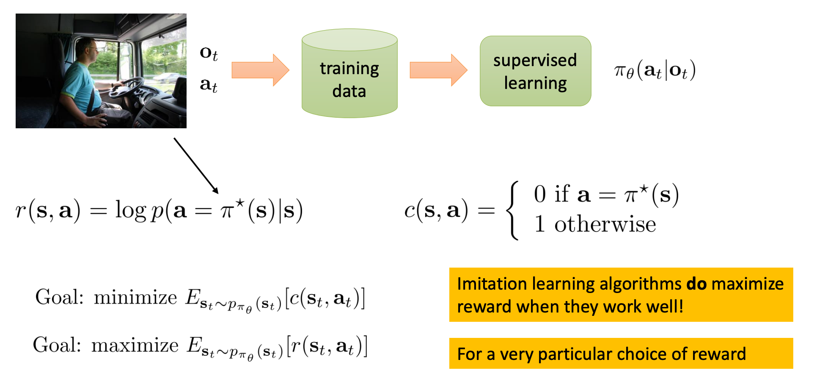
<!-- prettier-ignore-end -->

# Make Bahavior Cloning Work

介绍几个常见的方法，解决bahavior cloning的这个问题。

## Adding Mistakes

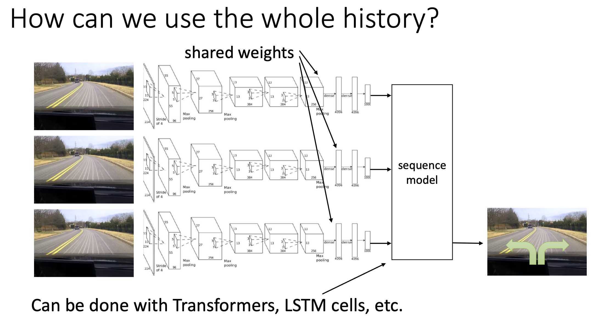
 
假设我们的模型学会改正自己的错误（比如，在走钢丝的时候，身体向左倾倒的时刻，我们的模型能够自动调整身体向右倾倒）。这样的话，成功的概率会大很多。

一个典型的实验是，我们做一个驾驶的模型，然后做三个摄像头：一个正常的摄像头，一个向左偏移的摄像头，一个向右偏移的摄像头。在训练的时候，左边摄像头的图片被标记为“右转”，右边摄像头的图片被标记为“左转”。这样的话，我们的模型就能够学会自动调整。

<!-- prettier-ignore-start -->
??? demo "线代模型的一些代表工作"
    
    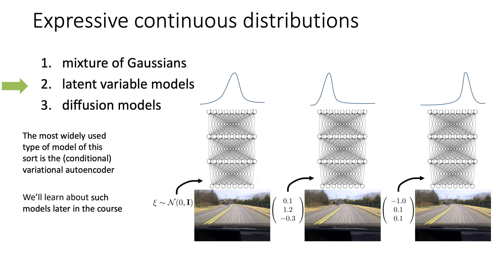
    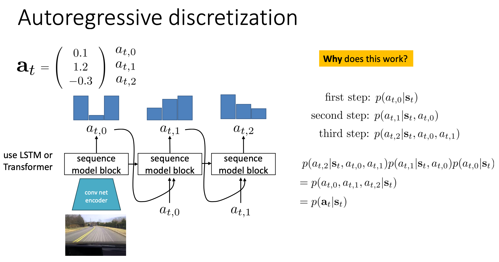
    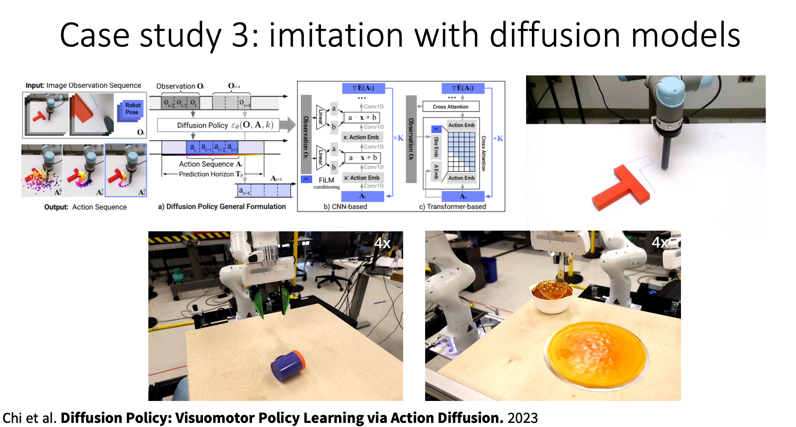
    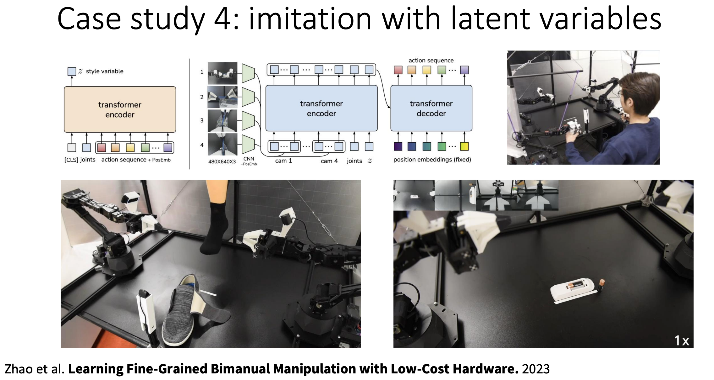
    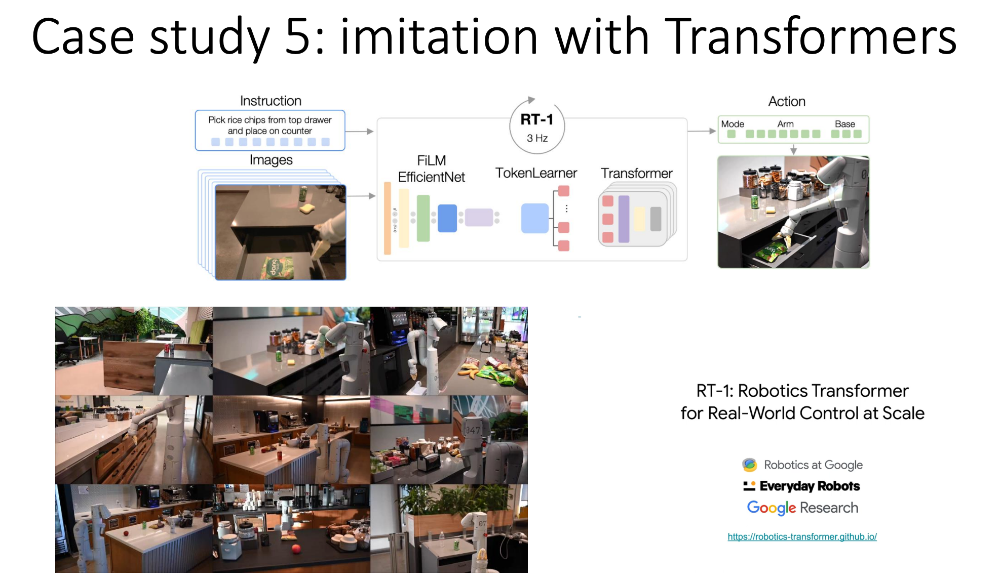
<!-- prettier-ignore-end -->

## Multi-task Learning

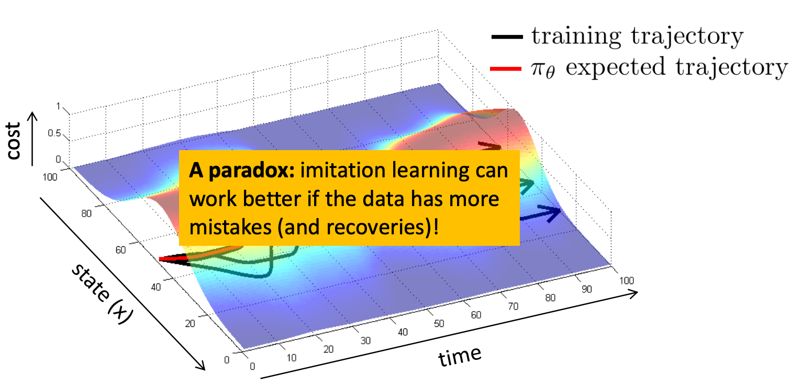

还记得我们之前的问题：只要模型一步误入歧途，接下来就再也没有挽回的余地。回顾一下，之前的模型失误的时候会走向一条全新的道路，是完全没有训练过的；但 multi-task learning 可以解决这个问题——它通过巧妙的设计收集大量的 trajectory 信息，使得模型在哪里都不至于完全不知所措。

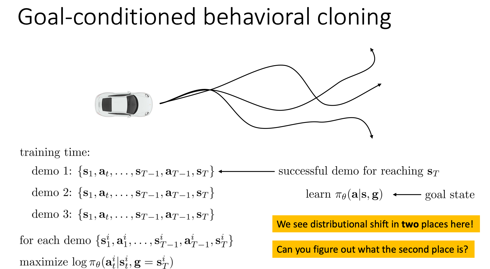

具体地，我们在训练的时候让专家并非向往一个目标 $s_T$ 前进；相反，让它对很多个 $s_T$ 走多条这样的路径：

$$
s_1,a_1,\cdots,s_{T-1},a_{T-1},s_T
$$

然后，我们的数据集收集

$$
\{(a_t|s_t,g_t=s_T)\}\in \mathcal{D}
$$

也就是说，我们模型知道了对于每一个 **目标 $s_T$** 应该每一步怎样走。这样的操作也叫做 Goal-conditioned behavior cloning。

<!-- prettier-ignore-start -->
??? example "一些现在的工作"
    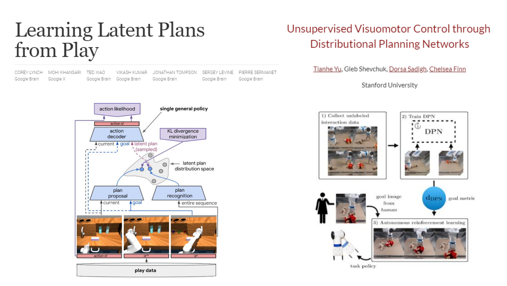
    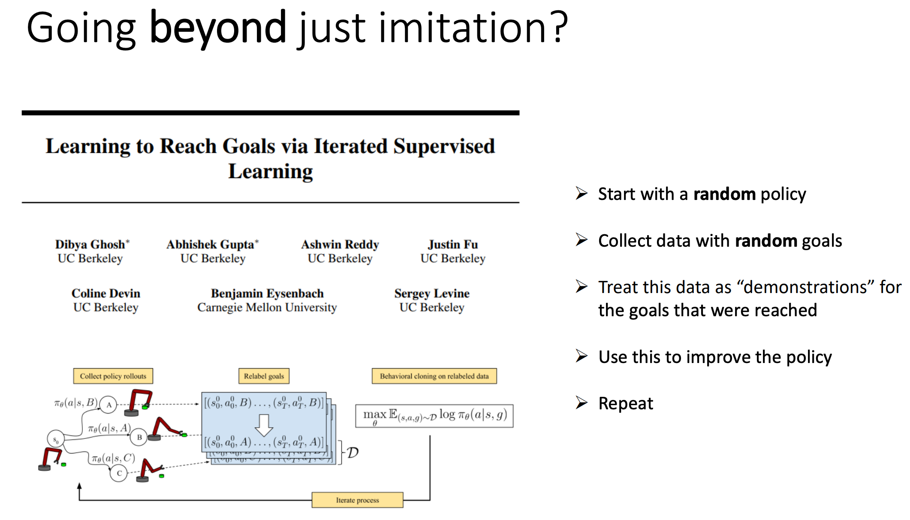
    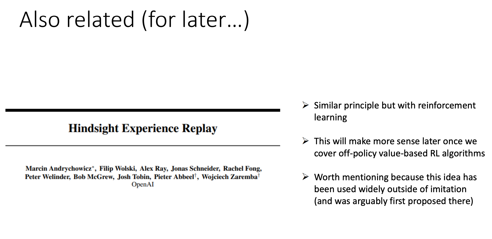
<!-- prettier-ignore-end -->

## DAgger

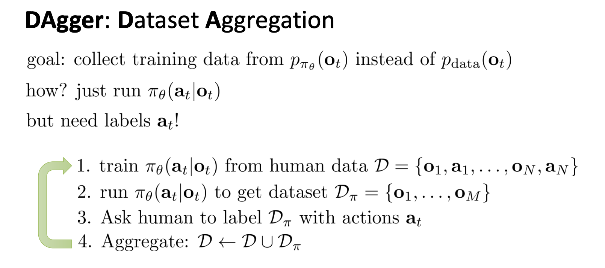

DAgger也试着解决原来的问题。它的思路是，为了防止模型走错之后不知道该怎么走，我们就在每一个训练 iteration 完成之后让模型自己跑一次，并让专家来标记正确答案。具体地，我们从 $\pi_\theta$ 中采样

$$
s_1,a_1\sim \pi_\theta(\cdot|s_1),\cdots,s_T,a_T\sim \pi_\theta(\cdot|s_T)
$$

然后把这些新的数据加入数据集中：

$$
\mathcal{D}= \mathcal{D}\cup \left\{(s_t,a_t^\star=\pi^{\star}(s_t))|t=1,2,\cdots,T\right\}
$$

当然，实际上可能采用一些其他策略，比如每一次不是在越来越大的数据集上完整地训练一轮，而是把所有训练的数据存到一个 buffer 内部，然后从中随机地采样。

当然， DAgger 也有很显著的问题：需要很多次专家进行数据的标注，因此这部分的代价可能会很昂贵。

# Reference Papers

1. [A Reduction of Imitation Learning and Structured Prediction to No-Regret Online Learning](https://arxiv.org/abs/1011.0686)