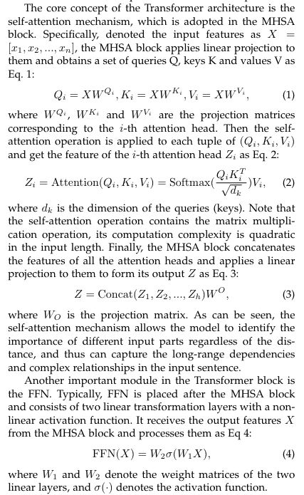
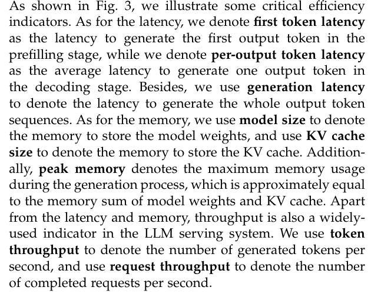
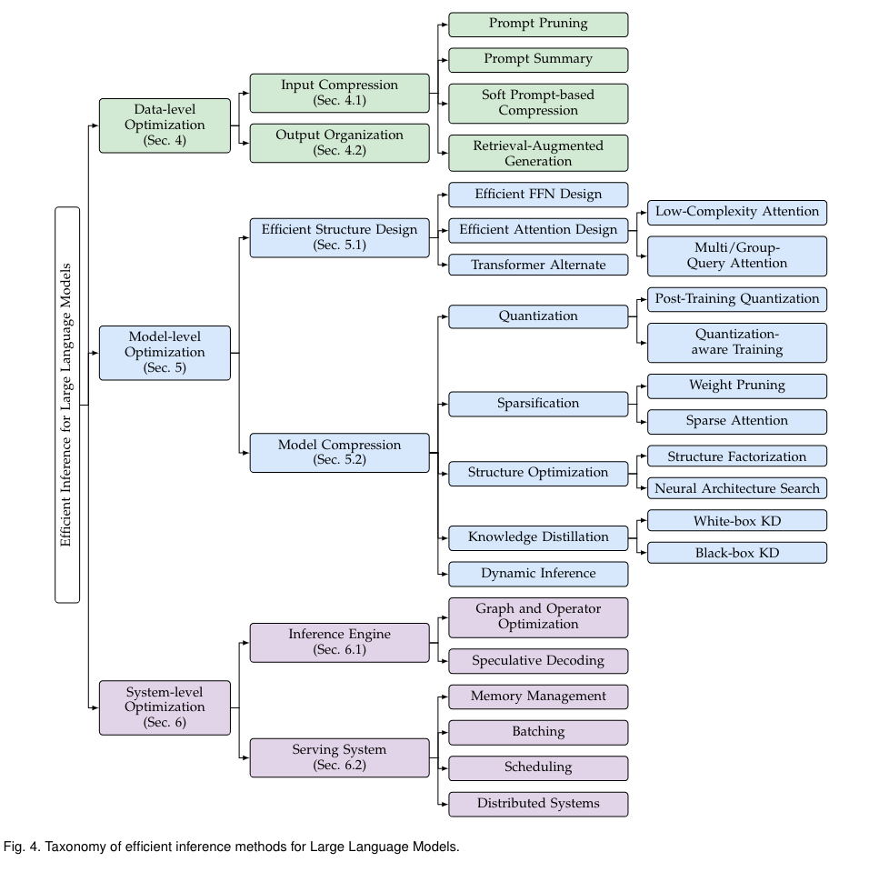
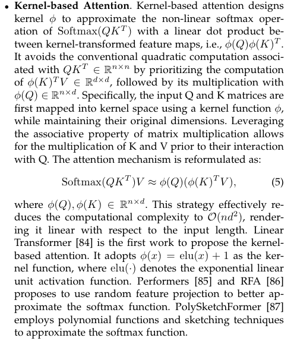
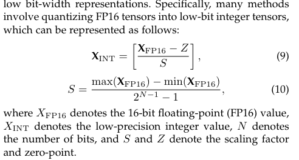
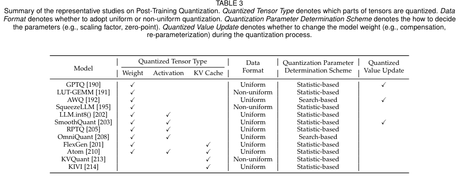
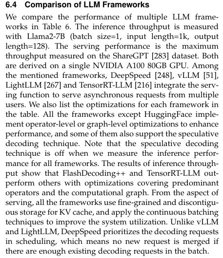

# A Survey on Efficient Inference for Large Language Models
本文介绍了一个综合的分类法，将当前的文献从数据级、模型级和系统级优化三个角度切入分析

## Introduction


## Background
### Transformer


一个关于最后投影矩阵的代码解释
```python
import torch

# 假设有 h 个头，每个头的输出表示为 Z1, Z2, ..., Zh
# Z_i 的形状为 (batch_size, seq_len, d_head)
Z1 = torch.randn(batch_size, seq_len, d_head)
Z2 = torch.randn(batch_size, seq_len, d_head)
# ...
Zh = torch.randn(batch_size, seq_len, d_head)

# 将所有头的输出连接起来
Z = torch.cat((Z1, Z2, ..., Zh), dim=-1)  # 形状为 (batch_size, seq_len, h * d_head)

import torch.nn as nn

# 线性层，用于投影
projection = nn.Linear(h * d_head, d_model)

# 通过投影矩阵 W^O
output = projection(Z)  # 形状为 (batch_size, seq_len, d_model)
```

#### FFN
FFN
https://www.zhihu.com/question/622085869
https://www.zhihu.com/question/460991118/answer/2353153090

```python
class FeedForwardNetwork(nn.Module):
    def __init__(self, d_model, d_ff):
        super(FeedForwardNetwork, self).__init__()
        self.linear1 = nn.Linear(d_model, d_ff)
        self.relu = nn.ReLU()
        self.linear2 = nn.Linear(d_ff, d_model)
    
    def forward(self, x):
        x = self.linear1(x)
        x = self.relu(x)
        x = self.linear2(x)
        return x
        
# 一般来说隐藏层纬度要更大，能有效解决token uniformity的问题
d_model = 512  # 输入和输出的维度
d_ff = 2048   # FFN中的隐藏层维度
```

### Inference
现在大多都是自回归模型（decoder-only），即在生成每个token时，都要考虑之前生成的token，这样的模型在推理时会有很大的延迟，因此需要一些技术来加速推理

#### KV-cache
由于存在大量对先前token存在的重复计算，我们采取了cache策略


> 术语表
> 
> 


### Efficiency Analysis

> 一般来说LLama-70B参数的模型需要140G存储weights（FP16）
> 至于延迟，在2块NVIDIA A100 GPU上生成一个令牌需要大约100毫秒。因此，生成一个包含数百个令牌的序列需要10秒以上的时间。

一般来说存在最开始提到的三个问题，本文优化的重点则主要集中于
• 模型参数
• Attention在长文本下的计算开销
• 自回归解码方法逐个生成token。在每个解码步骤中，所有的模型权重都从片外HBM加载到GPU芯片中，导致较大的内存访问成本。此外，KV-cache的大小随着输入长度的增加而增加，这可能导致碎片化的内存和不规则的内存访问模式

## 优化手段的简要分类

- data-level 对模型本身几乎没什么影响
- model-level 通过改变模型结构来减少计算量，可能微调会使模型性能受损
- system-level 从系统布局的角度优化（本论文说flash attention可能会有树脂偏差？）



### Data-level
#### Input Compression


ICL和CoT的使用，导致计算开销都二次方增长。

- Prompt Pruning：删除不重要的tokens
- Prompt Summary：提示摘要的核心思想是在保留相似语义信息的前提下，将原始提示浓缩为较短的摘要。
- Soft Prompt-based Compression这类压缩技术的核心思想是设计一个明显短于原始提示的软提示，作为LLMs的输入。
> The soft prompt is defined as a sequence of learnable continuous tokens.
- Retrieval-Augmented Generation(RAG工程)

#### Output Organization
Skeleton-of-Thought (SoT)：输出组织技术旨在通过组织输出内容的结构，(部分)实现生成的并行化。当然它还有一个`router model` 来决定应用SoT是否适合于特定的问题。


有一个SGD的东西extend the idea of SoT by organize sub-problems in DAG(有向无环图)形式(一定程度上优化了在数学和代码相关的问题)

与SoT相比，SGD优先考虑答案质量而不是速度。此外，SGD引入了一种自适应的模型选择方法，根据估计的复杂度为每个子问题分配一个最优的模型大小，从而进一步提高了效率。

> 大家可以看看SGLang这个东西，从编译器（语言）的角度来集成优化这个问题

#### 小结
最近，各种各样的激励管道( ToT  , GoT )和代理框架（agent framework）不断涌现。虽然这些创新增强了LLMs的能力，但它们也延长了输入的长度，导致计算成本增加。为了应对这一挑战，采用输入压缩技术来减少输入长度显示出作为解决方案的前景。

当然也有动态停止避免模型开始说废话。最终希望达到（pipeline的级别）的并行化。

<!-- prettier-ignore-start -->
???+ info "LLM Reasoning"
    https://zhuanlan.zhihu.com/p/654034193
<!-- prettier-ignore-end -->

### Model-level
LLM高效推理的模型级优化主要集中在优化模型结构或数据表示。模型结构优化包括直接设计高效的模型结构、修改原始模型和调整推理时间架构。在数据表示优化方面，通常采用模型量化技术。

#### Model Structure Optimization
这里的优化主要针对`FFN`（参数开销）和`Attention`（长文本二次方复杂度）两个部分
> 一个非常反直觉的是：FFN竟然是模型主要的参数开销
> 


##### FFN Design
Mixture-of-Experts (MoE)：MoE模型将FFN分解为多个专家，每个专家负责处理不同的输入。这种分解可以减少每个专家的参数量，从而减少整个FFN的参数量。

- MoEification设计了一种利用预训练权重将非MoE LLM转换为MoE版本的方法。
- MPOE [ 90 ]提出通过矩阵乘积算子( Matrix Product Operators，MPO )分解来降低基于MoE的LLMs的参数。该方法将FFN的每个权重矩阵分解为一个包含公共信息的全局共享张量和一组捕获特定特征的局部辅助张量。
- 此外便是不同专家模型的token并行度（或多或少）负载均衡的问题（有痛过修改损失函数来解决）
> softmax存在指数计算可能导致训练的不稳定性（有通过改变损失函数来解决的方法）
> 关于专家模型的设计有非常多取巧的细节，但我想这不是本文关注的重点


##### Efficient Attention Design
由于二次方的复杂度开销，尤其在长文本上影响显著，这些研究大致可以分为两个主要的分支：多查询注意和低复杂度注意。

- MQA：对MHA的改进，共享kv-cache在不同的attention heads上。（GQA则是MQA和MHA的Mix）
- Low-Complexity Attention：降低attention以及softmax非线性计算的复杂度
> 

- 当然我们还注意到了attention中的low-rank approximation（低秩近似）和sparsity（稀疏性）的研究（比如Linformer等）
- 还有压缩attention上下文范围

当然也有替换transformer等各种结构的出现：

在这一研究领域中，有两个突出的研究方向受到了极大的关注。其中，状态空间模型( State Space Model，SSM )是一种基于HiPPO理论的递归变换序列建模方法[ 64 ]。此外，其他研究主要集中在使用长卷积或设计类似注意力的公式来建模序列。

也有将卷积扫描改成并行扫描（更适合GPU的并行计算）

#### Model Compression

##### Quantization

接下来我们将从：效率分析以及两种不同的量化工作流程：训练后量化( PTQ )和量化感知训练( QAT )三个角度切入简要概述。


- **Efficiency Analysis**：LLMs的推理过程包括两个阶段：预填充阶段和解码阶段；Prefiling stage主要涉及GEMM相关。Decode主要是GEMV（vector生成一个token有关的计算）
- **Post-Training Quantization**：训练后量化( PTQ )是指在不需要重新训练的情况下，对预训练的模型进行量化，这可能是一个代价高昂的过程。虽然PTQ方法已经在较小的模型中得到了很好的探索，但将现有的量化技术直接应用于LLMs提出了挑战。这主要是因为与较小的模型相比，LLMs的权重和激活值往往表现出更多的异常值和更广泛的分布范围，使得它们的量化更具挑战性。（
GPTQ、AWQ等是被广泛使用的）





- **量化感知训练( Quantization-aware training，QAT )**： 在模型训练过程中融入了量化的影响。通过集成复制量化效应的层，该方法有利于权重适应量化引起的误差，从而提高任务性能。

为了降低计算成本，许多方法采用参数有效调整( PEFT )策略来加速QAT。QLoRA 将LLMs的权重量化为4 - bit，然后使用BF16中的LoRA 对每个4 - bit权重矩阵微调量化模型。QLoRA允许在仅有30GB内存的GPU上对65B参数LLM进行有效的微调。QALoRA 提出将分组量化融入到QLoRA中。作者观察到，QLoRA中量化参数的数量明显小于LoRA参数的数量，导致量化和低秩适应之间的不平衡。

<!-- prettier-ignore-start -->
??? info "Tips"
    LoftQ [ 189 ]指出，在QLoRA中用零初始化LoRA矩阵对于下游任务是低效的。作为替代方案，LoftQ建议使用差分的奇异值分解( SVD )来初始化LoRA矩阵。LoftQ迭代地应用量化和SVD来实现对原始权重更精确的逼近。Norm Timming [ 186 ]提出对量化后的LayerNorm层进行训练，并使用知识蒸馏将量化模型的输出分布与FP16模型的输出分布进行匹配，在取得与LLM - QAT相似效果的同时避免了高昂的训练成本。
<!-- prettier-ignore-end -->


从结果中，可以得出几个关键的结论：
1. 仅加权量化可以大大加速解码阶段，从而导致端到端延迟的改善。这种增强主要源于从高带宽存储器( High Bandwidth Memory，HBM )中加载低精度权重张量的量化模型的能力，如前文"高效分析"部分所述。因此，这种方法明显减少内存访问开销。
2. 对于预填充阶段，单纯的权重量化实际上可能会增加延迟。这是由于预填充阶段的瓶颈是计算成本而不是访存成本。因此，在没有激活的情况下，只量化权重对延迟的影响很小。此外，如图9所示，单纯的权重量化需要逆量化的低精度权重给FP16，导致额外的计算开销，从而减慢预填充阶段。
3. 随着批大小和输入长度的增加，仅使用权重量化所获得的加速比逐渐减小。这主要是因为批次规模和输入长度较大时，计算成本较高虽然仅权重量化显著降低了访存开销，但随着批处理大小和输入长度的增加，计算需求变得更加突出，仅权重量化对延迟的影响变得不那么显著。
4. 由于与较大的模型尺寸相关的显著的内存访问开销，仅权重量化为较大的模型提供了更大的益处。随着模型复杂度和规模的增加，存储和访问权重所需的内存容量成比例增加。通过量化模型权重，仅权重量化有效地减少了这种内存占用和内存访问开销。


##### Sparsification


##### Structure Optimization


##### Knowledge Distillation

##### Dynamic Inference


#### Knowledge, Suggestions and Future Direction


### System-level


#### Inference Engine
##### Graph and Operator Optimization


##### Speculative Decoding

#### Serving System

#### Hardware Accelertor Design

#### LLM Framework



## 结语