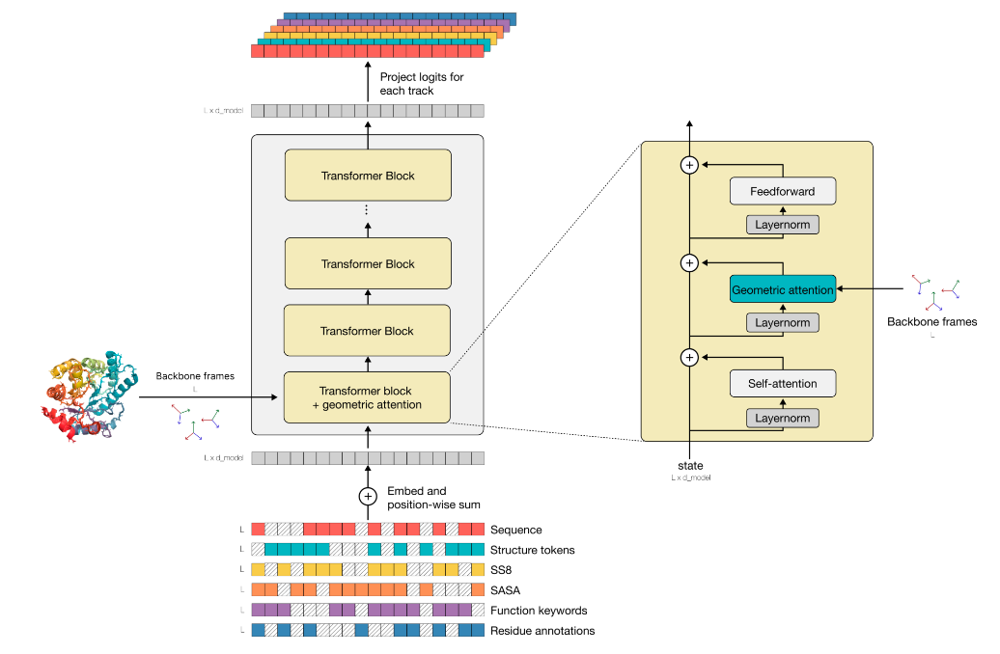
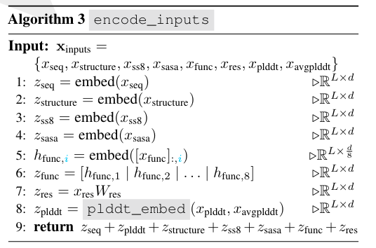
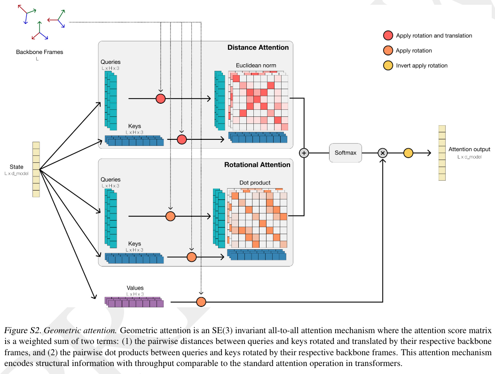
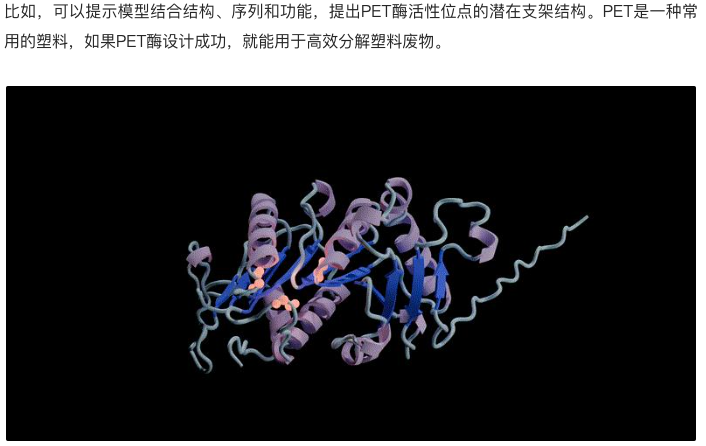

# ESM3
<!-- prettier-ignore-start -->
!!! note "导读"
    本文其实是用多模态的思路做的蛋白质结构、功能、序列的统一表征；我会尽可能结合论文和代码做一个解读
<!-- prettier-ignore-end -->

> ESM3与不同于模拟多种生物分子的`AlphaFold3`，只专注于蛋白质，但可以同时推理其序列、结构和功能

## Architecture
鉴于LLM scaling low 的能力，提高了60倍数据量，训练计算量提高25倍。

结构图如下：

The generative pipeline is as follows:

- **Tokenization**: First, raw inputs are tokenized as described in Appendix A.1.3. Structural inputs are tokenized via a VQ-VAE (Appendix A.1.7). Function keywords are tokenized by quantizing the TF-IDF transform of functional keywords with locality sensitive hashing (LSH), detailed in Appendix A.1.8.

- **Transformer Trunk**: A standard Transformer (57, 58) architecture processes the post-tokenized inputs. Geometric Attention (Algorithm 6 and Fig. S2) directly processes structural coordinates as input. Model outputs are logits over token space, and can be sampled to obtain outputs described in Appendix A.1.5.2. The overall architecture is diagrammed in Fig. S1

- **Decoder**: Most tracks can be naively decoded into tokens detailed in Appendix A.1.3. Structure tokens must be decoded with a model - we use a 700M parameter transformer model to do this, trained post-hoc (Appendix A.1.7.2). The decoder uses sequence tokens and structure tokens to directly predict coordinates, pTM, and pLDDT (59). Function tokens are decoded using a small 3-layer transformer, trained post-hoc to invert the LSH quantization procedure (Appendix A.1.8.2.1).

## Structure
结构信息的表达是通过`VQ-VAE`来实现的；还会融合几何结构信息。

## 功能
还是基于数据库的传统算法的标注（这里怀疑是否会拟合人造数据）

## 可能性

