# Lec12 | Computational Photography

计算摄影学的任务就是通过算法使得拍出来的图像质量更高。

## High Dynamic Range Imaging(HDR)

HDR, 即高动态范围成像。回想我们生活中，在晚上拍照时，照片会出现要么一片黑，要么一片亮的情况。原因是晚上的场景对比度太大，而这种明暗的对比度就被称作动态范围。HDR可以做到既捕捉亮处的细节，也捕捉到暗处的细节。

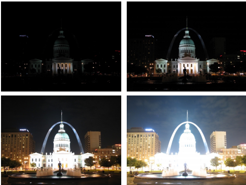

对于相机，它每个像素的曝光(exposure)取决于如下三个因素：

- 增益(Gain): controlled by the ISO. 可以理解为光电信号转化的效率。ISO是底片的感光度。
- 辐射度(Irradiance): 可以理解为打到底片上的光的数量(光强)，取决于光圈的大小。
- 曝光时间(Time)：由快门速度控制。

**Dynamic range**

The ratio between the largest and smallest values of a certain quantity.

即一个场景中最亮地方和最暗地方的比值。在夜晚拍照时，由于场景动态范围太大，暗处和亮处的细节不能兼得，就会造成上图的两种情况。

真实世界具有很大的动态范围。但是相机的传感器只能覆盖很小的动态范围。传感器的动态范围不能覆盖真实场景的动态范围，这就是我们拍照不能兼顾明暗细节的原因。

### HDR

一个很直观的想法就是我们拍多张图像，部分图像用较小的曝光时间，记录亮出的细节，另一部分图像用较长的曝光时间，记录暗处的细节，最后将所有图像合成得到最终的图像。

- Exposure bracketing: Capture multiple LDR images at different exposures.
- Merging: Combine them into a single HDR image.

对于图像合成，有以下几个步骤：

For each pixel:

- Find valid pixels in each image. 这个像素值既不会太亮也不会太暗(0.05<pixel<0.95)，我们即认为它处于合理的区间。
- Weight valid pixel values appropriately.(pixel value/t).
- Form a new pixel value as the weighted average of valid pixel values.

## Deblurring

任务是把模糊的图像变清楚。

首先我们要知道图像模糊的原因：

- 失焦(Defoucs): 在景深范围外defoucs(在lec2介绍过),光斑取决于光圈形状。
- 运动模糊(Motion blur): 成像的过程是对光强做积分的过程，倘若在这过程中相机或物体运动， 成像结果就产生模糊。一般由曝光时间过长造成。在画面上形成运动的轨迹。

那么我们要如何用数学模型来描述图像模糊呢？

回顾我们在lec3介绍的高斯模糊，采用了高斯核对图像进行卷积操作。因此我们可以用卷积来描述模糊的过程。

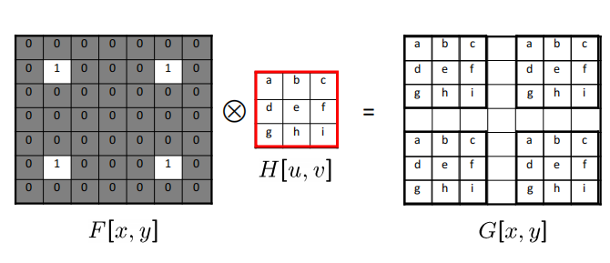

$F(X,Y)$是清晰的图像，$H(U,V)$是卷积核，与F卷积后得到模糊的图像$G(X,Y)$。

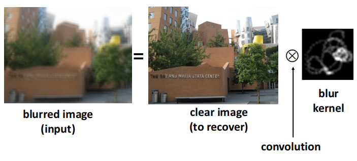

因此我们要解决的问题就是去卷积。

根据是否知道卷积核分成两种情况：

### Non-blind image deconvolution(NBID):

任务定义：给定模糊的图像和卷积核，求解原图。

对于解决的方法，一个很直观的类比，如果是乘法，那么我们只需要做一个除法便可以还原。这样就很自然想到将图像做个傅里叶变换（实域上的卷积等于频域上的乘积）。

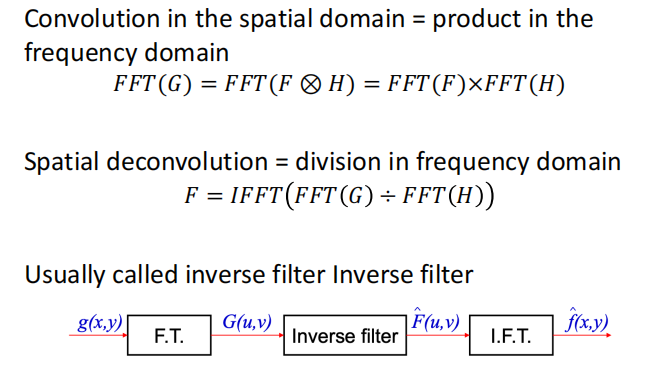

但是有一个问题，卷积核$H(u,v)$一般是一个低通滤波器，因此我们在去卷积的过程中，相当于乘上$\frac{1}{H(u,v)}$，即乘上一个高通滤波器。所以去卷积我们是在放大高频信息，但与此同时也会相应放大高频噪声。

解决这一问题的方法就是调整卷积核。即做inverse fliter的同时抑制高频噪声。(**Wiener Fliter**)

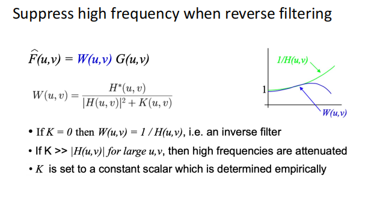

### Deconvolution by optimization

我们还可以用优化的方法来解决去模糊问题。

优化变量：清晰的图片；目标函数：清晰图像过卷积后与给定的模糊图像后的差别。用每个像素值差别的平方和来衡量。

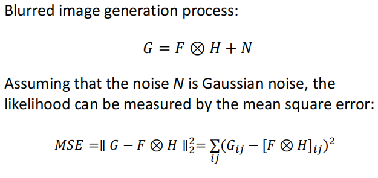

但是使用优化来求解可能使该问题变为ill-posed.(可能存在无穷多个解)。

这时候我们就需要一些先验信息(解的约束条件)来解决ill-posed问题。

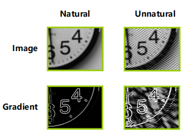

如上图所示，两张图片都是我们优化问题的解，但是显然左边那张图更符合实际情况，因为它的梯度图是比较稀疏的。我们就可以将稀疏的梯度图作为先验条件，回顾lec4的内容，我们在优化函数上加一个$L_1$正则项即可。

$$
\mathop{min}_F \Vert G-F\otimes H\Vert_2^2+\Vert\nabla F\Vert_1
$$

### Blind Image Deconvolution(BID)

现在我们不知道卷积核是什么，这时候我们不能用逆向滤波求解，只能用优化的方式做，此时卷积核也成了优化的目标。

我们希望卷积核也是稀疏并且非负的。所以目标函数：

$$
\mathop{min}_{F,H}\Vert G-F\otimes H\Vert_2^2+\lambda_1\Vert\nabla F\Vert_1+\lambda_2\Vert H\Vert_1 \, s.t.H\ge 0
$$

## Colorization

我们希望把黑白的图像转化成彩色图像。我们必须告诉算法我们想要什么样的颜色。

### Sample-based colorization

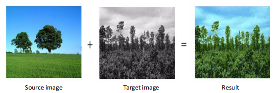

source image就称为样本图像。我们想要把样本图像的颜色迁移到中间的target image上。

做法是，对于每一个像素，在样本图像中找到最佳的匹配点(亮度和梯度)。然后根据匹配点填充像素值。

### Interactive colorization

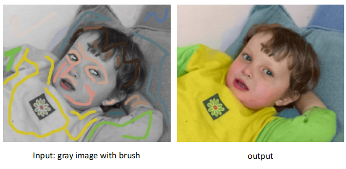

该方法是让用户在每个区域给定颜色，算法将该区域的颜色补全。

我们使用优化的方法求解。

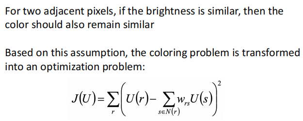

- $U(r),U(s)$: RGB values of pixel r,s.

- $N(r)$: neighborhood pixels of pixel $r$.
- $w_{rs}$: Weight that measures similarity between $r,s$.

### Generative Adversarial Network(GAN)

对于生成式问题，采用传统神经网络的固定损失函数是不合理的。因为对于一个灰度图进行上色，解不是唯一的。

GAN并不自己定义损失函数，而又借助了一个神经网络(classifer)来判断第一个网络生成的图片的质量。

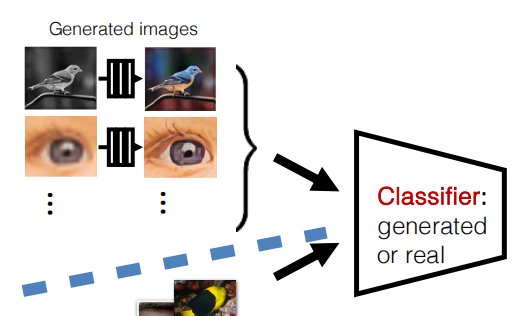

如下图所示，两个神经网络分别为生成器$G$和判别器$D$。

- $G$ tries to synthesize fake images that fool $D$.
- $D$ tries to identify the fakes.

对于$D$而言，它的损失函数：

$$
\arg \max_D E_{x,y}[\log D(G(x))+\log (1-D(y))]
$$

对于$G$而言，它的损失函数：
$$
\arg\min_G E_{x,y}[\log D(G(x))+\log (1-D(y))]
$$
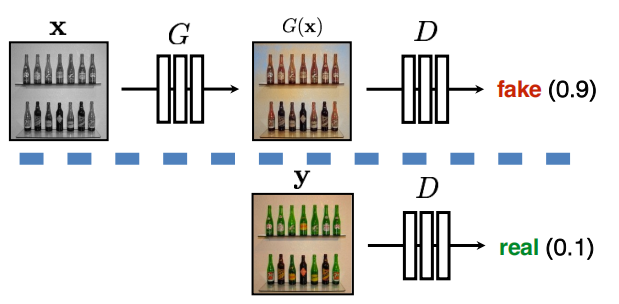

同时训练两个网络的方法：
$$
\arg\min_G\max_D E_{x,y}[\log D(G(x))+\log (1-D(y))]
$$
**G tries to synthesize fake images that fool the best D**

D can be viewed as a loss function to train G:

- called adversarial loss
- learned instead of being hand-designed
- can be applied to any image synthesis tasks

## Super Resolution

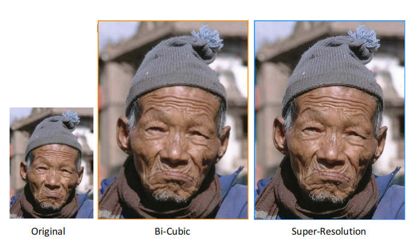

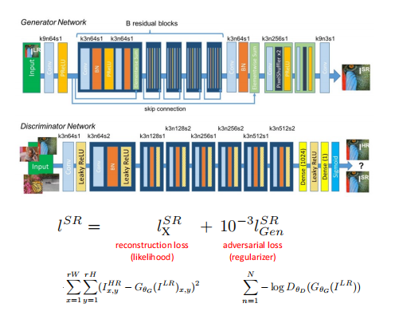

