# Lec 3 : Image Processing

!!! note

    该部分笔记不是很完整。

## Image processing basics

### Increasing Contrast
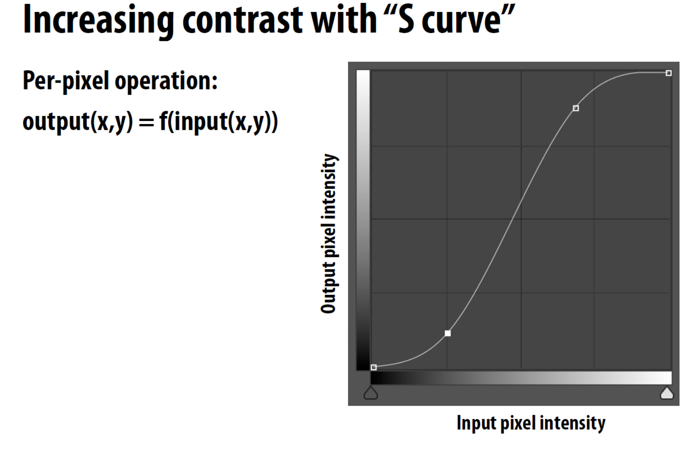

- 模糊，锐化，边缘提取

### convolution

$$
(f*g)(x)=\int_{-\infty}^{\infty}f(y)g(x-y)dy
$$

#### Discrete 2D convolution

$$
(f*g)(x,y)=\sum_{i,j=-\infty}^{\infty}f(i,j)I(x-i,y-j)
$$
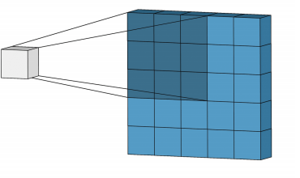

#### Padding

如果没有padding的话，那么我们经过卷积操作之后得到的图像size会变小，为了得到大小相同的图像，我们选择在图像周围进行padding。

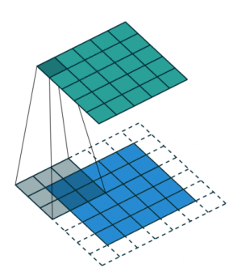

### Guassian blur

- Obtain filter coefficients by sampling 2D Gaussian function $f(i,j)=\frac{1}{2\pi\sigma^2}e^{-\frac{i^2+j^2}{2\sigma^2}}$

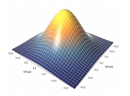

### Sharpening

锐化操作就是往图像里添加高频信息

- Let $I$ be the original image
- High frequencies in image $I=I-blur(I)$
- Sharpened image = $I+(I-blur(I))$

### Bilateral filter

**removing noise while preserving image edges**

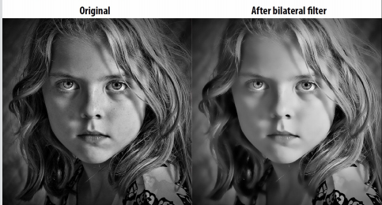

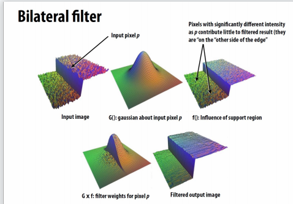

## Image sampling

采样就是给定一个连续的函数，在不同的点求它的值，也可以认为，采样是把一个连续的函数离散化的过程。

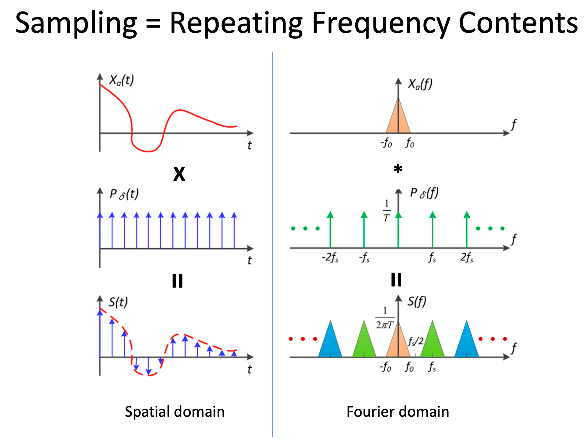

Image resizing: change image size/resolution.

Reducing image size -> down-sampling

但是我们在采样时有可能发生**反走样/锯齿**现象：

> alias
> 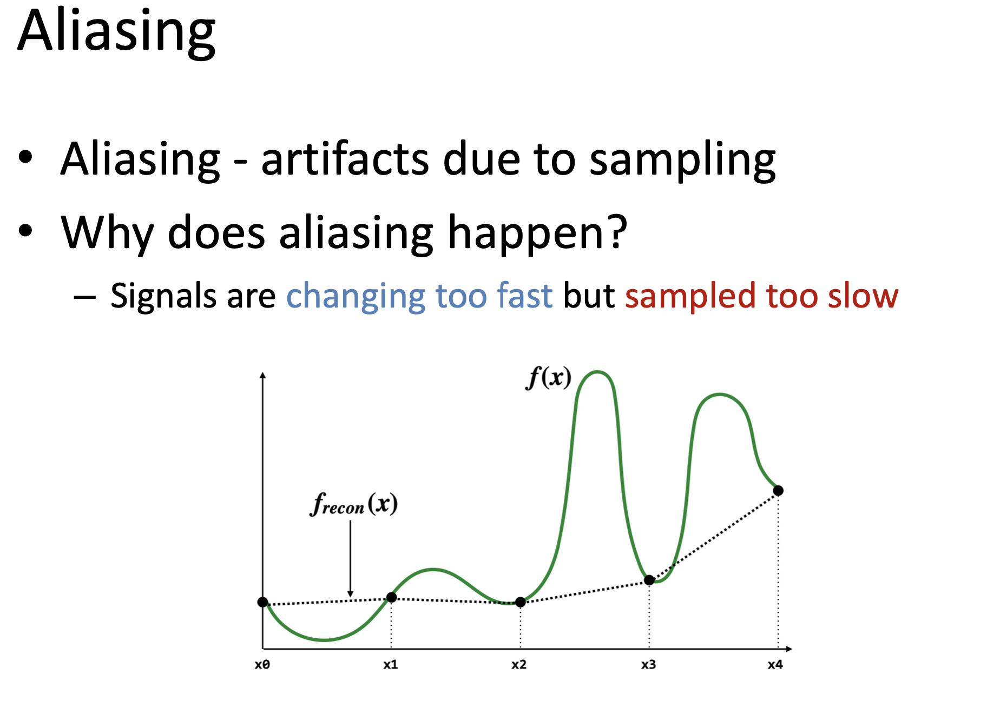

原因可能是：

- 像素本身有一定大小
- 采样的速度跟不上信号变化的速度（高频信号采样不足）

### Fourier Transform

傅里叶变换可以将信号分解为频率，并且能将满足一定条件的某个函数表示成三角函数（正弦和/或余弦函数）或者它们的积分的线性组合。

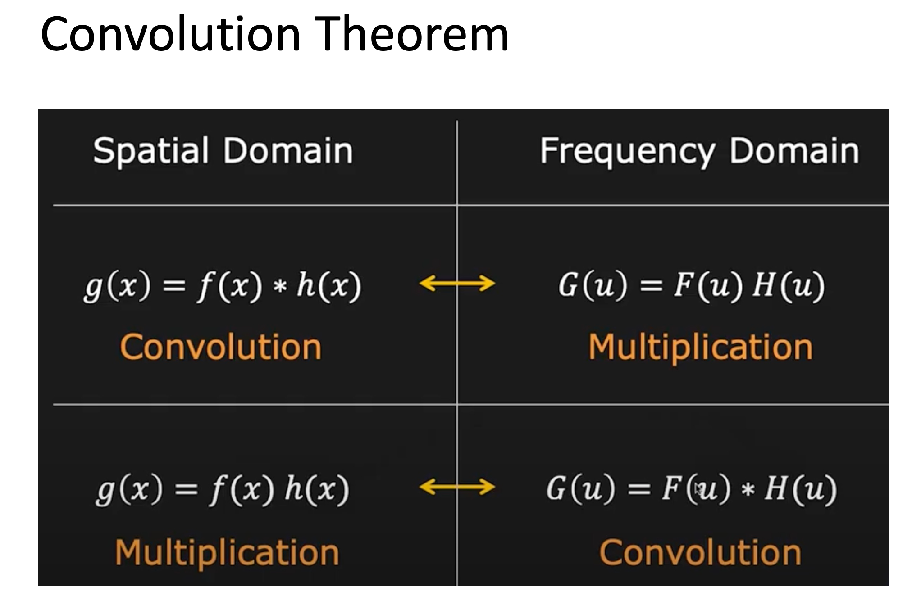
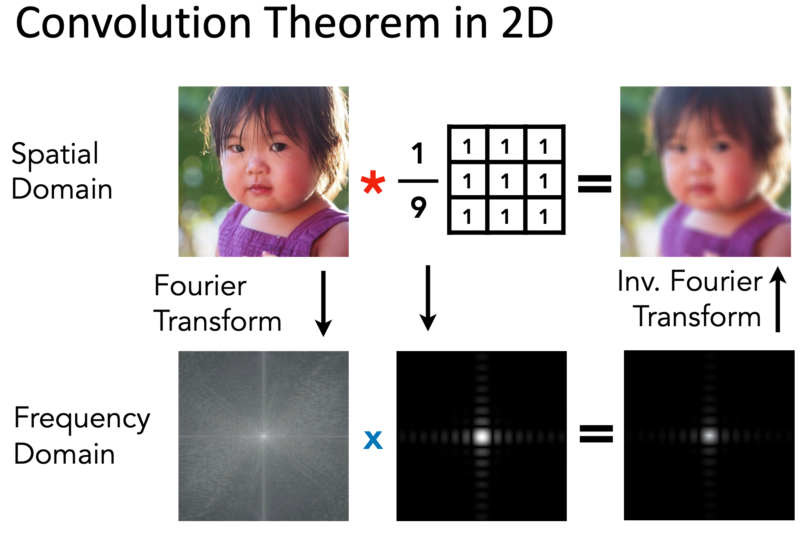

> We can also use Fourier Transform to analyze the frequency content of an image and fix the aliasing problem.
> 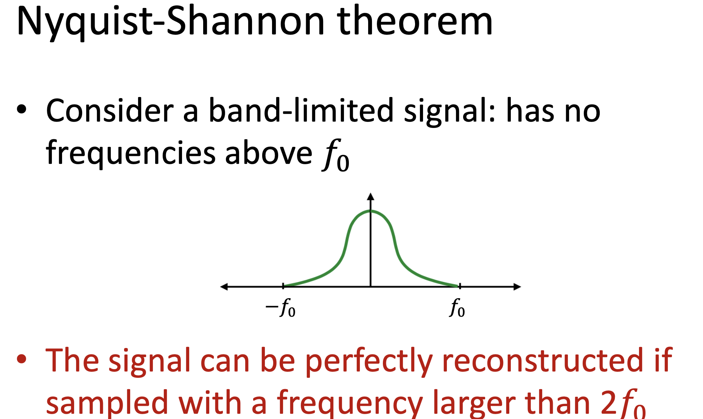
> 
> 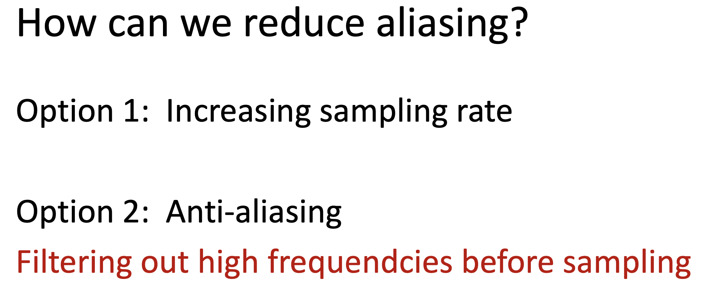
>
> 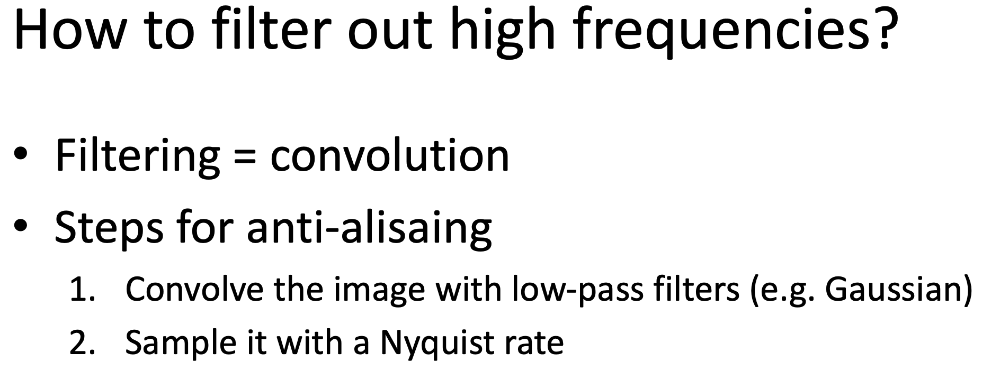

## Image magnification
> 这里主要介绍插值的各种技巧；个人认为如果你熟练使用matplotlib的话，这部分内容应该不会有太大的困难。

### Interpolation

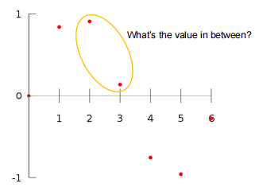

#### Nearest-neighbor interpolation

- Not continuous
- Not smooth(光滑函数：几阶导连续就称该函数几阶光滑)

#### Linear interpolation

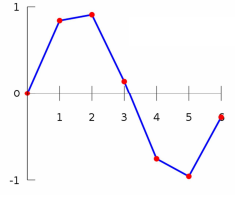

#### Cubic interpolation

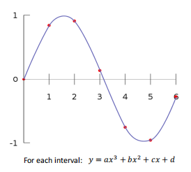

**For each interval**: 并不是对整体进行拟合，而是每两点首先拟合线性函数，非线性项的引入是为了使曲线光滑

#### Bilinear Interpolation
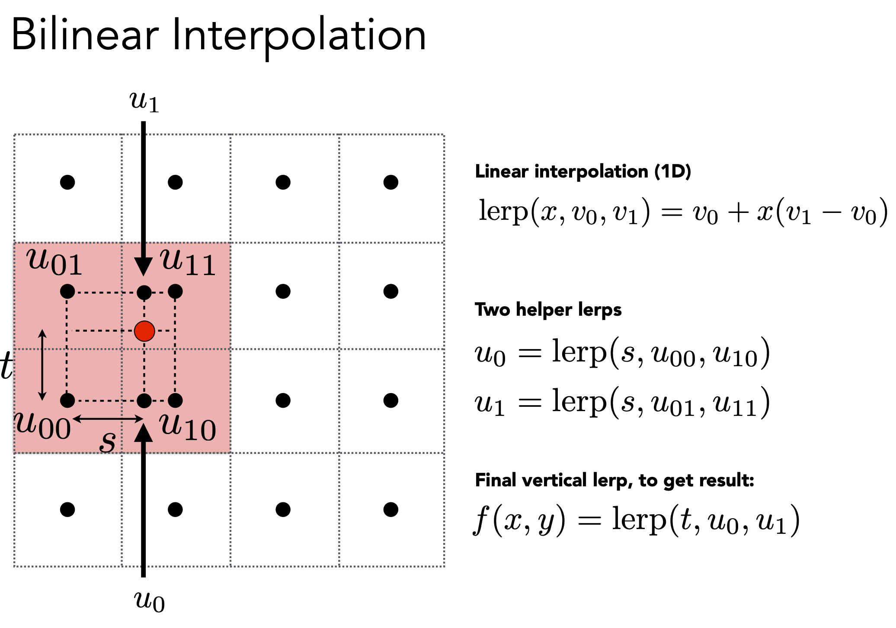

### Super resolution
> 超分辨率技术，现在几乎都是基于深度学习的方法