# Image Matching and Motion Estimation

## Image matching

**Finding point-to-point correspondences between two images**

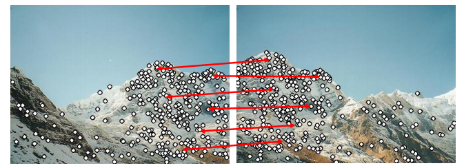

**Main Components of Feature matching**

- Detection: identify the interest points
- Description: extract vector feature descriptor surrounding each interest point
- Matching: determine correspondence between descriptors in two views

### Detection

#### Feature points

特征点需要满足独特性（至少要在局部唯一）

那么我们首先的问题就是如何衡量一个点的独特性.

考虑一个小的像素窗口,如下图所示，当我们向任意一个方向移动该窗口，都会造成较大变化时，我们认为该点是uniqueness

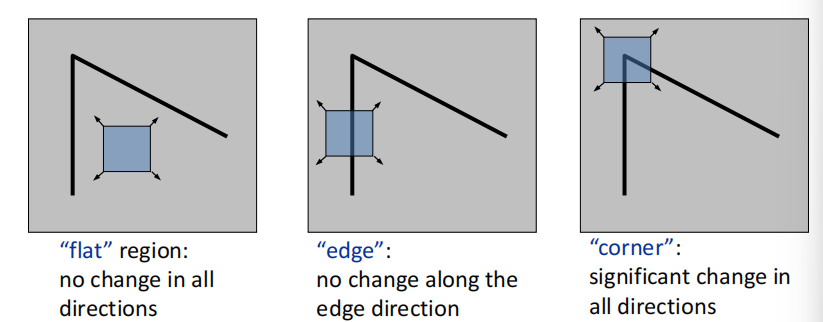

在数学上，我们可以用梯度分布来衡量该变化

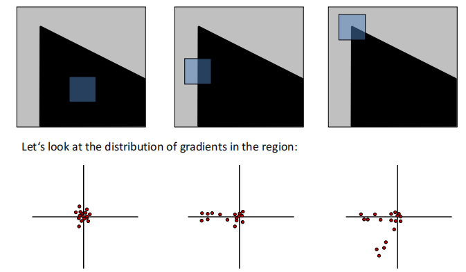

根据上图我们可以大致观察到图像的特征，即存在多少个edge及其变化的方向（即梯度方向），更进一步，我们使用**主成分分析（PCA）**的方法进行计算

- The 1st principal component is the direction with highest variance
- The 2nd principal component is the direction with highest variance which is *orthogonal* to the previous components.

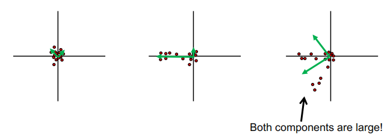

图中绿色箭头所指的方向即协方差矩阵两个特征向量的方向，长度即特征值的大小。可以看到，我们想要的是两个主成分大小都很大的区域。具体计算过程如下：

- Compute the covariance matrix at each point

$$
H=\sum_{(u,v)}w(u,v)\begin{bmatrix}I_x^2&I_xI_y\\I_xI_y&I_y^2\end{bmatrix}\\I_x=\frac{\partial f}{\partial x},I_y=\frac{\partial f}{\partial y}
$$

- Compute eigenvalues

$$
H=\begin{bmatrix}a&b\\c&d\end{bmatrix}
$$

$$
\lambda_{\pm}=\frac{1}{2}((a+d))\pm \sqrt{4bc+(a-d)^2}
$$

- Classify points using eigenvalues of $H$:

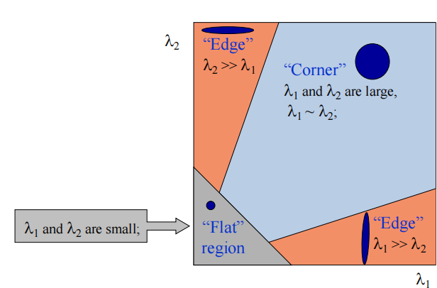

为了更方便计算，我们引入哈里斯算子(Harris operator):
$$
f=\frac{\lambda_1\lambda_2}{\lambda_1+\lambda_2}=\frac{determinant(H)}{tr(H)}
$$
注意到只有满足$\lambda_1,\lambda_2$都很大时函数值才不为零，$f$ 被称作corner response.

#### Summary: Harris detector

- Compute derivatives at each pixel
- Computer matrix $H$ in a Gaussian window around each pixel
- Compute corner response $f$
- Threshold $f$（阈值过滤）
- Find local maxima of response function 

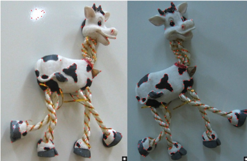

除了独特性之外，我们还希望特征点在图像变换（下图是常见的变换，包括光学变换和几何变换）中保持不变。比如说对于上图，我们希望左右两张图片检测到的特征点相同。

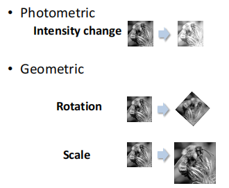

**Harris detector: Invariance properties**

首先对于光学变换，对于常数项 $b$, 我们在求导时会将其消掉，但是intensity scaling $a$ 无法消掉，所以Harris detector is partially invariant to affine intensity change.

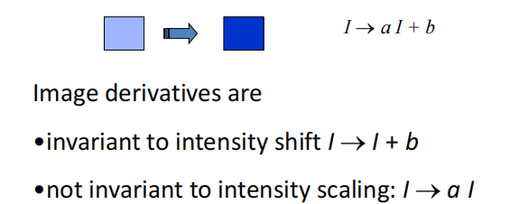

比较显然的是几何变换中的平移与旋转变换，由于几何结构保持不变，我们计算的协方差矩阵也不会变化，因此Corner response is invariant w.r.t image translation and rotation.

但是对于图像放缩来说，角点响应函数的值是会变的，下图是一个直观的例子，在左侧图的区域识别为角点，但是在右侧图识别为边缘

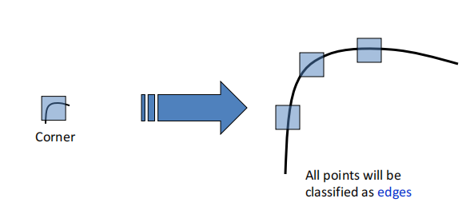

这就是我们需要解决的问题：如何在经过一定变换后的图像中找到合适的scale（或者窗口大小）呢？

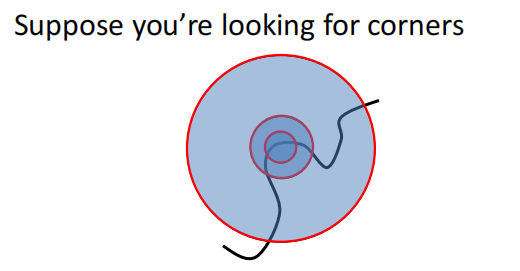

注意到我们的目标是特征点匹配，那么理想的结果就是两张图相同的feature point对应的corner response应该相同。

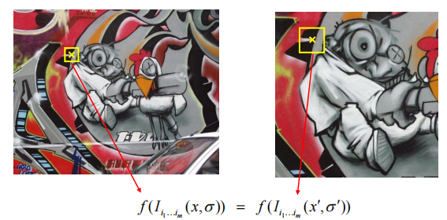

所以我们考虑不同大小的window size, 取得对应的corner response值，将其绘制成图像，曲线的峰值（即特征最明显的区域）即为当前图片应该取的scale。

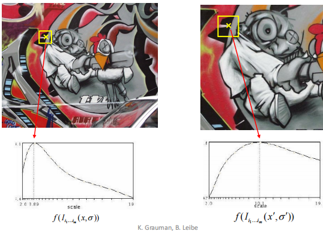

但是在实际应用中，instead of 改变window size，我们一般固定住窗口大小，而去改变图像的大小，形成一个图像金字塔(**image pyramid**), 二者效果上是等价的。

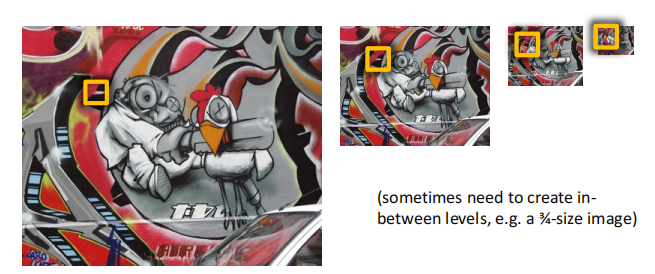

#### Blob detector

Blobs are good fearues, but how to find them?

由于斑点的局部性质(即在一个小区域内，且一般是闭合的)，所以斑点区域在像素上具有比较大的二阶导。所以我们的步骤是计算图像的拉普拉斯，然后找到局部最大与最小值。

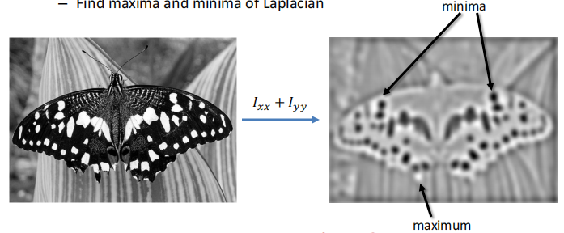

而对于计算经拉普拉斯变换后得到的图像，我们使用滤波器来实现。

- Laplacian operator:

$$
\nabla^2=\frac{\partial^2}{\partial x^2}+\frac{\partial^2}{\partial y^2}
$$

- Compute image derivatives by filtering:

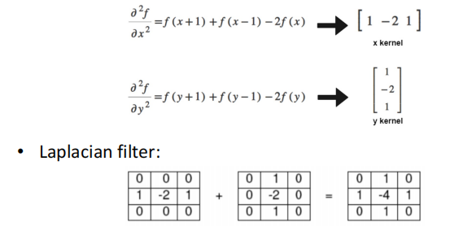

**Laplacian of Gaussian Filter**

由于Laplacian对噪声比较敏感(实际上求导这种运算对噪声都很敏感，它计算的是区域像素的变化率，更何况二阶导)， 所以我们通常使用**Laplacian of Gaussian(LoG) filter** 进行处理，即首先对图片作高斯模糊，再计算拉普拉斯算子：

$$
\nabla^2(f*g)=f*\nabla^2g
$$

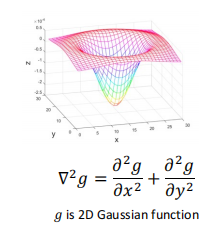

需要注意的是，The scale of LoG 是由高斯分布的方差$\sigma$控制的，可以想象一下当 $\sigma$ 比较大时，高斯核整体分布就比较宽，对应的scale也变大，反之亦然。

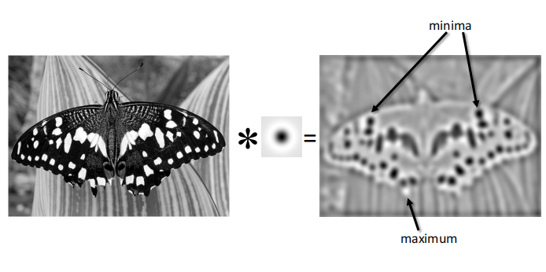

而在这里我们可以产生对滤波器更直观的认识。原图像与滤波器进行卷积之后，得到结果中比较清晰的是和卷积核长得比较像的像素区域，而差别比较大的则被模糊处理。LoG的visualization与斑点极其相似，因此它可以用来进行blob detection.

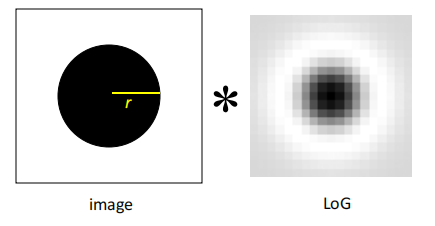

对于scale的选择，我们可以采用类似Harris detector的方法，只不过这里我们放缩的是LoG的$\sigma$ 

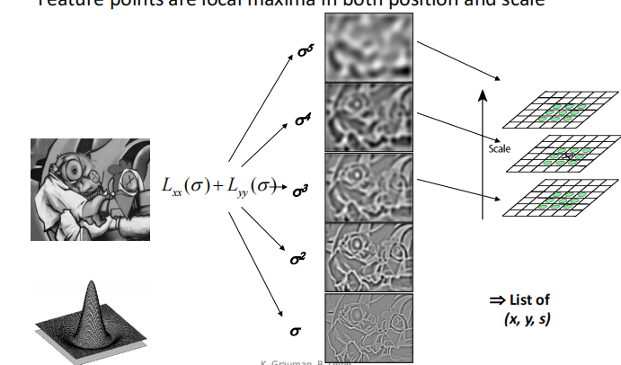

**Difference of Gaussian(DoG)**

- Filter the image with two Gaussians
- Compute the difference of two filtered images

LoG可以由两个相邻$\sigma$的Guassian进行近似

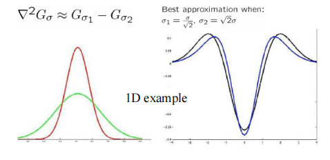

之所以引入DoG, 是因为我们在使用LoG处理图像时也是要进行Guassian滤波的，直接将滤波后的相邻两个图像相减效率会更高。

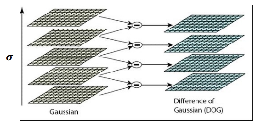

#### Summary of detection

- What is a good feature point?
    - unique
    - invariant to transformations
- Popular detecors
    - Harris corner detector
    - Blob detector(LoG,DoG)

### Description

We know how to detect good points.

Next question: *How to match them?*

Answer:  **Extract a descriptor for each point, find similar descriptors between the two images**(构建一个描述子)

**Patches with similar content should have similar descriptors**

首先很容易想到的就是将像素值拉长，作为一个特征向量。But this is very sensitive(i.e.,not invariant) to even small shifts, rotations.

#### SIFT(Scale Invariant Feature Transform)
> 一个非常自然的想法

SIFT 使用patch的**梯度分布**(梯度向量的方向分布)作为描述子。该方向必然是位于$[0,2\pi]$之间，因此SIFT构建一个直方图，来统计在每个区间（例如十等分）有多少个像素。$[0,2\pi]$等分个数即为描述子的维度。

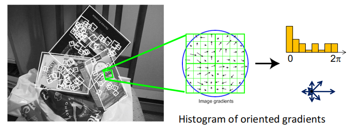

此时对于图像的平移显然不会有影响，但我们考虑旋转和scale。

旋转会改变梯度向量的方向，导致直方图循环平移。但这个情况很好处理：我们可以选中最大的分量放在第一个，使整个直方图平移对齐，称作直方图的归一化(朝向归一化)

对于scaling来说，SIFT的名字scaling invariant 可能会有些误导。但很显然地，SIFT本身描述子是not invariant to scaling的(缩放后区域内的向量个数都发生变化了呀)，但其实SIFT是经过DoG处理过的，即在检测阶段已经确定了scale的大小(最佳的$\sigma$)，所以我们在提取描述子时就不用考虑scale的影响了。

**Properties of SIFT**

Extraodinarily robust matching technique

- Can handle changes in viewpoint
- Can handle significant changes in illumination
- Fast and efficient-can run in real time

**Summary: SIFT algorithm**

- Run DoG detector: find maxima in location/scale space
- Find dominate orientation
- For each (x,y,orientation), create descriptor

### Matching

现在我们找到了特征点，并且有了特征点的描述方法(描述子),现在我们要做的就是将对应的特征点匹配起来,简单的思路就是计算两个描述子向量之间的距离,并与最小的匹配.

但是当两张图有很相似的区域时，这种方法会造成有歧义的匹配，如下图所示

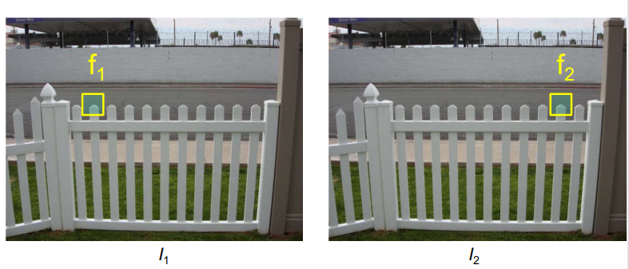

我们有两种解决方法:

#### Ratio test

我们定义 ratio score:
$$
\frac{\Vert f_1-f_2\Vert}{\Vert f_1-f_2^{'}\Vert}
$$

其中$f_2$是$f_1$的bset match, $f_2^{'}$是second best match

容易得知,当匹配正确时,ratio score会比较小, 反之,ambigous matches have large ratioi scores.

#### Mutual nearest neighbour

**find mutual nearest neighbours**
如果匹配正确的话,我们对$f_2$寻找最佳匹配，那么应该也是$f_1$.

- $f_1$ is the nearest neighbour of $f_2$ in $I_1$
- $f_2$ is the nearest neighbour of $f_1$ in $I_2$

#### Deep learning for feature matching

表现得比传统方法好很多

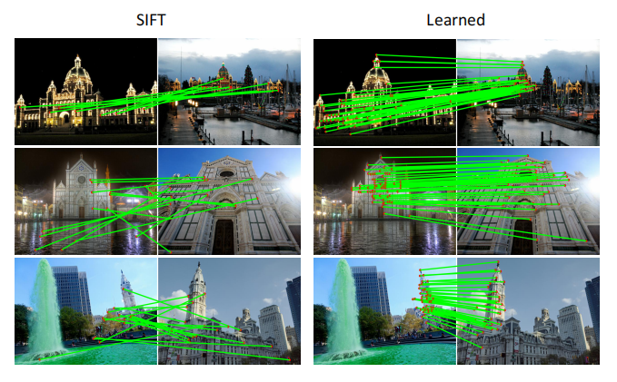

## Motion Estimation

**The cause of motion**
- Static camera, moving scene
- Moving cameera, static scene
- Moving camera, moving scene
- Static camera, moving scene, moving light

**Motion estimation problems**
- Feature tracking
    - Extract featur points and track them over multiple frames.(即给出两帧画面，估计特征点的运动方向)
    - Output: displacement of sparse points
- Optical flow
    - Recover image motion at each pixel
    - Output: dense displacement field

二者的主要区别在于feature tracking输出是离散的,仅限于某些特征点;而optical flow输出是连续的,估计的是整张图片

但二者使用的方法都是一样的： **Lucas-Kanade method**

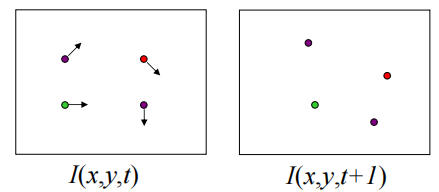

LK算法的三个主要假设:

- small motion: points do not move very far
- brightness constancy: same point looks the same in every frame
- spatial coherence: points move like their neighbours

基于上述三个假设，我们可以得到以下的方程：

- Brightness Constancy Equation:

$$
I(x,y,t)=I(x+u,y+v,t+1)
$$

- Taylor expansion assuming small motion:

$$
I(x+u,y+v,t+1) \approx I(x,y,t)+I_xu+I_yv+I_t\\
I(x+u,y+v,t+1)-I(x,y,t)=I_xu+I_yv+I_t\\
I_x\cdot u+I_y\cdot v+I_t \approx 0
$$

所以得到
$$
\nabla I\cdot \begin{bmatrix}u&v\end{bmatrix}^T+I_t=0
$$

我们有两个未知数，但是只有一个方程，这时候需要用到另一个假设： spatial coherence constraint:
- 在当前像素邻域的像素运动方向相同
- 所以如果我们使用$5\times 5$的窗口，那么可以得到25个方程!

$$
\begin{bmatrix}I_x(p_1)&I_y(p_1)\\\vdots&\vdots\\ I_x(p_{25})&I_y(p_{25})\end{bmatrix}=-\begin{bmatrix}I_t(p_1)\\ \vdots\\ I_t(p_{25})\end{bmatrix}
$$

这时候我们就可以使用最小二乘法求解 $\mathop{min}_d \Vert Ad-b\Vert^2$,得到$(A^TA)d=A^Tb$,即
$$
\begin{bmatrix}\sum I_xI_x&\sum I_xI_y\\
\sum I_xI_y&\sum I_yI_y \end{bmatrix}\begin{bmatrix}u\\
v\end{bmatrix}=-\begin{bmatrix}\sum I_xI_t\\
\sum I_yI_t\end{bmatrix}
$$

当$A^TA$可逆且两个特征值不能太小的时候,该方程有解,这个条件和之前介绍的Harris corner detector 的条件是一样的!

!!! Example "不能预测运动的情况"

    - Low Texture Region: gradients have small magnitude

    - Edge: Large $\lambda_1$, small $\lambda_2$,只能估计一个方向的运动。(analogy:aperture problem)

但是如果实际情况不符合上述三个假设时,LK算法就会出现问题

对于不满足small motion的情况(比如说特征点实际上移动了八个像素)，我们有方法可以解决

一个直观的想法就是将图片缩小到原来的八分之一,在缩小后的图片中处理之后再放大回去.但是该方法的缺点就是在缩小图片的过程中会丢失信息，这样图像移动距离的精度就无法保证。

一个想法就是使用像素金字塔。其中金字塔一是时间为$t$时的图像,金字塔二是时间为$t+1$时的图像。在金字塔上逐层估计,并逐步细化。例如先估计运动距离小于一个像素的最上层图像，根据此估计在金字塔一中的第二层恢复出运动，再与金字塔二进行比较，此时特征点移动的距离经过较为准确的估计后也小于一个像素，以此类推。

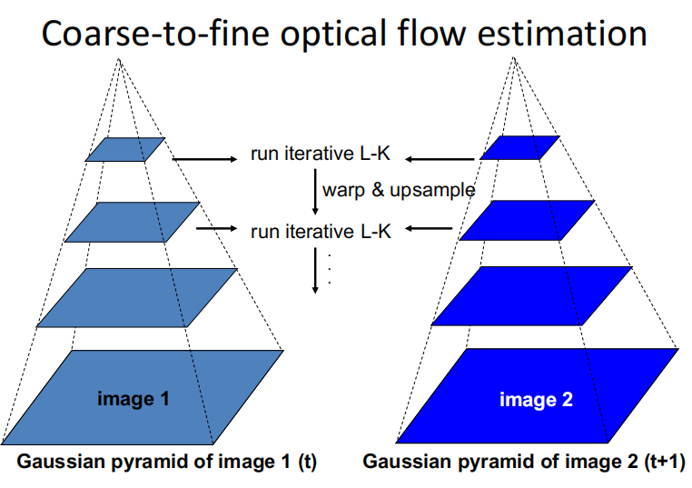

**Applications**

- Video stablization

- Video denoising