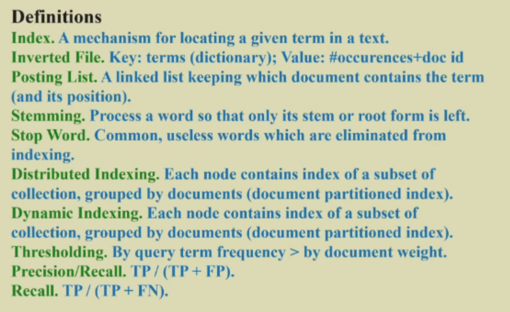
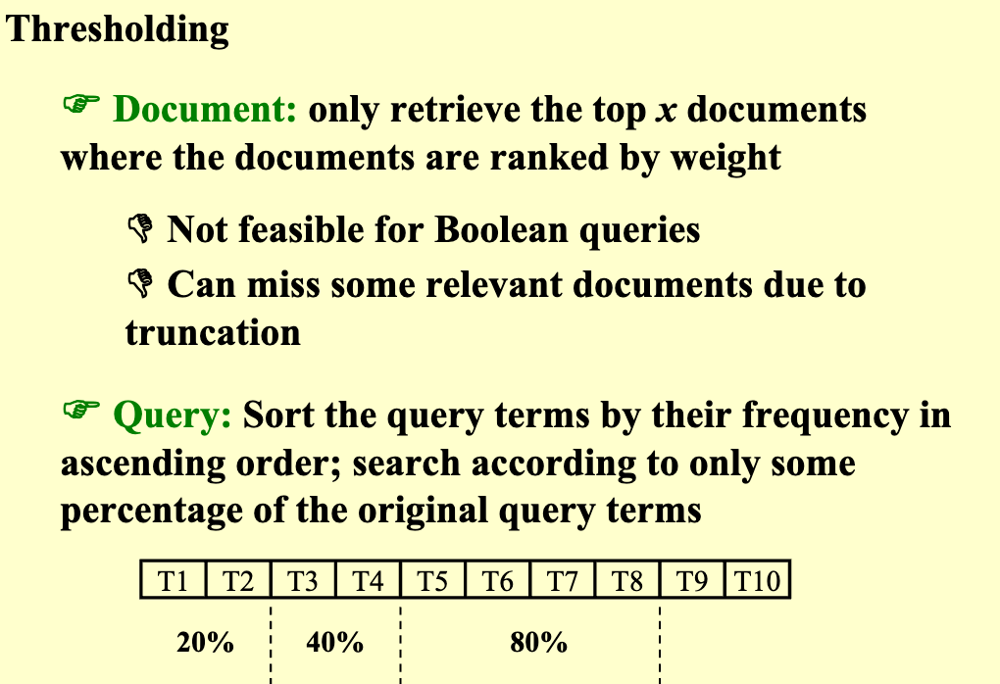
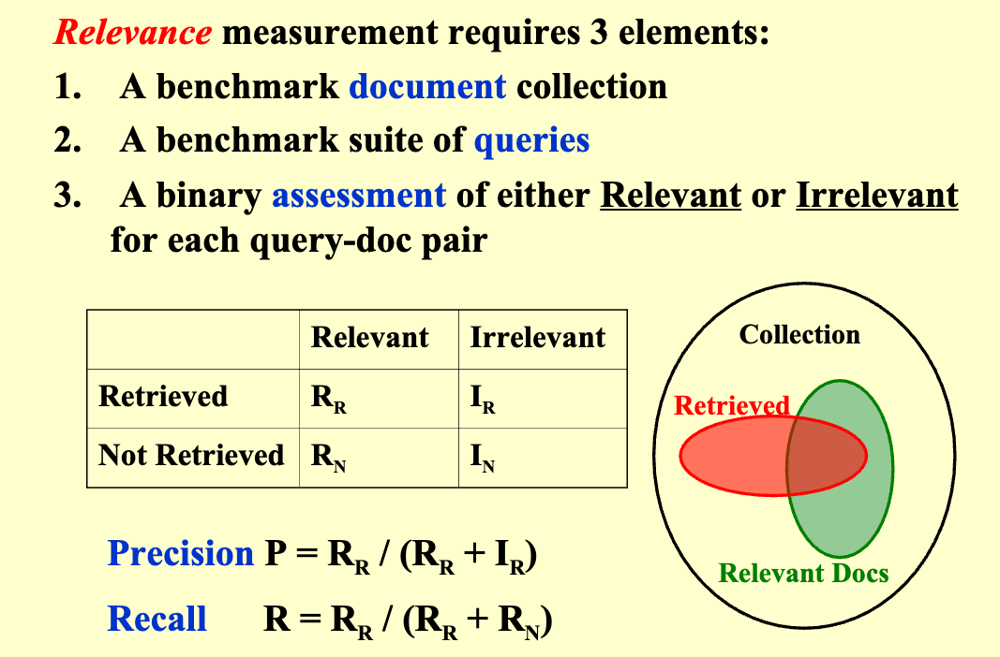

# Lecture 3 | Inverted File Index

## 倒排索引

> 倒排索引（inverted file index）是一种常见的文本检索技术，用于快速查找包含特定单词或短语的文档。它通过将单词或短语作为关键字，并将它们出现在文档中的位置记录在一个索引中，从而支持快速的文本检索。在搜索过程中，系统可以快速地定位包含指定单词或短语的文档，并返回它们的相关信息。倒排索引广泛应用于搜索引擎、数据库系统和信息检索等领域。
>  
> —— ChatGPT

!!! info link
    Wiki: https://en.wikipedia.org/wiki/Inverted_index

所谓的倒排索引，所有的思想都凝结在了“倒”，也就是 inverted。如果可以，我觉得用“逆”更合适。这里的索引对象指的是“文档”和“单词”之间的关系，而倒排索引的意思是，对于每一个单词，我们记录它出现在哪些文档中，以及记录他们出现的次数（频率）。

搜索引擎是一个非常常见的，倒排索引的应用案例，我们通过输入我们关注的词语，来索引包含这个词的所有文档。 当然，在这里我们考虑的是英文。

---

### 倒排索引的实现

知道了倒排索引的思想之后，其实现就变得非常直观了。我们可以用一个字典来描述一类关系，其主键为单词，键值为这个单词出现的所有位置。

最朴素的版本就是让键值为单词出现过的文档的序号序列，而如果我们还需要知道词汇出现的位置，则可以让键值是一个二元组的序列，其中第一个元素是文档的序号，第二个元素是单词在文档中出现的位置。

[TI/idF](https://zh.wikipedia.org/wiki/Tf-idf): 词频-逆文档频率

!!! eg "一个 🌰"
    
    例如我们有如下文件集：

    !!! summary "文档集"
        | Doc   | Text                                              |
        |:-----:|:--------------------------------------------------|
        | 1     | Gold silver truck                                 |
        | 2     | Shipment of gold damaged in a fire                |
        | 3     | Delivery of silver arrived in a silver truck      |
        | 4     | Shipment of gold arrived in a truck               |

    那么我们可以得到如下的倒排索引：

    !!! summary "倒排索引"
        | No.| Term       | Times; (Doc ID: Places) |
        |:--:|:-----------|:------------------------|
        | 1  | a          | {3; (2;6),(3;6),(4;6)}  |
        | 2  | arrived    | {2; (3;4),(4;4)}        |
        | 3  | damaged    | {1; (2;4)}              |
        | 4  | delivery   | {1; (3;1)}              |
        | 5  | fire       | {1; (2;7)}              |
        | 6  | gold       | {3; (1;1),(2;3),(4;3)}  |
        | 7  | of         | {3; (2;2),(3;2),(4;2)}  |
        | 8  | in         | {3; (2;5),(3;5),(4;5)}  |
        | 9  | shipment   | {2; (2;1),(4;1)}        |
        | 10 | silver     | {2; (1;2),(3;3,7)}      |
        | 11 | truck      | {3; (1;3),(3;8),(4;7)}  |

所以实际上非常简单，我们只需要扫描文档，然后存下每一个文件在哪里出现过即可。

---

### 改进

那么到此为止了吗？非也。倘若毫无节制的将所有词都存到倒排索引中，那么我们的倒排索引就会变得非常大，其中必然有很多冗余信息存在，所以我们需要对倒排索引进行一些改进。

---

#### 停用词

我们观察到，我们存下来的这些内容中，有一些东西频繁地出现在所有文档中，在特定情况下，这些词可能并不会成为一个索引，例如正常的英文文章中的 `a`，`the` 等。所以，对于这一类词——我们称之为**停用词(stop words)**，对于停用词，我们就不需要将他们存下了。

!!! question "哪些词会成为停用词？"

    一般一个词成为停用词，是因为它无法成为一个有效的检索关键字，它可能是在大量资料中大量出现，导致我们无法利用它找出我们想要的资料。换句话来说，一个共通点是它们**通常**都有着相当高的出现频率。

> 但是我们也不能盲目地将所有的词都作为停用词，因为有些词它在某些含义下适合作为一种停用词，但是在另一些含义下，它就不适合作为停用词了，不过这个问题就变得比较复杂了，所以这里并不展开。

---

### 字典存储
- B+树
- 哈希表
- tries tree https://www.digitalocean.com/community/tutorials/trie-data-structure-in-c-plus-plus

#### 词干分析

**词干分析(word stemming)**是一种将单词转换为其词干的技术。例如，词干分析可以将单词 `trouble`，`troubled`，`troubles`，`troubling` 都转换为 `trouble`（甚至是 `troubl`，核心目的是让它们变成同一个单词）。相同词干的词有着类似的含义，在检索 `troubled` 的时候，当然也可能想找到包含 `trouble` 的文档。这种技术也可以让多个单词共享同一条索引记录，在存和找的过程中都能优化效果。

不过在具体操作方面，这个东西就显得比较繁杂和暴力了，我们只能根据语法规范进行暴力匹配和判断，这里我们就不展开了。

---

### 分布式

可想而知，对于一个搜索引擎来说，它所需要索引的文料是非常庞大的，所以我们通常需要将其分布式地存储和索引。

而这里有两种分布式的策略，其一是根据单词的字典序进行分布式，其二是根据文档进行分布式。

显然根据单词的内容进行分布式，能够提高索引效率，但是这样的话，我们就需要将所有形式接近的单词都存储在一个地方，这样就会造成单点故障，容灾能力很差，所以这种方式并不是很好。

而第二种办法则有较强的容灾性能。即使一台机器无法工作，也不会剧烈影响到整个系统的工作。

---
## THreshold

请区分`document`和`Query`判准的区别

<!-- prettier-ignore-start -->
??? info "例题"
    
<!-- prettier-ignore-end -->
---

## 性能评估
<!-- prettier-ignore-start -->
!!! warning "必考！！！"
    这个计算必考一定要记住呀！！！
<!-- prettier-ignore-end -->

<!-- prettier-ignore-start -->
??? info "23mid"
    
<!-- prettier-ignore-end -->