# Fundamentals of Computer Design

## History and background

> 当多核出现时，每个核都有自己的pipeline，这时的指令冲突更为严峻。

memory也会按照分层结构进行设计，以减少访问时间。
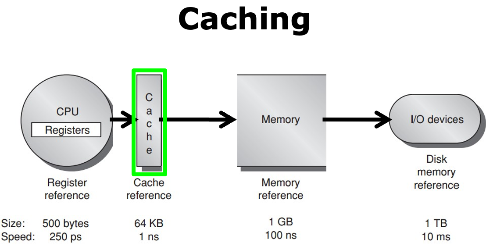

接下来讲解了cpu发展史，Moore law & Dennard scaling，以及cpu的性能指标。
<!-- prettier-ignore-start -->
??? info "Dennard scaling"
    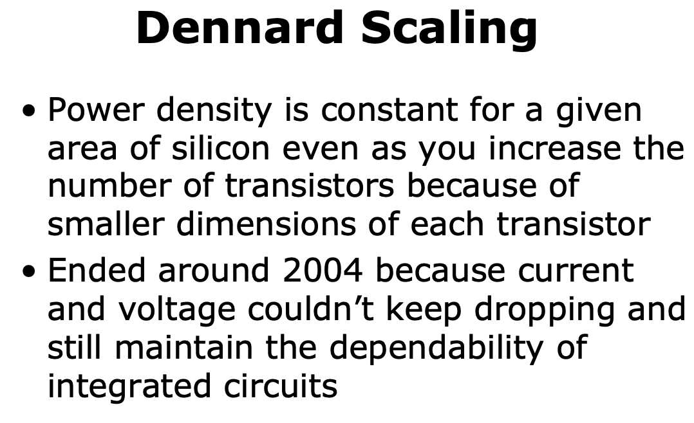
<!-- prettier-ignore-end -->

<!-- prettier-ignore-start -->
??? info "Amdahl's Law"
    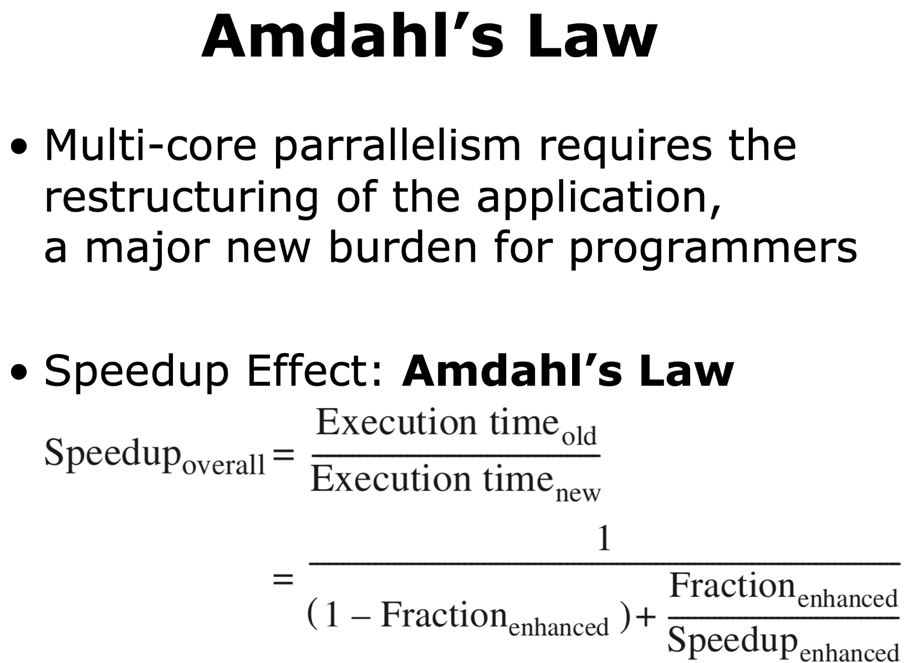
<!-- prettier-ignore-end -->

## What type of Computer?

- PMD: Personal Mobile Device
  > real-time performance: a maximum execution time for each application segment (牺牲性能但提高反应时间和predict的能力)
  
- Desktop
- Server
- Cluster/WSC (Warehouse-Scale Computer)
- Embedded/IoT computer

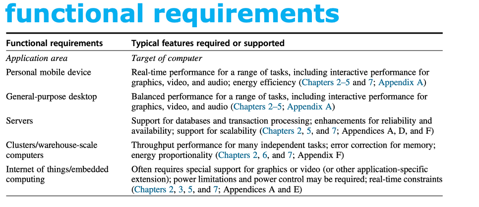

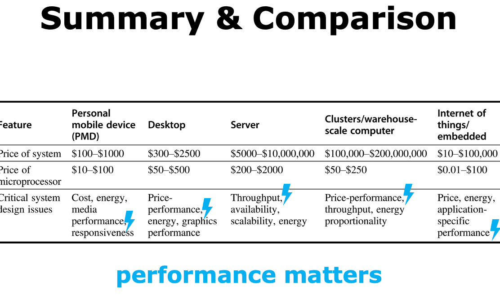

## What make the computer fast?
### Parrallelism
- application-level parallelism
- - DLP: Data-level parallelism > 
- - TLP: Task-level parallelism > 
- hardware-level parallelism (four ways) > 

### Class of parrallel architecture
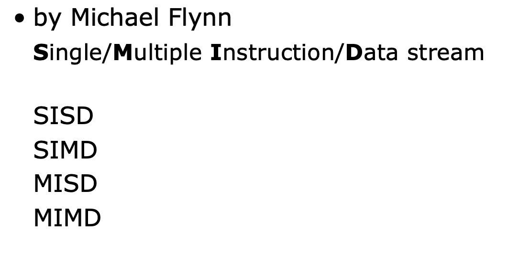
    

## What's computer architecture
### ISA (Instruction Set Architecture)
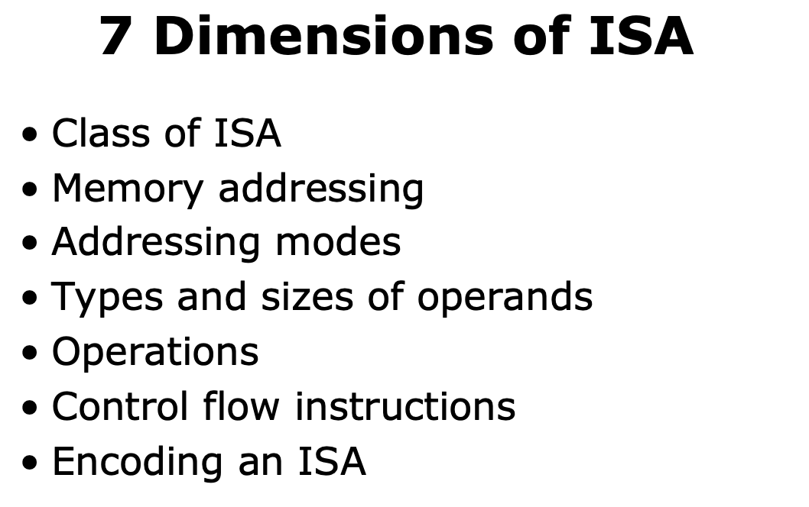

<!-- prettier-ignore-start -->
???+ note "why we need memory alignment"
    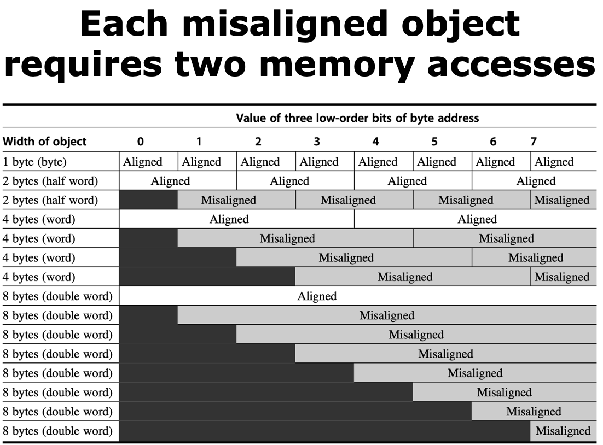
<!-- prettier-ignore-end -->

> Different Address Model and meaning
> 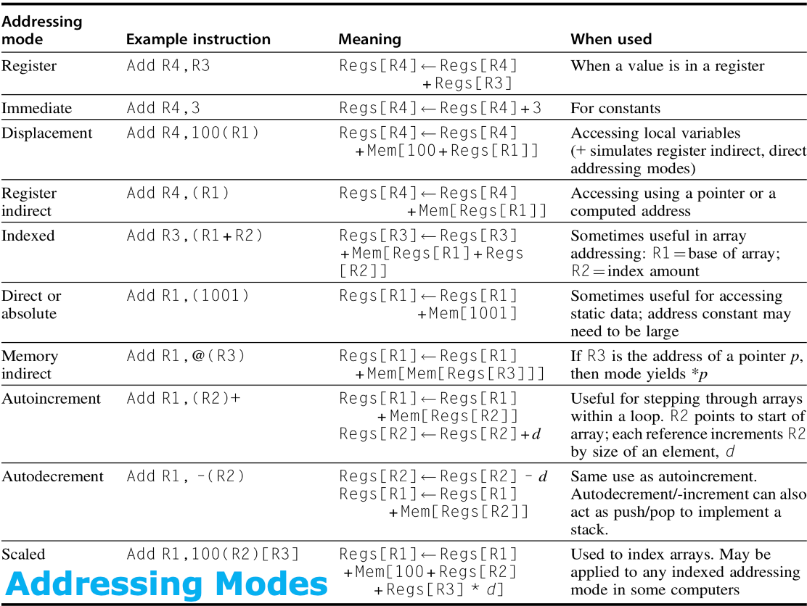

---

## Trends in Technology
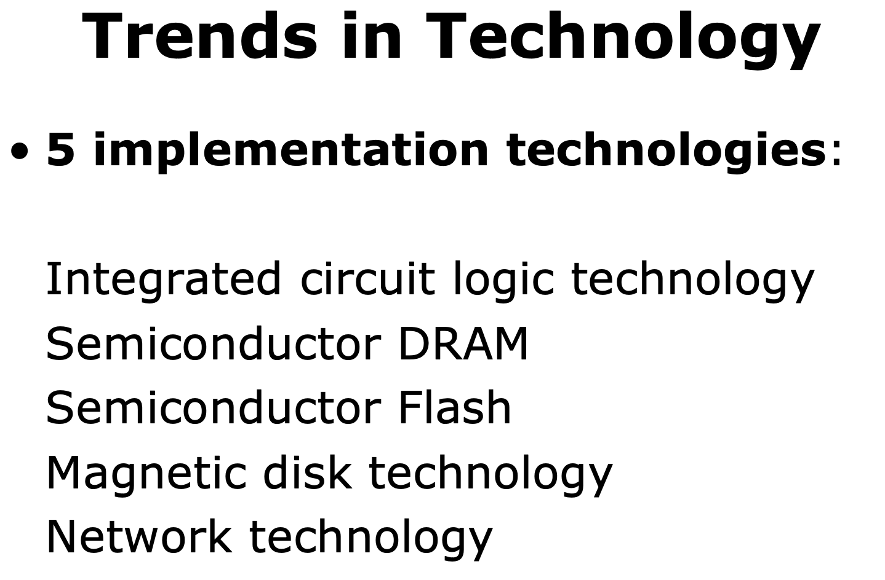

## Power and Energy
- 1 watt = 1 joule per second
- energy to execute a workload = avg power x execution time

### Power Consumption

<!-- prettier-ignore-start -->
??? info "Example"
    
<!-- prettier-ignore-end -->

### How to economize energy?
- do nothing!!!
- **DVFS **(Dynamic Voltage and Frequency Scaling)
- design for typical case
- Proportional(相应，对应) to the number of devices

## Cost
- time
- volume
- commoditization

> 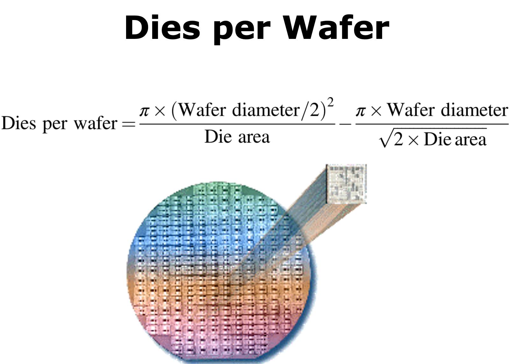

### How to measure dependability
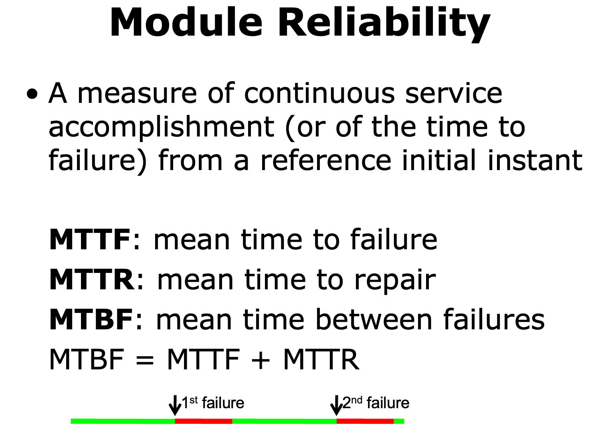
$$
\text{Module availability} = \frac{\text{MTTF}}{\text{MTTF} + \text{MTTR}}
$$

### RAID
RAID: redundant array of inexpensive/independent disks（磁盘冗余阵列）
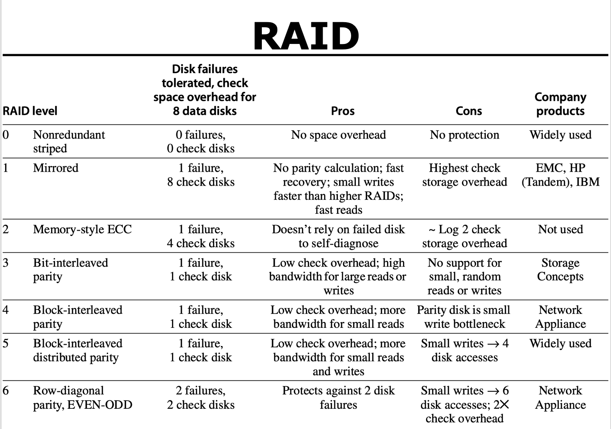
- RAID 0: just a bunch of disks(JBOD or stripe)
- RAID 1: mirroring or shadowing
- RAID 2: http://www.acnc.com/raidedu/2 
- RAID 3: byte-level striping with dedicated parity http://www.acnc.com/raidedu/2 

<!-- prettier-ignore-start -->
??? info "Further reading"
    https://www.youtube.com/watch?v=jgO09opx56o 
<!-- prettier-ignore-end -->

### Measure Performance

<!-- prettier-ignore-start -->
???+ note "SPEC"
    [SPEC CPU2017](https://www.spec.org/cpu2017/)
    20 SPECspeed benchmarks                  
    23 SPECrate benchmarks
<!-- prettier-ignore-end -->

例子：

### Quantitative Principles of Computer Design
- Amdahl's Law: performance improvement to be gained from using some faster mode of execution is limited by the fraction of the time the faster mode can be used
- spatial locality
- temporal locality

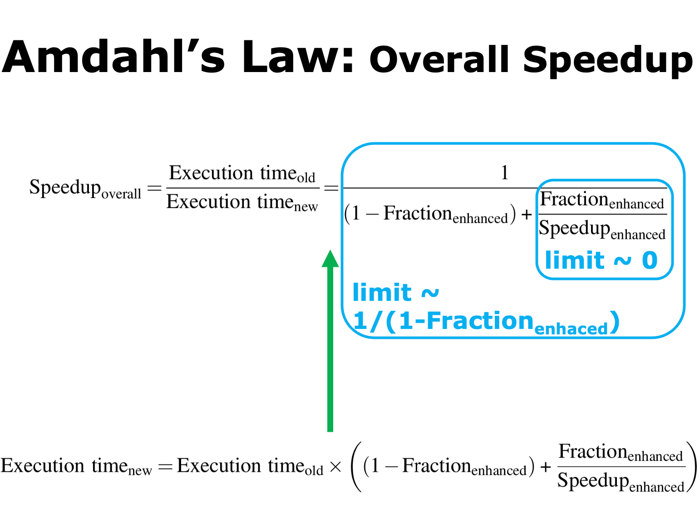