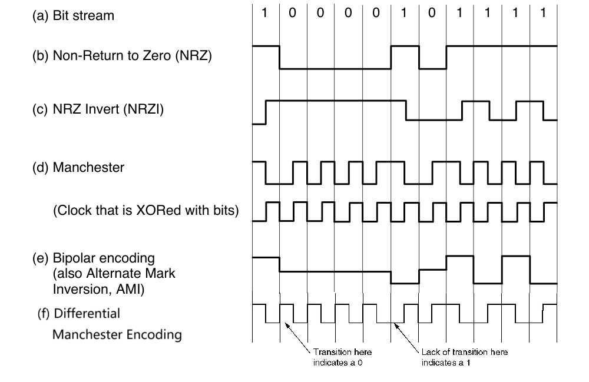
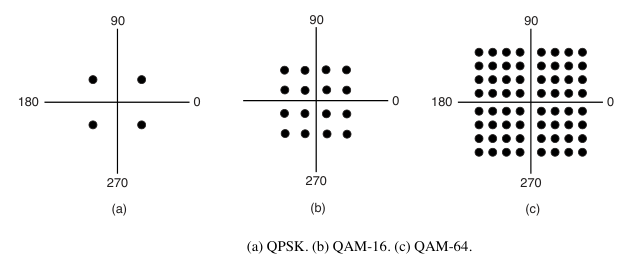
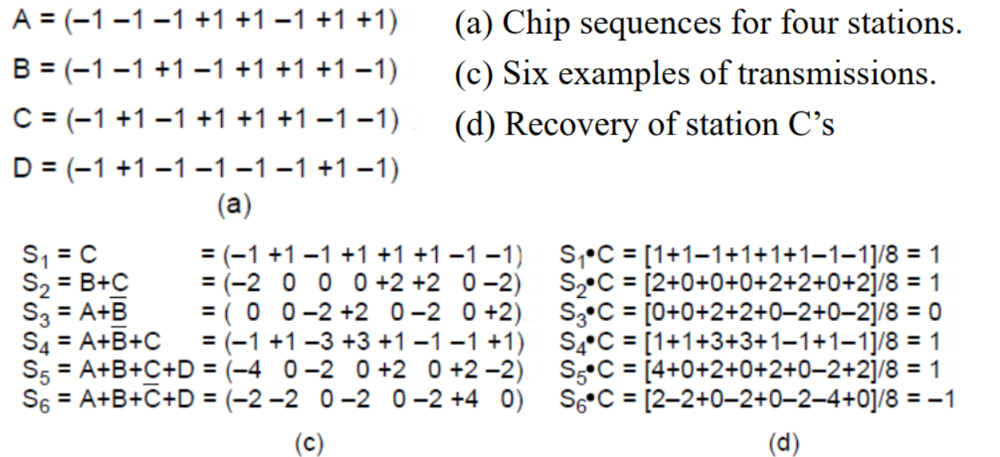
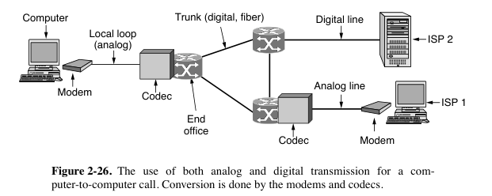
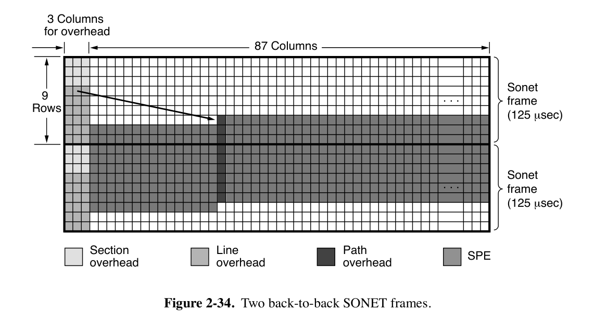
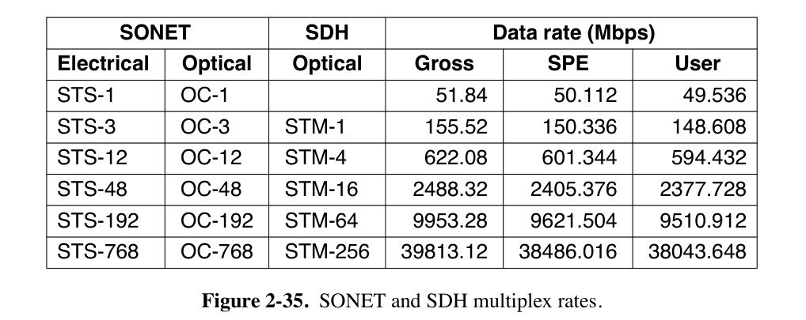

# Chap02 | Physical Layer

- 物理层的协议也常常称为procedure（规程）
- 物理层要做的是把计算机中的电信号转化成可以在传输介质中传播的各种信号
- Signal（信号）是数据的电气或者电磁表现，分为Analog Signal（模拟信号）和Digital Signal（数字信号）
    - 模拟信号也叫连续信号，代表消息的参数的取值是连续的
    - 数字信号也叫离散信号，代表消息的参数的取值是离散的。

## 2.1 Transmission Media

- Guided Transmission Media（依赖物理电线或光缆的传输介质）
    - Twisted Pair（双绞线）
        - 双绞合可以减少对相邻导线的干扰。外部无金属网屏蔽层的双绞线称**UTP**，否则为STP。
        - 最早的双绞线标准是Cat 3（三类线），属于UTP。
        - Cat 5 属于UTP，用于100-Mbps和1-Gbps的以太网局域网。
        - Cat 6（UTP）和Cat 7（对双绞线上以及整个电缆都有屏蔽）速度更快，支持10-Gbps链路。
        - Cat 8（八类线）的运行速度比低类别更快，但只能在约30米的短距离内运行。
            - Cat 8标准有两个选项：Class I兼容Cat 6A，Class II兼容Cat 7A
        - 双绞线的传输距离有限（几十km），模拟传输需要放大器，数字传输需要中继器对信号进行整形。
    - Coaxial Cable（同轴电缆）
    - Fiber Cables（光缆）
        - 利用了光的全反射原理，在特定入射角度下不会发生折射
        - 多模光纤（multi-mode fiber）的直径较大。
            - 光源是发光二极管，因此可能同时有多个入射角的信号在其中传播。
            - 随着传输距离增大，不同入射角的光线的光程差逐渐拉大，因此脉冲会展宽、失真。
        - 单模光纤（single-mode fiber）的直径只有一个光的波长左右，这时候光线可以一直向前传输，而无需多次反射。
            - 光源是半导体激光器（semiconductor laser），因此传输中衰减较小。
            - 为了不让光纤太细，一般单模光纤中的光的波长要长一点。
        - 在光纤连接方法中，fuse（熔接）的信息损失较小。
        - 光纤的优点是带宽高，低衰减（损耗小距离高），抗电磁干扰，体积小重量轻，安全性好不易被窃听。
- Interface Line（接口线）
- Wireless Transmission（无线传输）：
    - 卫星通信
    - 微波通信：常见于移动通讯，微波会穿过遮挡物继续传播，但可能会被吸收。

## 2.2 Channel & Transmission

- Channel（信道）：表示向某一方向传送信息的媒体
    - 信道和电路的概念不相同，电路往往包含了发送信道和接受信道各一条
    - 信道的通信方式也分为单向通信、双向交替通信和双向同时通信
- Bandwidth / Baud / Symbol / bit rate
    - Bandwidth（带宽）是允许正弦波通过的频率范围，单位是Hz。
        - 带宽取决于传输介质的物理性质。
        - baseband signals（基带信号）：运行频率范围为0到一个特定的频率（记作$f_0$）的信号。
        - passband signals（带通信号）：被移位以占据更高频率范围的信号（如无线传输）。
    - baud rate（波特率）是每秒钟的波形样本（sample，又称码元）数，单位也是Hz。
        - baud rate = symbol rate
    - bit rate（比特率）= baud rate$\times$每个波形样本中承载信息的比特数
        - 比特率的单位是b/s或bps。
    - bandwidth（带宽）这个词有两种意思：
        - 设备能够处理的最低频率和最高频率之间的范围（即上面的定义），单位是Hz
        - 单位时间内能够通过信道传输的数据量，单位是bps（比特/秒）

### 2.2.1 The Maximum Data Rate of a Channel

- Nyquist Theorem（奈奎斯特定理）
    - 用于 finite-bandwidth noiseless channel，或者称 low-pass filter（低通滤波器）
    - 如果一个任意信号通过带宽为$B$的低通滤波器，滤波后的信号可以通过每秒仅进行$2B$次（精确）采样完全重建。
        - 以超过$2B$次每秒的速度对线路进行采样是没有意义的，因为这种采样可以恢复的更高频率分量已经被滤除。
    - 多进制编码：数据传输速度 = $2B\log_2V$，其中$V$代表每个码元可能的状态数，结果的单位是bps
        - Bilevel（二进制编码）：数据传输速率 = 2倍的带宽
    - 没有理论值的上限，但是会产生损失
- Shannon's Theorem（香农定理）
    - 用于有噪声信道
    - 带宽记作H(HZ)，信噪比记作S/N（SNR，Signal-to-Noise Ratio），计量单位是bps。
        - 以dB为单位的信噪比$=10\log_{10}(\frac SN)$    
    - 最大的数据传输速率是：$H\log _2(1+\frac SN)$ ，信噪比单位是bps。
        - 也就是说信噪比越大，最大的可能传输速率就越高
- 两个公式都可以用的时候，在两个最大值中选择更小的。

### 2.2.2 Digital Modulation

比特与信号之间转化的过程称为 digital modulation（数字调制）。将比特转化为信号会导致 baseband transmission（基带传输）。在此基础上调节载波信号的幅度、相位、频率等，会导致passband transmission（带通传输）。由于信道通常由多信号共享，我们引入 multiplexing（多路复用）。

- Baseband Transmission （基带传输）
    - Non-return to zero（NRZ）用高频代表1，低频信号代表0
        - 需要精确时钟，例如15个零和16个零看起来非常相似。
        - 接收方需要从每个周期的中间处采样
    - NRZ Invert 在发生10切换的时候信号突变，高低电平进行切换
        - 被USB使用
    - Manchester 曼切斯特编码：传输1是半个高信号+半个低信号，传输0是半个低信号+半个高信号。
        - 同时传输时钟信号，Manchester Code = Bit Stream XOR Clock Signal
        - 被**Ethernet（以太网）**使用
        - 时钟在每个比特时间内进行一次时钟转换，因此它以比特速率的两倍运行。
            - 缺点：由于时钟，曼彻斯特编码需要比NRZ多一倍的带宽
            - 开销为100%
    - Differential Manchester encoding：传输1是在间隔开始时没有跳变，传输0是在间隔开始时有跳变
        - 差分方案需要更复杂的设备，但具有更好的抗噪性
    - 4B/5B编码：
        - 每4位数据被映射到一个5位的模式，有一个固定的转换表
        - 确保了不会出现超过三个连续的0
        - 开销为25%（或者说效率为80%）
        - 有些输出组合并未使用，可以用来表示物理层的控制信号
    - scrambling（加扰）：在传输前将数据与伪随机序列进行异或运算来工作
        - 不增加带宽或时间开销
        - 不能保证不会有长串的全0或者全1。
    - balanced signals：短时间内电压平均值为0
        - bipolar encoding（双极性编码）：为了发送1，发射器在+1V和-1V电平之间交替，以便它们总是平均为零。
            - 在电话网络中，称为AMI（交替标记反转）
        - 8B/10B编码
            - 它将8比特的输入映射为10比特的输出，因此其效率为80%
            - 8比特被分为一组5比特，映射为6比特，以及一组3比特，映射为4比特；然后将6比特和4比特的符号连接起来。
            - 部分输入模式可能有两个输出模式。例如，`000`被映射为`1011`及补码`0100`，二者交替使用。

- Passband Transmission（通带传输）
    - Modulation（调制）的三种方法：
        - ASK（Amplitude Shift Keying，幅度键控）
        - FSK（Frequency Shift Keying，频移键控）
        - PSK（Phase Shift Keying，相移键控）
            - 本书只讨论相对相移键控，根据本时间段波形与上一时间段波形的相位移动（相位差）决定0还是1。
            - BPSK（二进制相移键控）：载波在每个周期移位0或180度。
            - QPSK（Quadrature Phase Shift Keying，正交相移键控）：使用四个移位（如45、135、225或315度），每个周期传输2比特信息。
        
        
        
    - 除了这几种方式之外，在调制中可以组合振幅和相位（混合调制），使用 constellation diagram（星座图）表示。
    
        - QAM（Quadrature Amplitude Modulation，正交幅度调制）
        - 将比特分配给 symbol 的方式：gray code（格雷码）
        
        

### 2.2.3 Multiplexing（信道复用）

#### FDM

- FDM（频分复用，Frequency Division Multiplexing）属于 passband transmission。

- 不同的信号在不同的频率带宽内传输。发送者使用不同的频率将信号合并，接收者根据频率分离出原始信号。
- 每个用户独占一个频段（portion of spectrum）来发送自己的信号。
- guard band（保护带）使信道之间相互分离。下图语音级电话的例子中，guard band 宽度为4kHz。

- 不使用保护带：OFDM（Orthogonal Frequency Division Multiplexing，正交分频复用）
    - 信道带宽被划分为许多独立发送数据的子载波（例如使用QAM）。子载波在频域中紧密排列。
    - 每个 subcarrier（子载波）的 frequency response 在相邻 subcarrier 的中心处为0，因此在中心频率处采样就不会受到相邻载波的干扰。
    - 需要引入 guard time 来重复信号的一部分，以保证响应频率。
    - 用于802.11、4G cellular system等。

- 波分复用(Wavelength Division Multiplexing, WDM)：波长叠加，FDM的变种
    - 可以用于光纤中的多路复用：输出端使用特殊构造的 core（纤芯）来过滤波长。
    - DWDM（密集波分复用）：具有大量信道且信道之间间隔小。例如，将间隔缩小到12.5 GHz可以在单根光纤上支持320个信道。

#### TDM

- Time Division Multiplexing，时分复用

- FDM依赖模拟电路，TDM用数字电子设备，更适用于现代电话系统。

- 用户轮流获取一个非常短的时间段的整个带宽，每个输入流中的bit从一个固定的时间槽中取出，并输出到混合流中。
    
    

#### CDM

- 码分复用
- 码分多址 CDMA：在CDMA中，每个bit时间被分为m个更短的时间间隔，称为chip（码片）
    - 每个站被分配一个唯一的m位code，称为 chip sequence，这里用括号里的一串`+1`和`-1`表示。
    - 如果要传输一个1就发送分配的 chip sequence（码片序列），如果要传输0就发送码片序列的反码。
    - 发送站的任意两个 chip sequences 都两两 orthogonal（正交）。
    - 从下图中的例子可以看出来，接收站需要知道发送方的 chip sequence才能接收，每个站发送的信息不受其它站的信息的影响。
    - 此方案称为 Walsh codes。对于$2^n$个站可以提供$2^n$个长度为$2^n$的码片序列。
    - 限制：要求所有码片在接收端上同步
    

## 2.3 PSTN

- PSTN（Public Switched Telephone Network，公共电话系统）结构如下图所示：

- 主要组成部分：
    - Local loop（本地回路）：从设备到端局
    - Trunk（干线）：高带宽数字光纤链路，连接各个交换局
    - Switching office（交换局）：进行通话的交换，从手动切换变成了计算机切换
        - toll office（长途局）是交换的中心。
        - 使用WDM

### 2.3.1 Local Loop

本地回路的通信链路结构：计算机$\rightarrow$ Modem（解调器）$\rightarrow$ Codec（解编码器）

- 本地回路是用户与ISP（Internet service provider）之间的物理连接

- modem（调制解调器）：在计算机（数字信号）和电话系统（模拟信号）之间

    - TCM（Trellis Coded Modulation，网格编码调制）：使用编码纠错。

    - Modem标准

        

        - 受限于本地环路，modem的最大传输速率为33.6kbps

        - 如果去掉两端通话连接中的两个本地回路中的一个，可以提高数字信号质量，增加modem发送速率
            - V.90和V.92（上图ISP2）：分别提供56 kbps的下行通道（ISP到用户）和33.6 kbps及48 kbps的上行通道（用户到ISP）。

    - Modem分为full duplex（全双工）, half duplex（半双工）, simplex（单工）。所有现代解调器都可以全双工操作。

- DSL（数字用户线路）

    - xDSL：泛指各种数字用户线路技术，如ADSL、VDSL等。
    - ADSL（非对称数字用户线路）：一种常见的xDSL技术，其上行和下行带宽不对称，通常下行带宽远大于上行带宽。
        - 使用Twisted Pair（双绞线）作为传输介质 
    - ADSL技术通过绕过滤波器，利用更高的频带来传输数据，从而提高传输速度。
        - AT&T的初始ADSL方案：将1.1 MHz的可用带宽划分为三个频段，采用频分复用（FDM）技术。
            - 三个频段分别为POTS（普通旧式电话）、上行数据、下行数据
        - DMT：将1.1 MHz的频谱划分为256个通道
            - 通道0用于POTS，通道1-5未使用，以避免语音和数据之间的干扰
            - 剩余250个通道：1个通道用于上行控制、1个通道用于下行控制。常见的划分：32个通道用于上行数据，216个通道用于下行数据
        - ADSL标准：允许的最大速度为8 Mbps下行和1 Mbps上行。
            - 波特率（Baud Rate）：4000波特
            - QAM调制
            - 224个下行通道，每个通道15比特/波特，波特率为4000，因此最大下行带宽为：224\*15\* 4000 = 13.44 Mbps。

### 2.3.2 Trunks and Multiplexing

- Codec（编解码器）用于 end office 将模拟信号转化为数字信号
    - 使用PCM（脉冲编码调制）技术
        - PCM每秒进行8000次采样（125 µsec/样本），将每次采样得到的电压分为不同等级，用一个8位二进制码表示。则数据速率为64 kbps。
    - codec处浮点数与整数转化存在噪声。ISP2的优点是codec处直接把数字信号转化为数字信号，不存在噪声，因此带宽高。
    
- T-Carrier：通过单一电路传输多个 TDM channel 的规范
    - T1载波：复用24个通道，每个通道依次插入，数据传输速率是**1.544Mbps** 
        - T1信道每一帧传输的193bit中，有7\*24=168bit是有效信息，有1+24bit是开销，因此开销率是25/193=13%
            
    - E1信道有32个PCM信号，数据传输速率是**2.048Mbps** 
        - E1载波在基本125-µsec帧中打包了32个8位数据样本，每组4个帧。
        - E1信道的32个信道中30个传输数据，2个传输信号，因此开销是2/32=6.25%
    - 高阶载波：4个T1通道被复用到一个T2通道中，7个T2流逐位组合形成一个T3流。然后，6个T3流被组合成一个T4流。在每一步中，都会添加少量开销用于帧和恢复。T1和T3使用广泛，另两个少见。

- Multiplexing Optical Networks: SONET/SDH 

    - 光纤通信的TDM标准

    - SONET（Synchronous Optical NETwork，同步光纤网络）

    - SDH（Synchronous Digital Hierarchy，同步数字体系）

    - SONET是一个Synchronous（同步）系统，每个发送方和接收方都与一个公共时钟同步。

    - SONET的基本帧是一个每125微秒输出一次（即8000帧/s，与PCM采样率一致）的810字节块，总传输速率为51.84 Mbps。

        - 这种布局就是基本的SONET通道（或者说 carrier 载体），称为STS-1。
        - 无论是否有有用的数据发送，帧都会持续发出。
        - SONET帧可以被视为一个90列宽、9行高的字节矩形。
            - 前3列为 system management information
                - 前3行中包括section overhead（段开销），在section起始与结束处检查
                - 后6行中包括line overhead（线路开销），在线路起始与结束处检查

            - 接收者根据连续bitstream判断帧的开始的方法：
                - 每个帧的前两个字节包含了一个固定模式，接收方会搜索这个模式。
                - 如果这个模式出现在大量连续帧的相同位置，接收方就假设已经与发送方同步。

            - 每个帧的最后87列携带用户数据，因此有效数据传输速率为50.112 Mbps
                - SPE（Synchronous Payload Envelope），即承载用户数据的部分，并不一定总是从第1行第4列开始
                - SPE可以在帧内的任何位置开始，甚至跨帧

        

    - SONET/SDH的多路复用层次

        - 如果一个载体不是多路复用的，而是仅携带单个源的数据时，在载体名称后面加上字母c（表示concatenated）
            - OC-3表示由三个独立的OC-1载体组成的155.52 Mbps载体。
            - OC-3c表示来自单个源的数据流，速率为155.52 Mbps。
                - OC-3c流中的三个OC-1流按列交错：首先是流1的第一列，然后是流2的第一列，接着是流3的第一列，然后是流1的第二列，依此类推，形成一个270列宽、9行深的帧。
                

### 2.3.3 Switching

- Switching:（交换）
    - circuit switching（电路交换）：建立连接，传输报文，释放连接。跟打电话差不多。
    - message switching（报文交换）：每个中继站点缓存分组、查找转发表找到下一个目的地、转发分组（store-forward）
    - packet switching（报文交换）：将信息分拆为多个分组发出，不同分组可能采用不同路径，也不一定按发出顺序来接收。

### 2.3.4 Transmission Impairments

此部分未见于第6版教材，只出现在lkj PPT上。

传输损伤（Transmission Impairments）

- 衰减（Attenuation）：信号在传输过程中逐渐减弱，导致接收端收到的信号强度降低。
- 延迟失真（Delay Distortion）：由于不同频率的傅里叶分量以不同的速度传播，导致信号在接收端发生失真。
- 噪声（Noise）：
    - 热噪声（Thermal Noise）：由电子的热运动引起的噪声，不可避免。
    - 串扰（Crosstalk）：由于两条靠近的电线之间的耦合引起的干扰。
    - 两条不同路径：信号可能通过两条不同的路径传输，导致信号的延迟和失真。
