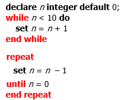
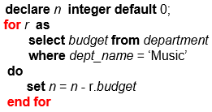
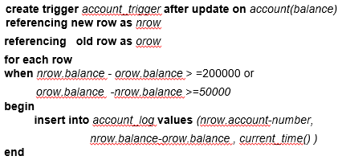
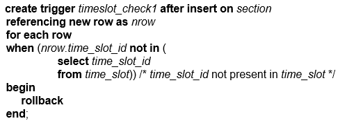
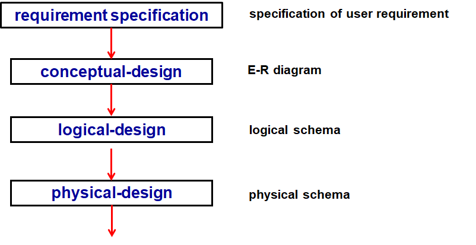

## Chap2: Relational Model

### 0. Outline

- 键值
- 关系代数

### 1. key

- superkey
- candidate key：minimal superkey
- primary key：selected candidate key
- foreign key：referencing->referenced(primary key)
- referential integrity

### 2. relational algebra

- "Pure” languages:
  - Relational algebra：非图灵机等价
  - Tuple/Domain relational calculus
- 6 basic
  - select：条件称为**selection predicate**
  - project
  - union
  - set difference
    - union, set differenct都要求same arity，对应属性的type要compatible
  - Cartesian product
  - rename
- Additional
  - set intersection
  - natural join、theta join
  - assignment
  - outer join
  - semijoin
  - division operation
- extended
  - **Generalized Projection**：arithmetic functions of attributes
  - **Aggregation function**：avg、min、max、sum、count
- multiset中duplicates树
  - selection: 满足条件，保持
  - projection: 保持
  - cross product: **m** of *t1* in *r*, **n** of *t2* in *s*, **mn** in *r*  x *s*
  - union: m + n
  - intersection: min(m, n)
  - difference: min(0, m - n)

## Chap3: Introduction to SQL

### 1. SQL

- Structured Query Language(SQL)

### 2. DDL

- 包含schema, domain, integrity constraints, indices, security+authorization, physical storage structure
- type
  - (var)char, int, smallint, numeric(p, d), real, double, float
  - date(ymd), time(hms), timestamp(date+time), interval

### 3. integrity constraints

- not null
- primary key()
- foreign key() references r()
  - on delete/update cascade/set null/restrict/set default
- alter
  - alter table r add A D
  - alter table r drop A

### 4. DML

- duplicates：distinct/all(default)
- between闭区间
- string: like '通配符'
  - %配string, _配字符
  - 逃逸字符用\，或用escape指定
- order by ... desc/asc(default)
- limit offset=0, cnt
- union, intersect, except
  - 默认去duplicates，可+all
- 含null算术得null，比较得unknown，is null判断
- 除count的聚合函数忽略null，如只有null返回null
- 嵌套子查询
  - set membership：(not) in
  - set comparison：some, all
  - scalar subquery
  - (not) exists
  - unique（嵌套子查询不可distinct）
- delete from ... where
- insert into ... values()
- insert into t1 select ... from t2
- update ... set ... where
- case when then else end

## Chap4: Intermediate SQL

### 1. join

- join **type**：inner join, left/right/full outer join
- join **condition**：natural, on..., using ...

### 2. SQL Data Types and Schemas

#### type, domain

- create type ... as numeric(12, 2)
- create domain ... char(20) not null
- create domain ... char(20)
  - constraint (name)
  - check(value in());
- Large-Object Types
  - blob: binary large object
  - clob: character large object

### 3. Integrity constraints

- not null
- primary key
- unique
- check()：可嵌套查询，但未常实现
- foreign key

#### Assertion

create assertion (name) check ...

### 4. views

create view v as ...

插入view，也会改变原relation

物理view

### 5. Indices

create index (name) on r(A)

### 6. Transactions

- commit, rollback

- SET AUTOCOMMIT = 0
- serializable, repeatable read, read commit, read uncommit
- ACID

### 7. Authorization

- select, insert, update, delete
- index, resources, alteration, drop
- grant (priv) on () to (user)
- revoke (priv) on () from (user)
- DCL
- create role (name)
- grant (role) to (user)
- grant reference () on () to()
- grant with grant option
- revoke cascade/restrict

## Chap5: Advanced SQL

### 1. Accessing SQL From a Programming Language 

- API, O(Open)DBC(Connectivity)/J(Java)DBC, Embedded SQL(in C), SQLJ, JP(Persistence)A(API)

### 2. SQL Functions

  

  

  

{: style="display:block;margin:auto;"}

{: style="display:block;margin:auto;"}

{: style="display:block;margin:auto;"}

### 3. Trigger

- insert, delete, update

- before, after
- referencing new/old row/table as
- for each statement/row

{: style="display:block;margin:auto;"}

{: style="display:block;margin:auto;"}

{: style="display:block;margin:auto;"}

## Chap6: Entity-Relationship Model

### 1. DB Design Process

{: style="display:block;margin:auto;width:67%;"}

- avoid：**redundancy** and **incompleteness**

### 2. ER model

- roles
  
-  
  

- binary/ternary relationship
- attributes(with domain)
  - simple/composite
  - single-valued/multivalued
  - derived
- weak entity set->identifying entity set
  - discriminator/partial key
- Specialization/Generalization
  - Top-down, attribute inheritance/ bottom-up
  - disjoint/overlapping
  - total/partial(completeness constraint)

## Chap7: Relational Database Design

### 1. pitfall of bad relations

- 信息重复Information repetition
- 插入异常Insertion anomalies
- 更新困难Update difficulty

### 2. Decomposition Lossless

- R->R1,R2，充要条件
  - $R_1\cap R_2\rightarrow R_1$
  - $R_1\cap R_2\rightarrow R_2$

### 3. Forms

- 第一范式First Normal Form：各attribute都atomic（不可分）
- Boyce-Codd Normal Form(BCNF)：任意函数依赖$\alpha\rightarrow\beta$，要么trivial，要么$\alpha$为超键
- 3NF：BCNF必3NF。若$\beta-\alpha$的任意属性都在整体$R$的某candidate key中，也属3NF。
- 4NF：类似BCNF的定义。若4NF，必BCNF。

### 4. Dependencies

### Functional dependencies

- functional/multivalued dependencies
- legal instance：满足现实约束
- superkey：K is superkey等价于$K\rightarrow R$
- trivial：$A\rightarrow B$ is trivial if $B\subset A$
- closure：all FDs(different from attribute closure)
- Armstrong’s Axioms:
  
-  
    
  

  - sound and complete
- Additional
  
-  
    
  

- Canonial Cover：去除所有**Extraneous Attributes**

- dependency preserving
