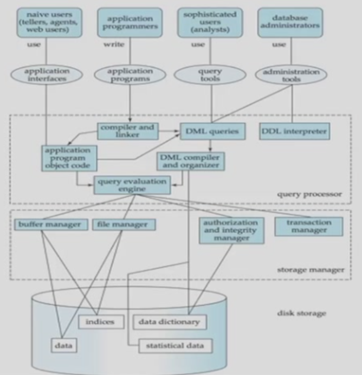
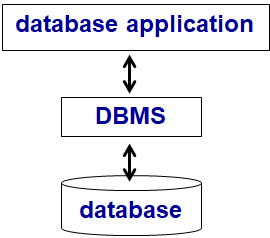
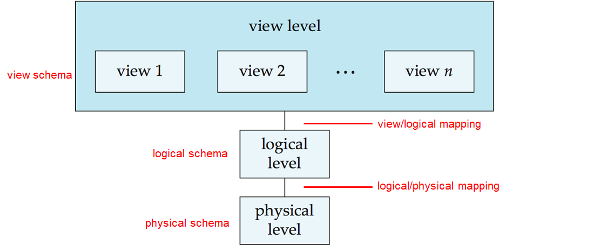
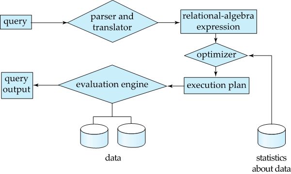
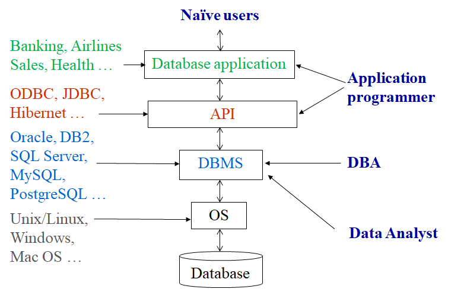
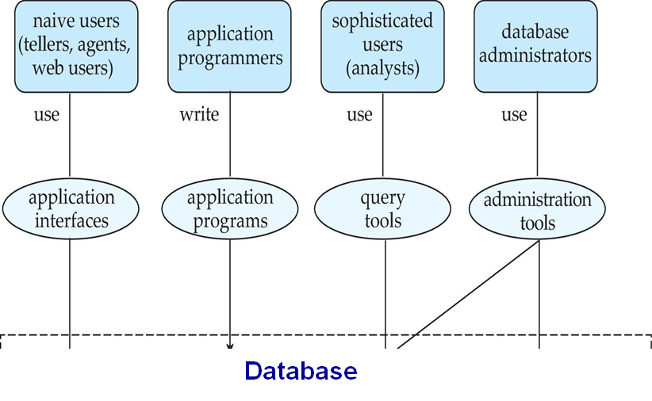

# week1
## Introduction

### 0. Outline

- 数据库系统Database Systems
- (使用)数据库系统的目的Purpose of Database Systems
- 数据视图View of Data
- 数据模型Data Models
- 数据库语言Database Languages

- 数据库设计Database Design
- 数据库引擎Database Engine
- 数据库用户与管理员Database Users and Administrators
- 数据库系统历史History of Database Systems

#### Database System
- DBMS: Database Management System
- Application built on files vs. built on databases.
- The primary goal of a DBMS is to provide a way to store and retrieve database information that is both convenient and efficient.
- concurrency control(并发控制) and recovery from failures are also important.

#### Purpose of DB
- Data storage, retrieval and update.
- Data reduncancy(数据冗余) and inconsistency. 
- Data isolation(数据隔离)  integrity(数据完整性) and atomicity(原子性). 
- Difficulty in accessing data.
- security problems.(audit审计) 

#### Database Engine

### 1. Database Systems

**数据库**是相互关联(interrelated)的企业数据的聚合(collection)，由**DBMS**(Database Management System)管理。 

**DBMS** 的主要目标是提供一种既方便(convenient)又高效(efficient)的存储(store)和检索(retrieve)数据库信息的方法。

（数据库中的）数据管理包括**定义**信息存储结构(structures for **storage** of information)和提供信息操作机制(mechanisms for the **manipulation** of information)。

**数据库系统**必须确保存储信息的**安全**，即使系统崩溃(crashes)或者试图进行未授权(unauthorized)访问

如果要在多个用户之间共享数据，系统必须提供**并发控制**(concurrency control)机制，以避免可能的异常(anomalous)结果。

{: style="display:block;margin:auto;width:67%;"}

数据库-数据库管理系统DBMS-数据库应用程序的层次结构

### 2. Purpose of Database Systems

直接基于文件系统(**file systems**)的数据库应用程序会招致诸多严重后果：

- 数据**冗余** Data **redundancy**与**不一致inconsistency**
  - 文件格式繁多，文件间信息冗余、不一致multiple file formats, duplication of information in different files
- 数据**孤立** Data **isolation**
  - multiple files and formats
- **存取**数据困难 Difficulty in **accessing** data
  - Need to write a new program to carry out each new task
- **完整性**问题 **Integrity** problems
  - 完整性约束(Integrity constraints)隐式表达（**显式**表达stated explicitly比较好） 
  - 维护与拓展：难以增加/更改完整性约束
- **原子性**问题 **Atomicity** problems
  - 错误Failures发生于数据库不一致状态inconsistent state(只有部分数据更新被执行partial updates carried out)
- **并发访问异常** **Concurrent access** anomalies
  - 并发访问：性能需求
  - 不受控的并发访问将导致不一致inconsistencies
- **安全性问题** **Security** problems
  - 需要限制用户的可访问数据范围
  - 认证Authentication
  - 权限Priviledge 
  - 审计Audit

相对应地，数据库系统有如下特征：

- **数据持久性**data persistence
- **数据访问便利性**convenience in accessing data
- **数据完整性**data integrity 
- **多用户并发控制**concurrency control for multiple user
- **故障恢复**failure recovery
- **安全控制**security control

### 3. View of Data

#### 数据库三层模型

{: style="display:block;margin:auto;width:67%;"}

数据库可以分为视图层、逻辑层和物理层。分别由视图/逻辑映射、逻辑/物理映射进行变换。

#### 模式(schema)与实例(instance)

- **Schema**：数据库的逻辑结构 
  - **Physical schema**: database design at the physical level
  - **Logical schema**: database design at the logical level
- **Instance**：特定时间点，数据库的实际内容

#### 数据独立性(Data Independence)

- **Physical Data Independence**：能够在不修改逻辑模式的前提下修改物理模式的能力
  - 应用程序依赖于逻辑模式即可
  - 一般来说，应明确定义各层次、部分之间的接口，以便某些部分的更改不会严重影响其他部分。（即好好设计logical/physical mapping）
- **Logical Data Independence**：能够在不修改用户视图模式的前提下修改逻辑模式的能力
  - 需要好好设计view/logical mapping

### 4. Data Models

- A collection of tools for describing 
  - Data
  - Data relationships
  - Data semantics(**语义**)
  - Data constraints(**约束**)

- **Relational model**(**关系模型**)
- Entity-Relationship data model
- Object-based data models 
  - Object-oriented **(面向对象数据模型)**
  - Object-relational **(对象-关系模型模型)**

- Semistructured data model (XML)(**半结构化数据模型**)

- Other older models:
  - Network model (**网状模型**)
  - Hierarchical model(**层次模型**)

### 5. Database Languages

#### classification

- Data Definition Language (DDL) ：产生templates stored in **data dictionary**
  - data dictionary：包括metadata
    - database schema
    - integrity constraints：primary key, referential integrity
    - authorization
- Data Manipulation Language (DML) 
  - Language for accessing and manipulating the data organized by the appropriate data model
  - also known as **query** language
  - 2类 
    - **Procedural** – 用户指定所需data，如何得到data
    - **Declarative (nonprocedural)** – 用户只需指定所需data
  - **SQL**：最广泛应用的query language
- SQL Query Language
- Application Program Interface （API）
  - 非过程查询语言（如SQL）不如通用图灵机强大。
  - SQL不支持用户输入、显示器输出或网络通信等操作。
  - 此类计算和操作必须用宿主语言(**host language**)编写（C/C++, Java or Python.）
  - 应用程序通常通过以下方式之一访问数据库：
    - 语言扩展以允许嵌入式SQL (**embedded SQL**)
    - API(e.g., ODBC/JDBC)，允许SQL查询语句被送入数据库

### 6. Database Design

ER模型与规范化理论(Normalization Theory)

### 7. Database Engine

#### 功能组件functional components 

- **storage manager**存储管理
  - 提供接口：底层数据与提交给系统的应用程序查询之间
  - 所负责任务：
    - 操作系统文件管理器的交互
    - 数据高效存储、检索和更新
  - 包括：
    - 文件管理器File manager
    - 缓冲区管理器Buffer manager
    - 权限与完整性管理器Authorization and integrity manager
    - 事务管理器Transaction manager
  - 作为物理系统实现，storage manager实现了如下数据结构：
    - 数据文件Data files--存储数据库本身
    - 数据字典Data dictionary--存储数据库结构的元数据，特别是模式。
    - 索引Indices--提供对数据项的快速访问。
    - 统计数据Statistical data
- **query processor** component查询处理
  - DDL解释器 **DDL interpreter**——解释DDL语句并在数据字典中记录定义。
  - DML编译器 **DML compiler**——将查询语言中DML语句转换为评估计划(evaluation plan)，评估计划由查询评估引擎(query evaluation engine)能理解的底层指令组成。
    - DML编译器执行**查询优化**，即从各种备选方案中选择成本最低的评估计划。
  - 查询评估引擎 **Query evaluation engine**——执行DML编译器生成的底层指令。
  - Parsing and translation - Optimization - Evaluation
  
  
- **transaction management** component事务管理
  - 事务**transaction**：在数据库应用程序中执行单个逻辑功能的操作集合。
  - 恢复管理器**Recover Manager**：确保数据库在出现故障时仍保持一致（consistent）状态。故障包括系统故障(system failures)（电源故障power failure, 操作系统崩溃OS crashes等）和事务故障(transaction failures)。
  - 并发控制管理器**Concurrency-control manager**：控制并发事务之间的交互，以确保数据库的一致性。

### 8. Database Users and Administrators

#### Database Users

{: style="display:block;margin:auto;width:67%;"}

Naive users：只与数据库应用程序交互(use interfaces)

Application programmer：Database application, API（通过DML calls交互）

sophisticated(Data Analyst)：DBMS, query tools

DBA(Database Administrator)：DBMS, administration tools

协调(coordinate)数据库系统的所有活动；对企业的信息资源和需求有很好的了解。

- Tasks
  - 模式定义**Schema definition**
  - 存储结构和访问方法定义**Storage structure and access method definition**
  - 模式和物理组织方式修改**Schema and physical organization modification**
  - 授权用户访问数据库**Granting user authority to access the database**
  - 指定完整性约束**Specifying integrity constraints**
  - 充当与用户的联络人**Acting as liaison with users**
  - 监控性能和响应需求变化-性能调整**Monitoring performance and responding to changes in requirements - Performance Tuning**

{: style="display:block;margin:auto;width:67%;"}

### 9. History of Database Systems

- 1950s-early 1960s：**magnetic tapes**, sequential access
- 1960s：**hard disks**(direct access), network/hierarchical model
  - 1961, **IDS**, GE, Charles W.Bachman(father of databases, 1973 Turing)
  - 1968, IBM **IMS**
- 1970s：Business Aplications(OLTP)
  - 1970, **relational model**, Edgar F. Codd(1981 Turing)
  - 1974, **System R** prototype, Jim Gray, IBM
  - 1974,  **Ingres** prototype, Michael Stonebraker
  - 2004, SIGMOD renamed its highest prize to the **SIGMOD Edgar F. Codd Innovations Award**(数据库领域最高奖).
- 1980s:
  - RDBMS implementation 
  - Research relational prototypes evolve into commercial system
    - Oracle(1983), IBM DB2(1983), Informix(1985), Sybase(1987), Postgres (PostgresSQL,1989)
  - Parallel/Distributed/Object-oriented/Object-relational database systems
  - Extended to Engineering Applications
- 1998 Turing：Jim Gray(also SIGMOD)，disappear Jan. 28 2007
- 1990s:
  - **Business intelligence(BI)**
  - Large decision support and **data-mining** applications
  - Large multi-terabyte **data warehouses**
  - **OLAP**(Online Analytical Processing)
  - Emergence of Web commerce
    - The Web changes everything
    - New workloads – performance, concurrency, availability
- 2000s:
  - **Web Era**
    - Big data
  - **XML** and XQuery standards
  - Automated database administration
  - **NoSQL**(not only SQL)
    - looser consistency, horizontal scaling and higher availability
    - useful for **big data**
    - **MongoDB, Cassandra, HBase**
- 2010s:
  - **NewSQL**
  - **Cloud database**
  - Blockchain
  - Autonomous Database (AI powered Database)
- **NewSQL**：VoltDB, NuoDB, Clustrix, JustOneDB
- 2014 Turing：Michael Stonebraker
- 2010s: **Cloud Database**
  - A cloud database is a database that typically runs on a cloud computing platform, access to it is provided as a service.
  - **Characteristics**
    - Scalability, High availability, Resource transparency, Trustiness, Security and privacy
  - **Vendors**
    - **Amazon** RDS/DynamoDB/SimpleDB
    - **Microsoft** Azure SQL Database 
    - **Google** Aurora
    - **Huawei** GaussDB
    - **Aliyun** PolarDB
    - **Tencent** TDSQL-C/ TencentDB
 