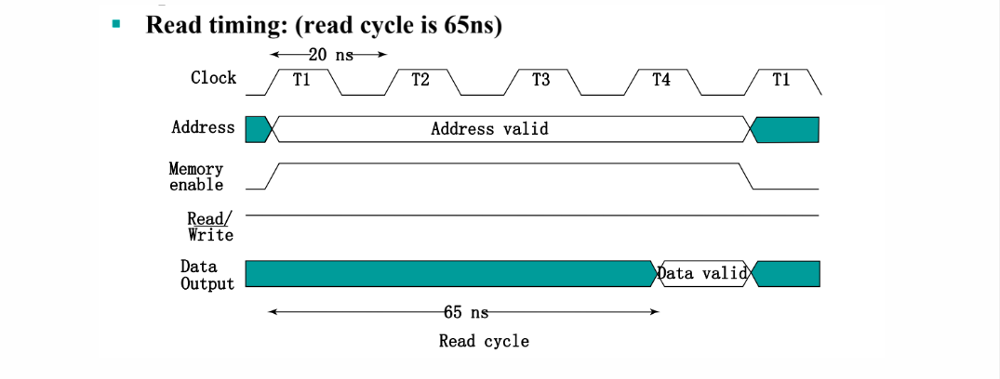
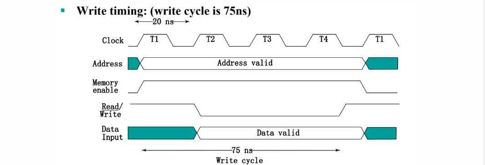
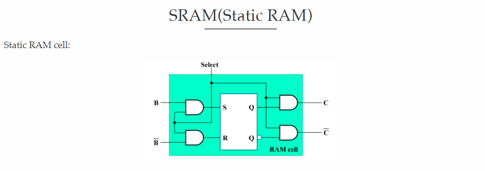
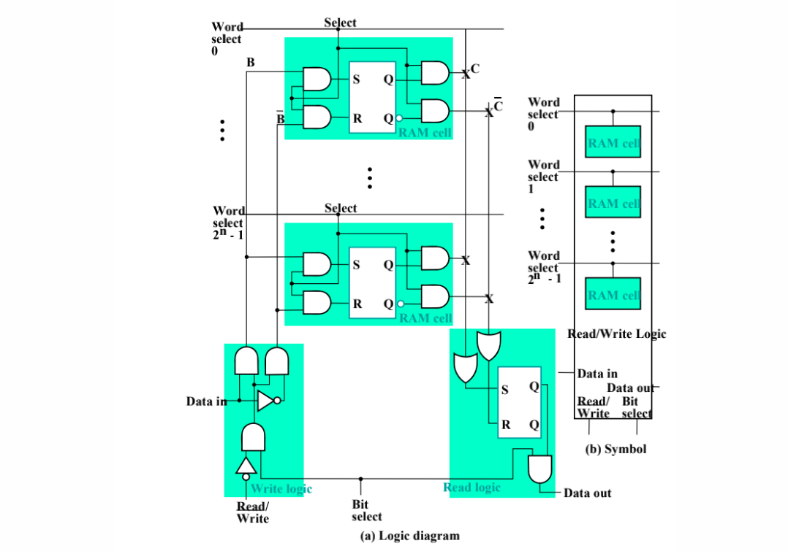

# Chap 7 Memory Basics

!!! summary "框架"
    - Two types: RAM & ROM
        - RAM ship consists of an array of RAM cells, decoders, write circuits, read circuits, output circuits
        - RAM bit slice
        - DRAM
        - Error-detection and correction codes, often based on Hamming codes
    - R&W operations have specific steps and associated timing parameters: access time & write cycle time
    - static(SRAM) or dynamic(DRAM), volatile or nonvolatile

## 7-1 Memory

**Defination**: Two types of memories are used in various parts of a computer: random-access memory (RAM) and read-only memory (ROM). RAM accepts new information for storage to be available later for use. The process of storing new information in memory is referred to as a memory write operation. The process of transferring the stored information out of memory is referred to as a memory read operation. RAM can perform both the write and the read operations, whereas ROM, as introduced in Section 6-8, performs only read operations. RAM sizes may range from hundreds to billions of bits.

> Memory is a collection of binary storage cells together with associated circuits needed to transfer information into and out of the cells.

<!-- prettier-ignore-start -->
??? note "word相关"
    1. A word is an entity of bits that moves in and out of memory as a unit—a group of 1s and 0s that represents a number, an instruction, one or more alphanumeric characters, or other binary-coded information.
    2. A group of eight bits is called a byte. 
    3. Most computer memories use words that are multiples of eight bits in length. Thus, a 16-bit word contains two bytes, and a 32-bit word is made up of four bytes. **The capacity of a memory** unit is usually stated as the total number of bytes that it can store.
    4. Communication between a memory and its environment is achieved through **data input and output lines, address selection lines, and control lines** that specify the direction of transfer of information.
    5.  Computer memory varies greatly in size. It is customary to refer to the number of words (or bytes) in memory with one of the letters K (kilo), M (mega), or G (giga). K is equal to 2^10, M to 2^20, and G to 2^30.
<!-- prettier-ignore-end -->

### Memory Organization
The memory is organized as an array of storage cells, each of which is capable of storing one bit of information. The cells are arranged in rows and columns. The intersection of a row and a column is called a memory address. The number of rows and columns determines the capacity of the memory. 

### Memory Operations
 The memory is accessed by specifying the address of the desired word. The address is applied to the memory address input lines. The memory then selects the addressed word and transfers it to the memory output lines. The memory is also capable of accepting a word from the memory input lines and storing it in the addressed word location. The memory is controlled by a set of control lines that specify the direction of transfer of information.
> Pay attention to the **order** of reading and writing

Read:
- 将有效的地址放到address input lines上。
- 将read control line置为1。
- 等待读出的数据稳定，将数据从memory output lines读出。

Write:
- 将有效的地址放到address input lines上。将写入的数据放到data input lines上。
- 激活写入控制。

> Data⼀定要在0-1前保持⼀段时间来建⽴并且0-1后维持⼀段时间才能正确写⼊.

## random-access memory (RAM)
RAM分为两种：static RAM (SRAM) and dynamic RAM (DRAM)。SRAM是静态的，DRAM是动态的。SRAM的速度比DRAM快，但是DRAM的容量比SRAM大。SRAM的单元是由flip-flop构成的，DRAM的单元是由capacitor和transistor构成的。（每隔一段时间需要refresh）
> 还分挥发与非挥发

### SRAM

- SRAM的单元是由flip-flop构成的，每个单元需要6个transistor。因此SRAM的面积比DRAM大，但是速度快，不需要refresh。
- Logic diagram如下：