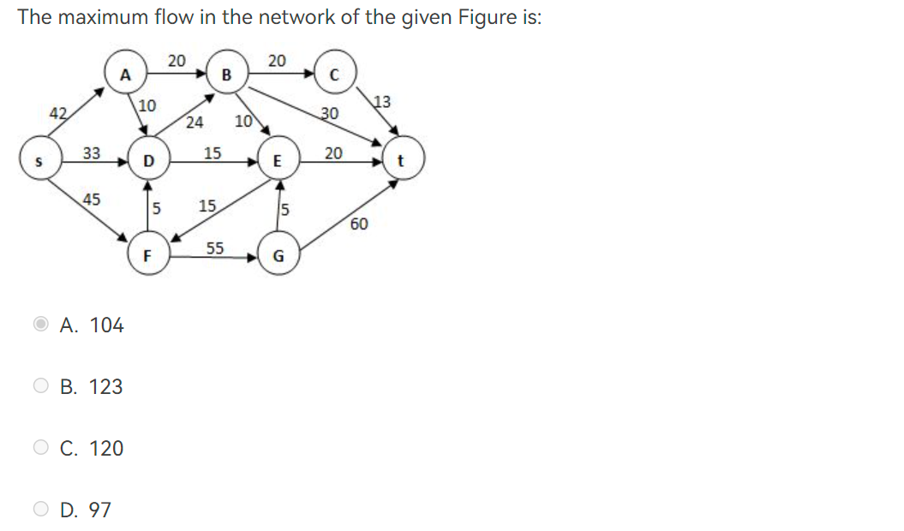

# 作业要点
这里记录着所有homework中的要点，便于小测复习！
[TOC]

## HW1
1. 用递归的方法求斐波那契数列的时间复杂度

<!-- prettier-ignore-start -->
??? info "Tips"
    在递归树中，每个节点表示一个递归调用，而树的深度表示递归的层数。对于斐波那契数列，每个节点会生成两个子节点，因为每个数都依赖于前两个数的和。

    假设我们要计算第n个斐波那契数，递归树的深度将是n。每个节点的计算时间是常数时间，因为它只涉及到简单的加法操作。

    因此，递归方法计算斐波那契数列的时间复杂度可以表示为O(2^n)。这是因为递归树的节点数是指数级增长的。
<!-- prettier-ignore-end -->


2. $$ P_1:T(1) = 1, T(N) = T(N/3)+1\\
P_2:T(1) = 1, T(N) = 3T(N/3) $$

求 $P_1, P_2$ 的复杂度

<!-- prettier-ignore-start -->
??? info "Tips"
    O(logN) for P1, O(N) for P2
<!-- prettier-ignore-end -->


3. 要温习``Mergesort`中merge的思想。


## HW2
1. Linear List（线性表）的初始定义是数组。
2. insertNode 函数可以背下来
```C
void insertNode(struct Node* head, int Element) {
    // 创建新节点
    struct Node* newNode = (struct Node*)malloc(sizeof(struct Node));
    newNode->Element = Element;
    
    newNode->Next = (head)->Next;
    (head)->Next = newNode;
}
```


## HW3
1. stack pop `ooops`有多少种方式？   
<!-- prettier-ignore-start -->
??? info "Tips"
    5
<!-- prettier-ignore-end -->


2. stack的一种集成方法

```C
//初始化时将top赋值为-1
typedef struct {
    int stack[MAX_SIZE];
    int top;
} Stack;

void push(Stack *s, int num) {
    s->stack[++s->top] = num;
}

int pop(Stack *s) {
    return s->stack[s->top--];
}
```

## HW4
1. There exists a binary tree with 2016 nodes in total, and with 16 nodes having only one child.

<!-- prettier-ignore-start -->
??? info "Tips"
    F 本题是个脑经急转弯题目
<!-- prettier-ignore-end -->

2. Given a tree of degree 3. Suppose that there are 3 nodes of degree 2 and 2 nodes of degree 3. Then the number of leaf nodes must be ____.

<!-- prettier-ignore-start -->
??? info "Tips"
    8
    结点的度（Degree）：结点的子树个数
    树的度：树的所有结点中最大的度数
<!-- prettier-ignore-end -->

3. If a general tree T is converted into a binary tree BT, then which of the following BT traversals gives the same sequence as that of the post-order traversal of T?

<!-- prettier-ignore-start -->

??? info "Tips"
    [普通树转二叉树](https://blog.csdn.net/best_LY/article/details/121346561)

<!-- prettier-ignore-end -->

!!! Note
    T的preorder = BT的preorder
    T的postorder = BT的inorder

1. Threaded Binary Trees(一种对二叉树的优化，老师不讲但要掌握) 
!!! Note 
    [线索二叉树](tree.md)


## HW5
1. In a binary search tree which contains several integer keys including 4, 5, and 6, if 4 and 6 are on the same level, then 5 must be their parent.

<!-- prettier-ignore-start -->
??? info "Tips"
    F 5 could be their grandparents
<!-- prettier-ignore-end -->
2. 2-3?
3. 什么是decision tree?


2. A binary search tree if ood nodes, 如果我们选`i/2`，之后每次都选`i/2`；选`i/2+1`则都选`i/2+1`。


## HW6
1. heap两种插入方式，具体可见hello算法书
2. 编程题有序数字串建完全二叉树可以利用中序历遍的思想来建树
3.  红黑树？

## HW7
1. In Union/Find algorithm, if Unions are done by size, the depth of any node must be no more than $N/2$ , but not $O(logN)$.
<!-- prettier-ignore-start -->
??? info "Tips"
    F 假设最初每个节点的深度都为0，那么在进行N-1次按大小合并后，每个节点的深度最多为1。因此，任意节点的深度不会超过N/2。
    需要注意的是，这个结论是在按大小合并的情况下成立的。如果使用其他合并策略，例如按秩合并（将深度较小的树合并到深度较大的树中），那么节点的深度可能会更小，甚至可能达到O(logN)。
<!-- prettier-ignore-end -->


2. The array representation of a disjoint set containing numbers 0 to 8 is given by { 1, -4, 1, 1, -3, 4, 4, 8, -2 }. Then to union the two sets which contain 6 and 8 (with union-by-size), the index of the resulting root and the value stored at the root are:

<!-- prettier-ignore-start -->
??? info "Tips"
    4 -5
<!-- prettier-ignore-end -->

3. Let T be a tree created by union-by-size with N nodes, then the height of T can be .
<!-- prettier-ignore-start -->
??? info "Tips"
    at most $log(N) + 1$
<!-- prettier-ignore-end -->

4. A relation R is defined on a set S. If for every element e in S, "e R e" is always true, then R is said to be **reflexive** over S.

## HW8 Graph
> 1. 图论中的degree是指与该节点所连接的边的个数
>    By contrast， 树中的degree是指子节点的个数
1. In a connected graph, the number of edges must be equal or greater than the number of vertices minus 1.
2. A graph with 90 vertices and 20 edges must have at least __ connected component(s)

<!-- prettier-ignore-start -->
??? info "Tips"
    70

<!-- prettier-ignore-end -->

## HW9 Shortest_Path
1. Let P be the shortest path from S to T. If the weight of every edge in the graph is incremented by 2, P will still be the shortest path from S to T.
<!-- prettier-ignore-start -->
!!! Note "key"
    F
    Because if shortest road has 6 nodes with 12 while 2nd-shortest road has 4 nodes with 13. After every edge incremented by 2. The last shortest road is 24 while last 2nd-shortest road is 21 which means it is the current shortest road!
<!-- prettier-ignore-end -->

2. Use Dijkstra algorithm to find the shortest paths from 1 to every other vertices. In which order that the destinations must be obtained?
   

## HW10 MST&Maxstream 
> [x] Finished
> 本次作业，你需要对最小生成树（minimum spanning tree）的两个算法清晰的记忆，关于最大流应当学会计算。
1. The minimum spanning tree of any weighted graph ____
<!-- prettier-ignore-start -->
??? info "Tips"
    May not exits.
    Exit if it is connected.
<!-- prettier-ignore-end -->

2. An example question about max stream.

<!-- prettier-ignore-start -->
??? info "Question"
    
<!-- prettier-ignore-end -->