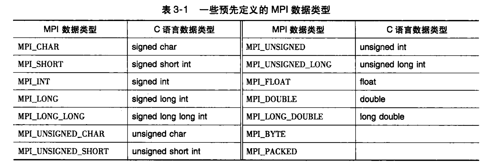
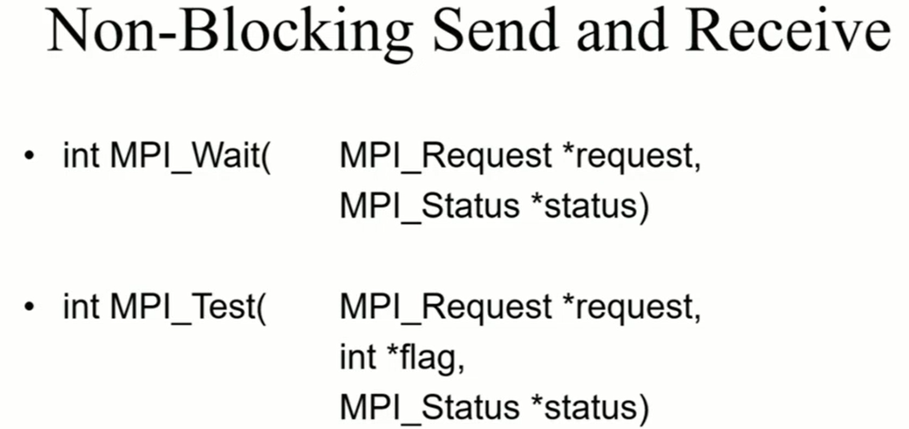
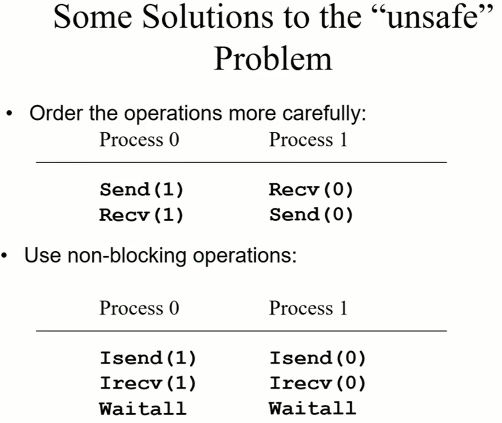
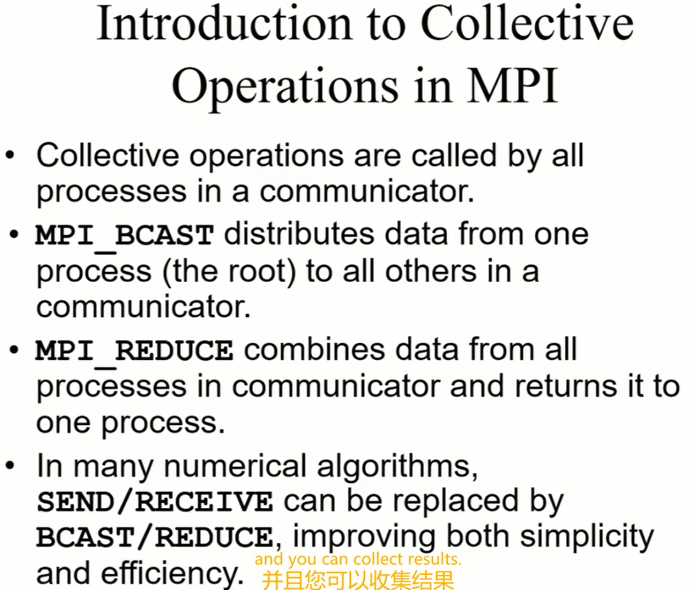

# 并行计算设计导论

## Chapter 2  并行计算相关的基础知识以及硬件


## Chapter 3 用MPI进行分布式内存编程

MPI is designed to work in a heterogeneous（异构） environment.

fairly heavily（相当）dispatch（分发，调度）

计算机可以大致分为：分布式内存系统和共享内存系统。本章主要讨论如何使用消息传递来对分布式内存系统进行编程。

注：本章内容可以结合课本以及`CMU 15-418 Recitation 6` 共同学习。（Recitation 6 的内容后半部分是一些矩阵优化相关的内容，不想看可以不看）

### 第一个类似于Hello world 的程序

```c
#include <stdio.h>
#include <string.h>
#include <mpi.h>

const int MAX_STRING = 100;

int main (void){
    char greeting[MAX_STRING];
    int comm_sz;
    int my_rank;

    MPI_Init( NULL , NULL);
    MPI_Comm_size( MPI_COMM_WORLD , &comm_sz);
    MPI_Comm_rank( MPI_COMM_WORLD, &my_rank);

    if (my_rank != 0) {
        sprintf(greeting, "Greetings from process %d of %d!\n", my_rank, comm_sz);
        MPI_Send(greeting, strlen(greeting)+1, MPI_CHAR, 0, 0, MPI_COMM_WORLD);
    } else {
        printf("Greetings from process %d of %d!\n", my_rank, comm_sz);
        for(int i = 1; i < comm_sz; i++)
        {
            MPI_Recv(greeting, MAX_STRING, MPI_CHAR, i, 0, MPI_COMM_WORLD, MPI_STATUS_IGNORE);
            printf("%s", greeting);
        }
    }

    MPI_Finalize();
    return 0;
}

```

用`mpicc -g -Wall -o hello hello.c`来编译

用`mpiexec -n 1 ./hello`来运行

### 一点点MPI程序的代码要点

1. 每个程序是由MPI_Init和MPI_Finalize进行必要的初始化和结束。与MPI有关的函数都要在这里面进行（其中，MPI_Init传入的是*argc和*argv的指针。
2. 通信子（communicator）、MPI_Comm_size 和 MPI_Comm_rank （一般来说，comm_sz表示进程的数量，my_rank表示进程号）（并且要初始化！！！）

### SPMD编程

> Single Program and Multiple Data：我们称为单程序多数据。理论上是每个进程编译不同的程序。但是我们常用的手段是编写一个程序，根据不同的进程号来分配进程。

### 通信

在上面的示例程序中，我们将信息通过`printf & sprintf`来传递。通过MPI_Send来发送MPI_Recv来接受。


值得注意的是size要加上'\0'。**Data type could make the program portable.**

（还有两个函数是MPI_Isend和MPI_IRecv）



注意：

1. 消息的大小不要超过我们所分配的缓冲区。

2. ```c
   recv_comm = send_comm
   recv_tag = send_tag
   dest = r
   src = q
   且前三个信息兼容
   ```

​	这意味着q号进程的信息可以被r号进程收到

3. MPI使用的是“推”通信机制
4. MPI消息不可超越。

### 潜在的一些陷阱

* 我们需要每条接受语句有相应的发送语句匹配，防止进程悬挂。




* also have a function `MPI_Probe`is like a mpi receive.

* unblocking IO 会使编程变复杂。




### I/O处理

书中举的例子是并行积分方法。

其中的一些要点如下：

1. MPI允许多个输出，但输出的顺序并不一定跟`my_rank`有关，可能是乱序的。
2. 但输入的话我们一般只规定0号进程负责读取，再将信息分发给各个进程。
3. 集合通信（collective communication），可以用来提高效率。书中的举例是一个二叉树形结构来通信
4. MPI_Reduce：用来优化全局求和函数

```
double local_x[N], sum[N]
MPI_Reduce(local _x, sum, N, MPI_DOUBLE, MPI_SUM, 0, MPI_COMM_WORLD)
//前两个参数必须是地址传参
```




> 小结：我们不难注意到点对点通信和集合通信的不同。他们都有些特点：必须有匹配的集合通信函数；传递的参数必须“相容？”；忠告就是不建议将同一块缓冲区作为输入和输出同时调用！


### 向量处理的技巧

这里会涉及到CMU课程后半部分以及书上的一些知识点：

1. 数据分发：块划分、循环划分、块-循环划分
2. 散射:`MPI_Scatter`; 聚集：`MPI_Gather`；MPI_ALLgather:可以将每个进程中的send_buf_p内容串联起来。
3. 书中有矩阵乘法和加法的示例。


### MPI性能

1. 计时：`MPI_Wtime`用double类型的变量记录返回值及可。
2. `MPI_Barrier`用来同步进程。在同一通信子的所有进程调用该函数之前所有调用MPI_Barrier 的进程都不能返回。
3. 排序算法的并行优化。


## Chapter 5 用OpenMP进行共享内存编程

OpenMP中的MP代表着“多处理”，是一个共享内存并行编程同一的术语。