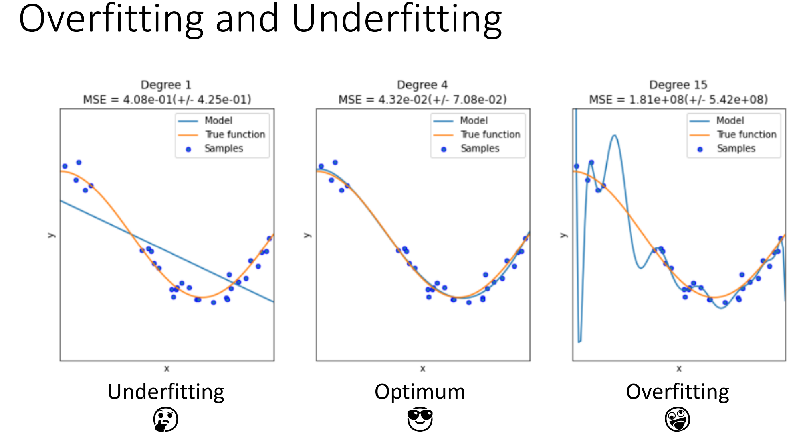
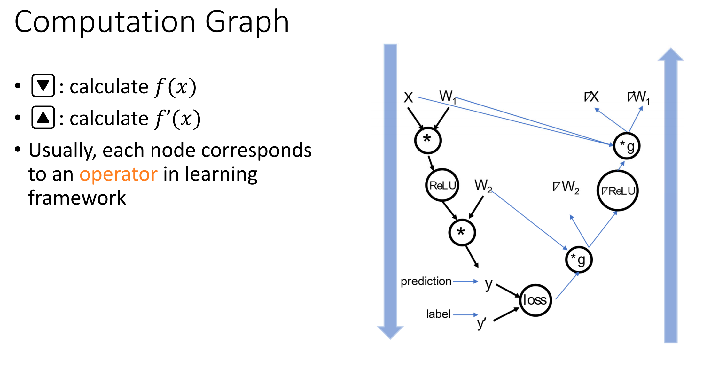
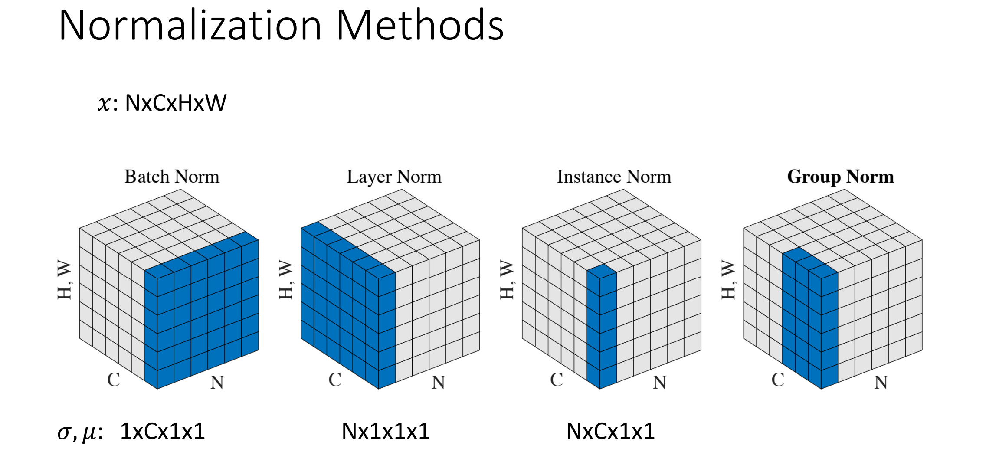

# 7月11号 机器学习（Machine Learning)

##　Why ML in an HPC course?

* ML(especially DL) is a special serious of application requiring large computing power.
* ML can be used to guide system optimization
* Emerging research topic : MLsys()

## Preview

* Introduction

* Basic of Machine Learning

* Typical Network Architectures

  > CNN
  >
  > Attention

* DL Hardware & Software
* MLSys

##　ML

1. Machine Learning Problems(classification / Regression / Clustering / Dimensionality reduction)
2. Learning method((un)Supervised learning / transfer learning / reinforcement learning)
3. Gradient Descent, and learning rate (just like 步长) (Stochastic随机)
4. About fit.

##　DL

1. Multilayer Perceptions(Input \ Hidden \ Output)

2. Forward / Back Propagation(follow chain rules)

   

> **Preview**
>
> 1. Layers(Activation Function \ Loss Function \ Regularization \ Dropout \ Normalization)
>
> 2. Optimizers
>
> 3. Problems in DL(Gradient Vanishment \ Overfitting \ Fitting Non‐linear Functions )

1. Activation Function(sigmoid(容易梯度消失) / tanh / Rectified Linear Unit（可避免梯度消失） )

2. Loss Function(•Cross Entropy / Mean Square Error)
3. Regularization(正则化)
4. Dropout

5. Batch Normalization(skip math)
6. Optimizer([link](https://distill.pub/2017/momentum/))

> SGD; SGD + Momentum; AdaGrad; Adam

## CNN

学长讲了不少，但是不太想记了。主要听听就好