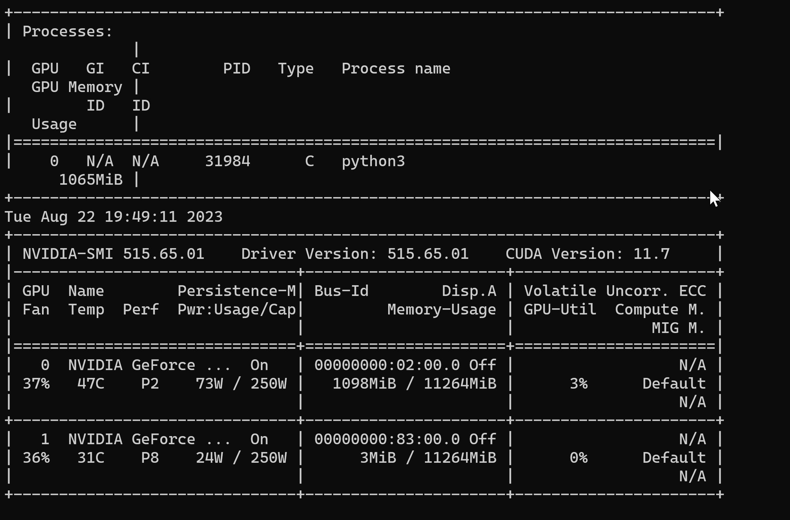
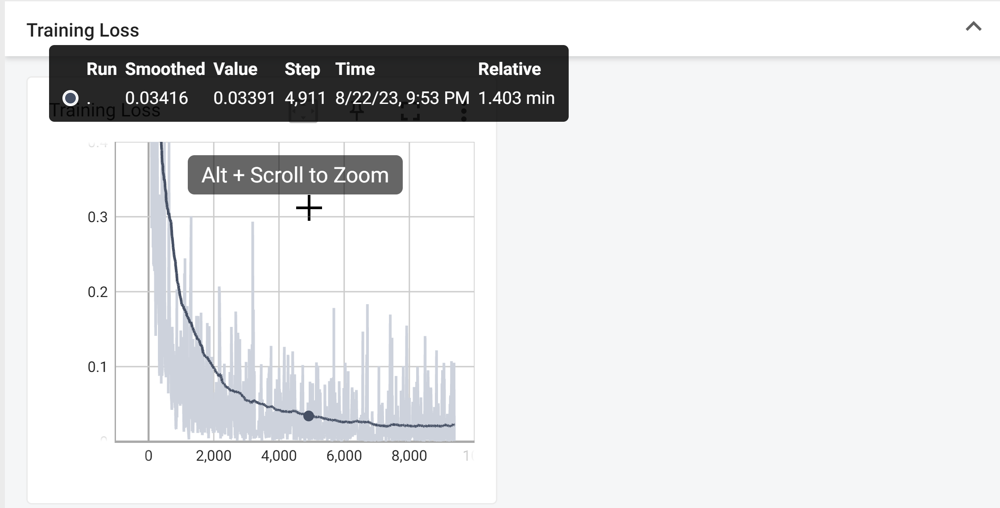
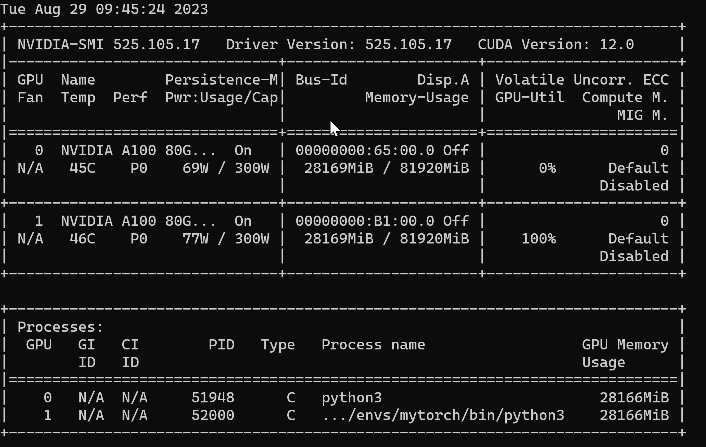

#　Lab-5 AI相关

[TOC]

## Lab Description

---

> 1. 使用 `PyTorch` 实现最基本的卷积神经网络 LeNet-5，并在 MNIST 数据集上使用 GPU 进行训练，并对测试集进行测试。
> 2. 编写 `GELU` 算子，并在 LeNet-5 中使用该算子，验证其正确性。
> 3. 你需要提交：
>    1. 全部代码
>    2. 实验报告，其中需要包含：
>       1. 简要实验过程
>       2. 贴上训练过程的 **GPU 占用率截图**（使用 `nvidia-smi` 查看）
>       3. Tensorboard **模型的损失曲线、LeNet-5 的准确率曲线等截图**
>       4. 对于 LeNet-5，你需要写明测试集上的**识别正确率**
>       5. 对于 Bonus，你需要写明训练时间、加速策略、加速效果


## Introduction Knowledge(可以跳过不看)

---

1. [GELU介绍](https://alaaalatif.github.io/2019-04-11-gelu/)
2. [神经网络基础](https://yaoyaolingbro.github.io/notebook/Online%20CS%20Courses/CS50%20AI/note/)
3. 3b1b的视频很有启发意义！


## Lab Design & Test Result

---

### LeNet

#### Environment

本次实验我选择使用conda自己管理环境。使用salloc的方法在2080Ti上完成实验。

```shell
conda create -n mytorch python=3.10
conda activate mytorch
conda install pytorch torchvision tensorboard -c pytorch -c nvidia
# conda deactivate
```

#### Optimizer

Adam 优化器会比SGD效率高很多，准确率也会高很多

#### Learing Rate

通过实验记录我们可以看到如果学习率为0.002时反而测试结果不理想。最后选择0.001

#### GPU Occupation

大约需要30s左右GPU占用达到峰值，大约维持在1098Mib。



#### Tensorboard

使用`ssh -L 16006:127.0.0.1:6006 dzz@clusters.zju.edu.cn -p 80`，但是在**H248**上使用tensorboard，然后再在本地访问 http://127.0.0.1:16006/，既可以看到页面。




```shell
[Epoch 1, Batch 200] loss: 0.681
[Epoch 1, Batch 400] loss: 0.171
[Epoch 1, Batch 600] loss: 0.117
[Epoch 1, Batch 800] loss: 0.092
[Epoch 2, Batch 200] loss: 0.076
[Epoch 2, Batch 400] loss: 0.063
[Epoch 2, Batch 600] loss: 0.060
[Epoch 2, Batch 800] loss: 0.058
[Epoch 3, Batch 200] loss: 0.052
[Epoch 3, Batch 400] loss: 0.050
[Epoch 3, Batch 600] loss: 0.048
[Epoch 3, Batch 800] loss: 0.045
[Epoch 4, Batch 200] loss: 0.035
[Epoch 4, Batch 400] loss: 0.039
[Epoch 4, Batch 600] loss: 0.037
[Epoch 4, Batch 800] loss: 0.037
[Epoch 5, Batch 200] loss: 0.028
[Epoch 5, Batch 400] loss: 0.032
[Epoch 5, Batch 600] loss: 0.030
[Epoch 5, Batch 800] loss: 0.029
[Epoch 6, Batch 200] loss: 0.021
[Epoch 6, Batch 400] loss: 0.026
[Epoch 6, Batch 600] loss: 0.033
[Epoch 6, Batch 800] loss: 0.029
[Epoch 7, Batch 200] loss: 0.018
[Epoch 7, Batch 400] loss: 0.020
[Epoch 7, Batch 600] loss: 0.022
[Epoch 7, Batch 800] loss: 0.022
[Epoch 8, Batch 200] loss: 0.019
[Epoch 8, Batch 400] loss: 0.018
[Epoch 8, Batch 600] loss: 0.019
[Epoch 8, Batch 800] loss: 0.018
[Epoch 9, Batch 200] loss: 0.017
[Epoch 9, Batch 400] loss: 0.014
[Epoch 9, Batch 600] loss: 0.017
[Epoch 9, Batch 800] loss: 0.015
[Epoch 10, Batch 200] loss: 0.011
[Epoch 10, Batch 400] loss: 0.016
[Epoch 10, Batch 600] loss: 0.017
[Epoch 10, Batch 800] loss: 0.019
Accuracy on the test set: 99.02%
```


### GELU

#### Python

```python
import torch
import math
import torch.nn.functional as F
from torch.autograd import Function


class MyGELUFunction(Function):
    @staticmethod
    def forward(ctx, input):
        output = input * 0.5 * (1 + torch.erf(input / math.sqrt(2)))
        ctx.save_for_backward(input,output)
        return output

    @staticmethod
    def backward(ctx, grad_output):
        input, output = ctx.saved_tensors
        grad_input = grad_output * (0.5 * (1 + torch.erf(input / math.sqrt(2))) + input * torch.exp(-(input)**2 / 2) / math.sqrt(2) / math.sqrt(math.pi))
        return grad_input
```

（推导过程可以见 Introduction Knowledge）

**实验结果：**


由于浮点精度的问题，该误差可以忽略不记了。（已打印grad张量比较过）


### C++

同样的，我们阅读官网资料，通过正常的改写c++代码即可完成该模块。**注：**此处我使用的是JIT动态编译。

其中gelu.cpp内容如下：

```c++
#include <torch/torch.h>
torch::Tensor gelu_fwd(torch::Tensor input){
    return input * torch::sigmoid(1.702*input);
}

torch::Tensor gelu_bwd(torch::Tensor grad_out, torch::Tensor input){
    auto tmp = torch::sigmoid(1.702*input);
    return grad_out * (tmp+1.702*input*tmp*(1.0-tmp));
}

PYBIND11_MODULE(TORCH_EXTENSION_NAME, m){
    m.def("forward", &gelu_fwd, "GELU forward"); 
    m.def("backward", &gelu_bwd, "GELU backward");
}
```


## Bonus

通过在基准代码上编写，实验基本结果如下（loss高的吓人）


### 多卡训练

当我使用lightning重构多卡训练模型后，由于未知原因（？可能是0显卡未启用)导致训练时间明显变慢了




### 混合精度


根据编译器的提示，我们更改代码：

```python
if __name__ == '__main__':
    torch.set_float32_matmul_precision('medium')
    main()
```


## Discussion

---

通过本次学习，自己为了能有更夯实的基础，学习了经典的CS50课程，两届了神经网络的基本框架。通过对PyTorch官网资料的阅读，以及优化过程中对PyTorch-Lightning的使用，能够编写简单的神经网络，为自己未来的学习有启发性意义并打下良好基础。

其中对GELU算子的编写，也为我打开了MLSys的大门，了解了如何将c加载如python中（为了提升效率），希望自己未来能在这个感兴趣的领域有所研究。

ps：bonus部分由于个人时间原因（最近这段时间家中有些事情），有部分优化方法未完整使用，还请助教谅解。
