# 4 Processor

!!! warning
    由于时间原因，本文后半部分有一些地方不完整。
    > 附上一个个人认为杀疯了的[ppt](https://passlab.github.io/CSCE513/notes/lecture07_RISCV_Impl.pdf)

我们讨论过，计算机的 performance 受 **inst#, clock cycle time 和 clock cycles per inst (CPI)** 决定。Clock cycle time 和 CPI 受 processor 的实现方式影响。本章介绍 RISC-V 的 processor 一种实现。

## 4.1 Datapath

### 4.1.1 Overview

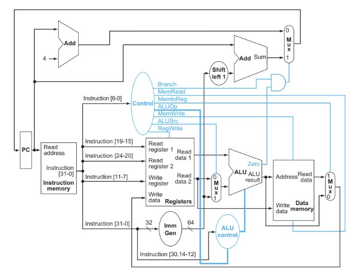

上图展示了一个 RISC-V 核心指令的实现（并不完整），包括  `ld`  ,   `sd`  ,   `add`  ,   `sub`  ,   `and`  ,   `or`  ,   `beq`  。我们简单进行分析。

   - PC 寄存器存储当前运行到的指令的地址。**PC** 寄存器连到 **Instruction memory** 中，读出的结果就是当前要运行的指令。这个指令被 **Control** 解析产生相应的信号。我们在 4.1.6 小节中具体说明它的实现。

<!-- prettier-ignore-start -->

??? info "Control signal"
    | Different types of instructions | RegWrite | MemtoReg | MemWrite | ALUSrc | Branch | MemRead | ALUOp | Jump |
    |---------------------------------|----------|----------|----------|--------|--------|---------|-------|------|
    
<!-- prettier-ignore-end -->

### 4.1.2 R 型指令

   -   `add`  ,   `sub`  ,   `and`  ,   `or`  这几个 R 型指令总共需要访问 3 个寄存器，如下图所示：

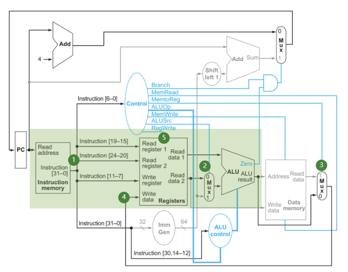

- (1) 处取出指令，  `[6:0]`  被送到 Control 产生对应的控制信号，我们稍后可以看到；  `[19:15]`  ,   `[24:20]`  ,   `[11:7]`  分别对应  `rs1`  ,  `rs2`  ,  `rd`  ，被连入 Registers 这个结构，对应地  `Read data 1`  和  `Read data 2`  两处的值即变为  `rs1`  ,  `rs2`  的值；
- (2) 处 MUX 在  `ALUSrc = 0`  的信号作用下选择  `Read data 2`  作为 ALU 的输入与  `Read data 1`  进行运算，具体的运算由  `ALU control`  提供的信号指明（我们在 **4.1.3 小节** 讨论这个话题）。运算结果在  `ALU result`  中。
- (3) 处 MUX 在  `MemtoReg = 0`  的信号作用下选择  `ALU result`  作为写回 Register 的值，连到 (4) 处；在 (5) 处  `RegWrite = 1`  信号控制下，该值写入到  `rd`  寄存器中。

这就是 R 型指令的运行过程。执行完指令后 PC 会 +4，我们在 **4.1.4 小节** 讨论这一操作的实现。

!!! info
    有聪明的小朋友可能会问，为什么需要  `RegWrite`  这个控制信号呢？非常简单，因为  `Write register`  和  `Write data`  这两条线始终是连着的，Reg files 需要知道什么时候需要写入寄存器，因此只有当  `RegWrite = 1`  时才会被对应地写入。

    聪明的小朋友可能又会问了，为什么  `PC`  寄存器也要写入，但是不需要控制信号呢？非常简单，因为  `PC`  在 **每个** 时钟周期都会被写入，所以只需要在时钟的 **每个** 上升沿或者下降沿触发就好了（我们采取的设计是下降沿触发，我们在 **4.3.3 小节** 再讨论为什么这样设计），不需要额外的控制信号了。

### 4.1.3 ALU Control
在 3.1 节中，我们设计的 ALU 需要这样的控制结构：

我们列一下需要使用 ALU 的指令的表格（我们在）：

我们根据这个表列出真值表：

其中可以发现，标为绿色的列的取值要么是 0 要么是无关的，因此它们并不影响结果。

根据这个真值表构造门电路，就可以构造出 ALU control 单元了。如图中所示，该单元依赖 Control 单元给出的  `ALUOp`  信号以及  `I[30, 14:2]`  ：

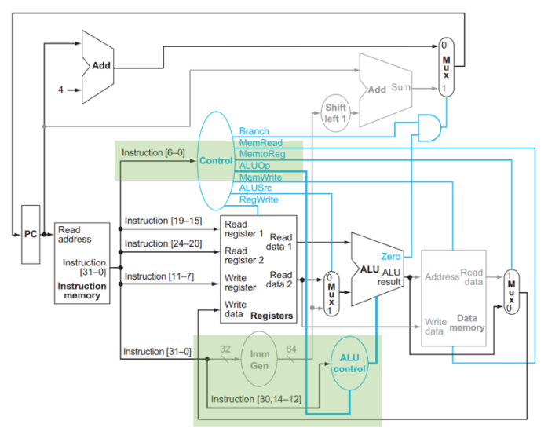

!!! info
    ALU control 模块可以这样实现：

    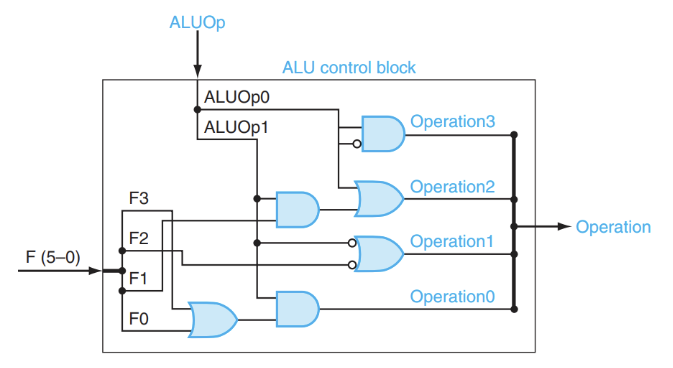
    
    需要理解的是，我们并不是根据机器码来构造电路的，而是相反：电路的设计参考了很多方面的问题，机器码应当主要迎合电路使其设计更加方便。

### 4.1.4 跳转指令与 Imm Gen 模块

- 在一条指令运行完后，如果不发生跳转，PC + 4，否则 PC 跳转到 PC + offset 的位置去。这个过程是如何完成的呢？看下图：

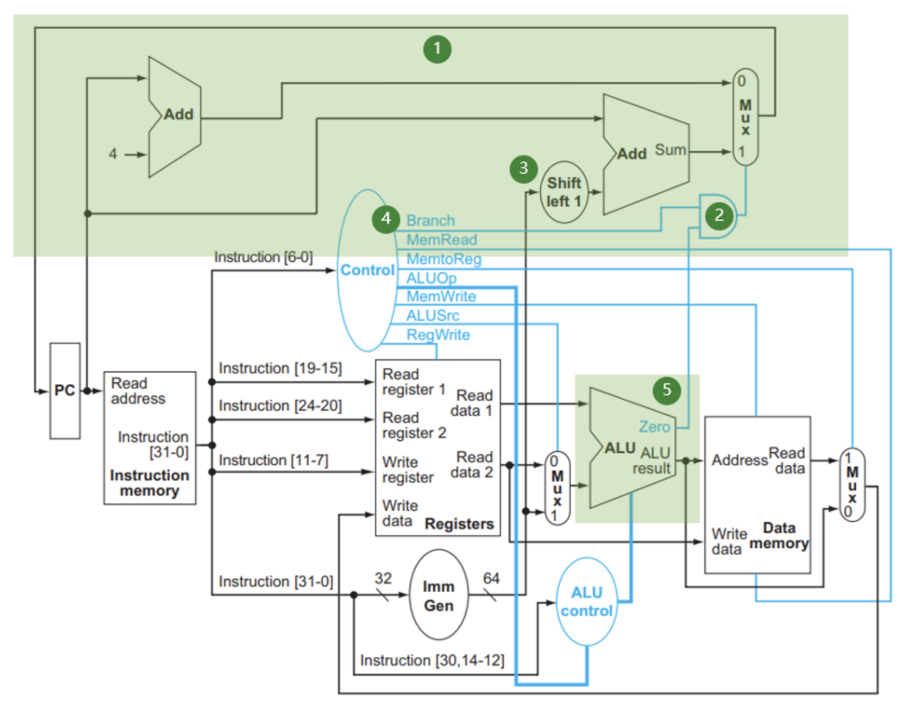

-  (1) 中有两个加法器，一个的结果是 PC + 4，另一个是 PC + offset，其中 offset 是来自当前 instruction 的；这两个加法器通过 MUX 送给 PC
- MUX 的控制信号来自  (2)， (2) 是一个与门，即当且仅当两个输入信号都为真时才会输出 1，从而在上述 MUX 中选择跳转。 (2) 的两个输入分别来自：
    -  (5) 这个 ALU 的 Zero 信号，这是第 3 章中我们设计的可以用来实现  `beq`  的结构；我们讨论过实现  `beq`  其实就是计算  `rs1 - rs2`  判断其是否为 0，所以这里根据 Zero 是否为 0 就能判断两个寄存器是否相等
    -  (4) 处 Control 给出的  `Branch`  信号，即如果这个语句是跳转语句，那么对应的信号会置为 1

也就是说，当且仅当语句确实是  `beq`  而且  `Zero`  信号的值确实为 1 时才会进行跳转。

- 再来看看当进行跳转的时候， (3) 处的 offset 来自哪里。我们可以看到，实际上这个 offset 来自于  `I[31:0]`  ，也就是整个指令；它被传给 **Imm Gen 模块**，将指令中的立即数符号扩展到 64 位；然后在  (3) 处左移 1 位（请回顾，因为 RISC-V 指令总是 2 字节对齐 [我们学的都是 4 字节对齐]，所以我们没有保存偏移的最低一位）再与 PC 相加。

!!! info "Imm Gen 模块"
    这个模块识别  `load`  类指令、  `store`  类指令和  `branch`  类指令的立即数模式并将其 **符号扩展** 到 64 位，根据  `I[5:6]`  的不同取值区分这三种情况，构造一个 3:1 MUX 选择实际的立即数，将其传给后面的使用。

### 4.1.5 Load 指令和 Store 指令
懒得写了，可以自己理解一下。

用文化人的话来说，Load 指令和 Store 指令的数据通路操作留作习题。

### 4.1.6 Control
看完上述若干小节，control 单元的设计也非常显然了。我们很容易给出如下真值表：

后面就是连电路的工作了。连出来长这样：

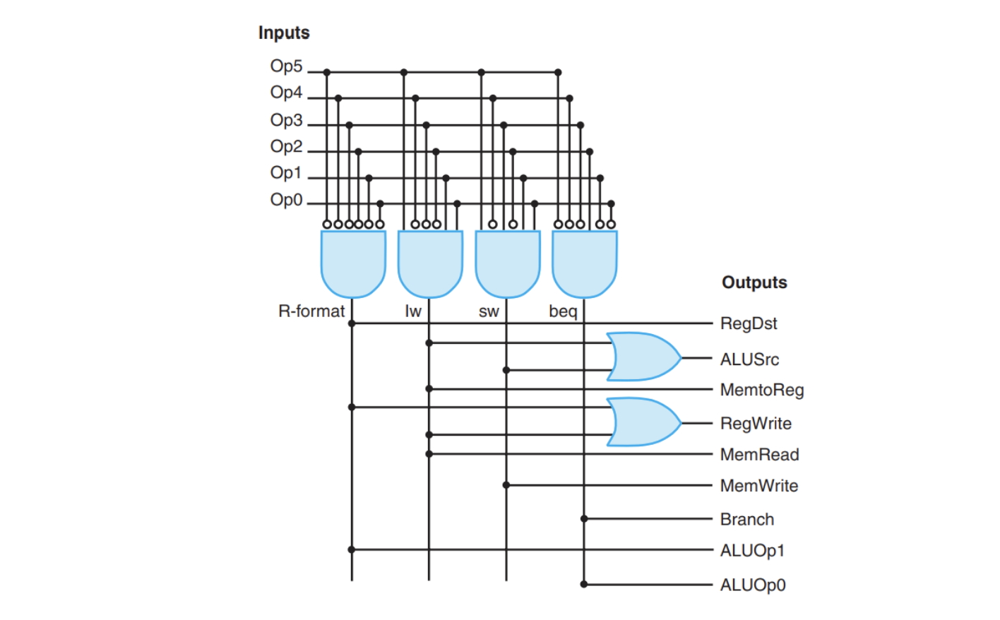

### 4.1.7 Why a Single-Cycle Implementation is not Used Today
单周期的实现是指，一个指令的所有工作都在一个时钟周期内完成，也就是 CPI = 1。那么，一个时钟周期的长度就要足够最长的那个指令完成运行。但是，例如  `load`  类的指令要经过 inst mem, reg file, ALU, data mem, reg file 这么多的步骤，这会使得时钟周期变得很长，导致整体性能变得很差。单周期的实现违反了 **common case fast** 这一设计原则。

因此，我们引入一种新的实现技术，叫 **流水线 (Pipeline)**。

## 4.2 Interrupts and Exceptions
中断是指一些I/O设备请求CPU的服务，而异常是指程序运行时出现的错误，如：除零错误、内存越界、未定义opcode、溢出等。这两者都会导致程序的正常执行被打断，CPU需要做出相应的处理。

### 4.2.1 Handling Exceptions
- 当异常发生时，CPU会将异常的原因保存在 **Cause Register** 中，将异常发生时的指令地址保存在 **EPC Register** 中，然后跳转到异常处理程序。
- 保存问题的原因和地址是为了在异常处理程序中能够知道异常发生的原因和异常发生时的指令地址，以便进行相应的处理。
> 在RISC-V中，SEPC和SCAUSE（2 for undefined opcode, 12 for hardware malfunction）分别对应EPC和Cause Register。
- Jump to Handler的过程是通过 **Exception Vector** 实现的，即在异常发生时，CPU会根据异常的原因跳转到相应的异常处理程序。
> 在RISC-V中，这个过程是通过 **Vectored Interrupt** 实现的。

### 4.2.2 CSR（Control and Status Registers）
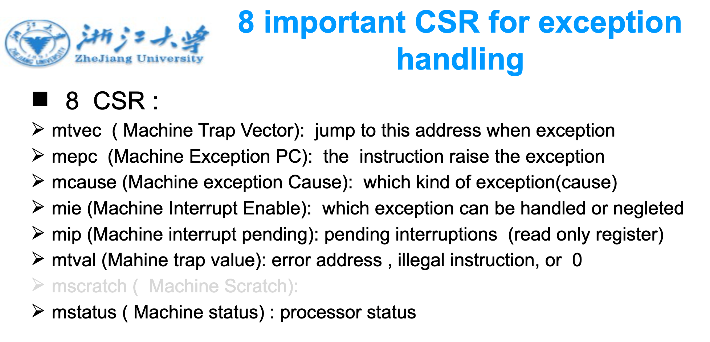

## 4.3 Pipeline

### 4.3.1 Intro
在小学奥数中我们就学过，并行能够提高整体的效率，例如这个洗衣服的例子：

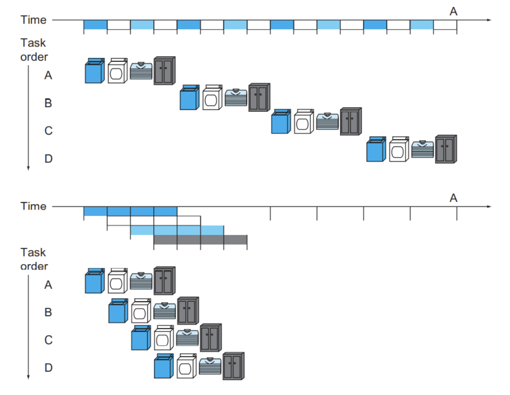

对于单个工作，流水线技术并没有缩短其运行时间；但是由于多个工作可以并行地执行，流水线技术可以更好地压榨资源，使得它们被同时而不是轮流使用，在工作比较多的时候可以增加整体的 **吞吐率 throughput**，从而减少了完成整个任务的时间。

在本例中，由于流水线开始和结束的时候并没有完全充满，因此吞吐率不及原来的 4 倍（4 来自于例子中有 4 个步骤）；但是当工作数足够多的时候，吞吐率就几乎是原来的 4 倍了。

回到 RISC-V 中来，一个指令通常被划分为 5 个阶段：

1. **IF, Inst Fetch**，从内存中获取指令
2. **ID, Inst Decode**，读取寄存器、指令译码
3. **EX, Execute**，计算操作结果和/或地址
4. **MEM, Memory**，内存存取（如果需要的话）
5. **WB, Write Back**，将结果写回寄存器（如果需要的话）

各阶段会用到的组件如下图所示（这个图还有很多问题，我们后面慢慢讨论~），可以看到这些部分是可以并行执行的（比如 Reg File 可以一边读一边写）：

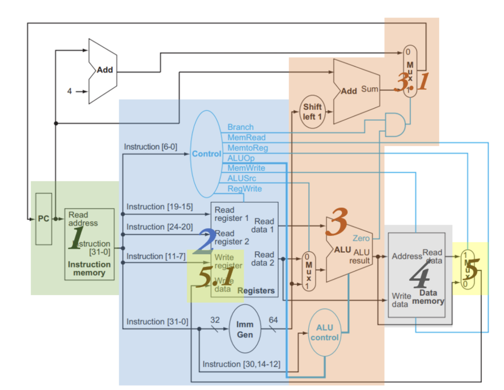

其加速的核心主旨是，它们都希望一个周期能完成一条指令，但是单周期 CPU 的一个周期需要承担一个指令的所有步骤；而流水线技术引入后，由于它可以并行地同时执行五个阶段的步骤，所以此时的周期只需要一个阶段的长度。总的来说，单周期 CPU 的时钟周期由总耗时最长的指令决定，流水线 CPU 的时钟周期由耗时最长的指令阶段（IF, ID 等）决定。

也就是说，我们本来是在一个周期中完成一个指令，而现在是在一个周期中完成五个不同指令的不同阶段。当然，每个时钟周期的长度也需要足够任何一个阶段完成执行。

RISC-V 也有很多流水线友好的设计，例如：

   - 所有 RISC-V 的指令长度相同，这可以方便  `IF`  和  `ID`  的工作
   - RISC-V 的指令格式比较少，而且源寄存器、目标寄存器的位置相同
   - 只在 load 或 store 指令中操作 data memory 而不会将存取的结果做进一步运算，这样就可以将  `MEM`  放在比较后面的位置；如果还能对结果做运算则还需要一个额外的阶段，此时流水线的变长并没有什么正面效果

---

Hazards 指的是阻止下一个指令在下一个时钟周期完成的一些情况。主要分为三种：

- Structure hazards
    - 一个被请求的资源仍处于忙碌状态
- Data hazards
    - 需要等待上一个指令完成数据读写
- Control hazards
    - 一些控制取决于上一条指令的结果

### 4.3.2 Structure hazards

但是，聪明的小朋友也可以看出一些问题！比如，前一个指令在  `ID`  阶段的时候，会使用到其在  `IF`  阶段读出的指令的内容；但与此同时后一个指令已经运行到  `IF`  阶段并读出了新的指令，那么前一个指令就没的用了！这个现象在很多地方普遍存在，包括 Control 信号的传递，因此我们实际上会在每两个 stage 之间用一些寄存器保存这些内容：

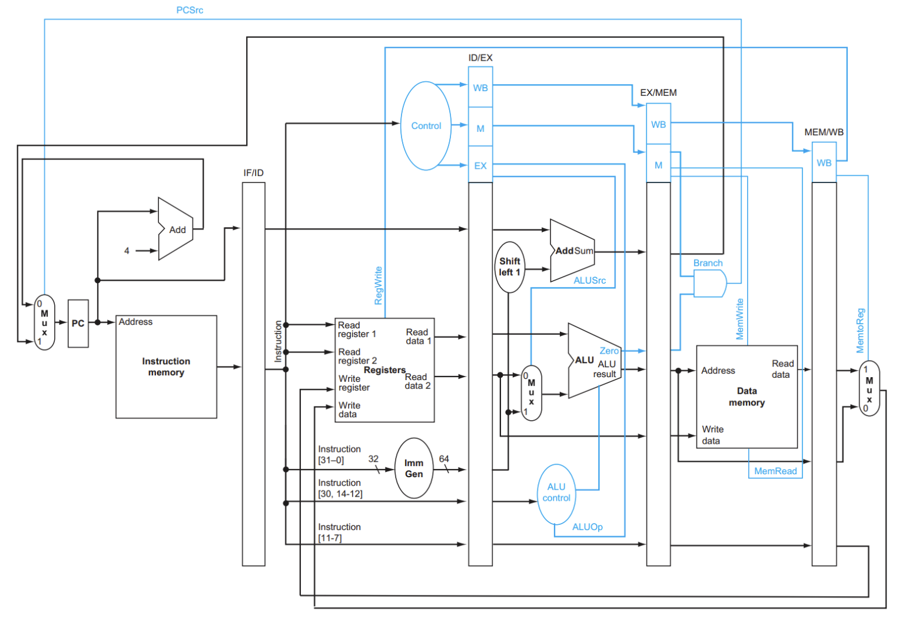

可以看到，上面这个图除了加了一些竖条条以外和之前没有流水线的时候几乎没什么差别。这些竖条条就是 pipeline registers，例如  `IF/ID`  就是  `IF`  和  `ID`  阶段之间的一些寄存器。

!!! tip

    聪明的小朋友可能会回忆起我们在 **4.1.2 小节** 中提到的，由于 PC 每个时钟周期都会被写入，所以不需要像 Reg files 和 Data mem 那样需要额外的控制信号  `RegWrite`  和  `MemWrite`  来控制写入，只需要在每个下降沿写入就好。Pipeline registers 也是这样，它们每个时钟周期都会被写入一次，所以也不需要额外的信号，也是在每个下降沿写入就好。
    
    我们之前并没有讨论为什么要**在下降沿写入**，本节下一个 Info 框框就会说明啦！

我们关注 datapath 中两个从右往左传东西的情况！一个是  `WB`  阶段写回数据，一个是  `MEM`  阶段判断是否发生跳转。分别关注对应增加的 datapath：

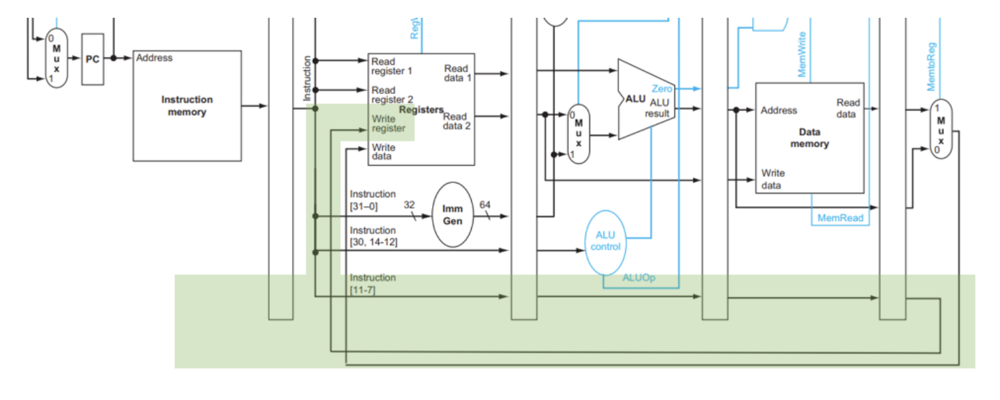

对于  `WB`  来说，我们写回时需要记录写到哪个 register 中，这个信息是  `ID`  阶段从 Instruction 中  `[11:7]`  的位置取出的，但是直到  `WB`  阶段才被用到，因此这个信息被存到了  `ID/EX`  ，下一个周期存到了  `EX/MEM`  ，下一个周期存到了  `MEM/WB`  ，然后下一个周期被使用。

  `MEM`  判断是否发生跳转的逻辑类似，略。

另外，由于在流水线中 IF 和 MEM 都有可能用到内存，为了不出现结构竞争，我们将数据和指令放在不同的地方，以避免同时出现要访问内存而导致的结构竞争。

### 4.3.3 Data Hazards
但是，聪明的小朋友仍然可以看出一些问题！考虑这样的指令序列：

用简化的数据通路查看一下各指令各 stage 的执行时间：

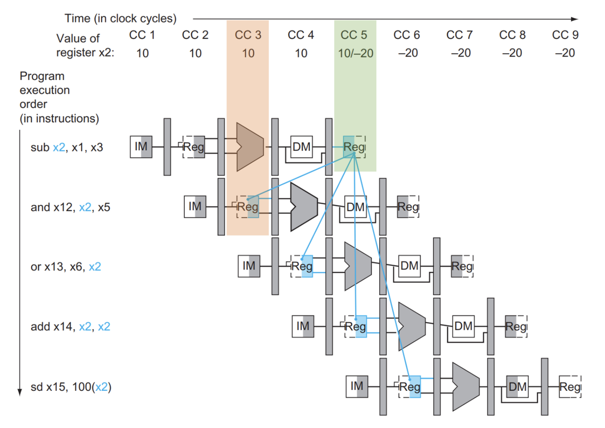

> 我们简单介绍一下这张图。最上面是横轴，也就是时间轴，CC 代表 Clock Cycle；下面的 10, -20 这种数据是  `x2`  寄存器的值；接下来的每一行都是一个语句的执行过程，  `IM`  就是 inst mem，对应  `IF`  stage；  `Reg`  就是 reg file，对应  `ID`  stage；长得像 ALU 的就是 ALU，对应  `EX`  stage；  `DM`  就是 data mem，对应  `MEM`  stage；最后面的  `Reg`  也是 reg file，对应  `WB`  stage。每个 stage 占用一个时钟周期。
> 
> 图中深色（灰色、蓝色）的部分就是对应指令会使用到的组件，其中 mem 和 reg file 用左半边为深色时表示 **写入**，右半边为深色时表示 **读取**。我们稍后解释这样表示的原因。

可以看到，当第一条语句  `sub x2, x1, x3`  运行到第 5 个时钟周期时，计算结果才被写回  `x2`  （如绿色框框所示），但是在第 3 个周期时第二条语句  `and x12, x2, x5`  就运行到  `ID`  阶段，需要用到  `x2`  的值（如橙色框框所示）。如果这时候不加处理，第二条语句读到的值就是错误的！这一问题同时会发生在第 3 条指令那里，它在第 4 个时钟周期需要用到  `x2`  的值，但是这时候  `x2`  的值仍未被更新。

也就是说，由于指令所需的数据依赖于前面一条尚未完成的指令，因此指令不能在预期的时钟周期内执行，这种情况我们称之为 **data hazard**。

???+ info
	在第 5 个时钟周期内，关于 Reg files 我们需要完成 2 件事：  `sub x2, x1, x3`  的  `WB`  阶段将  `x2`  的新值写入 Reg files，以及  `add x14, x2, x2`  的  `ID`  阶段将  `x2`  的值读出来并且存到  `ID/EX`  寄存器中。这两个事情有没有可能正确执行呢？答案是有的！

	众所周知，时钟信号有上升沿和下降沿，我们既可以规定一个时钟周期由一个上升沿开始到另一个上升沿结束，也可以规定一个时钟周期从一个下降沿开始到另一个下降沿结束：
	
	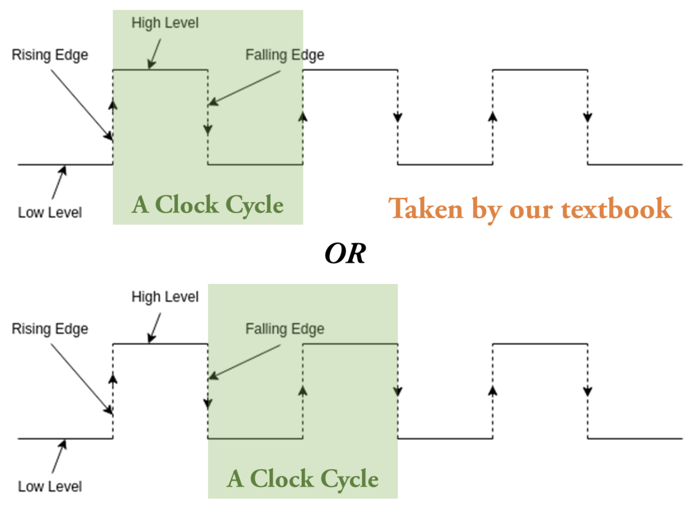
	
	在课本的设计中，我们采取前者，也就是一个时钟周期就是相邻两次上升沿之间的时间段。
	
	而寄存器的写入可以由上升沿触发，也可以由下降沿触发。如果我们规定 Reg files 中的寄存器在上升沿触发写入，也就是在前半个周期中完成写入 Reg files 寄存器的工作；而规定 Pipeline registers 在下降沿触发写入，也就是在后半个周期完成写入工作，那么，在第 5 个时钟周期的上半，  `x2`  的新值被写入 Reg；下半周期从 Reg 读出  `x2`  并写入  `ID/EX`  Reg 的值就是  `x2`  的新值了。所以说，这样的设计使得这种情况下不会出现 structure hazard。
	
	这也就能解释为什么  `PC`  要在下降沿写入了，看 datapath 的这一部分：
	
	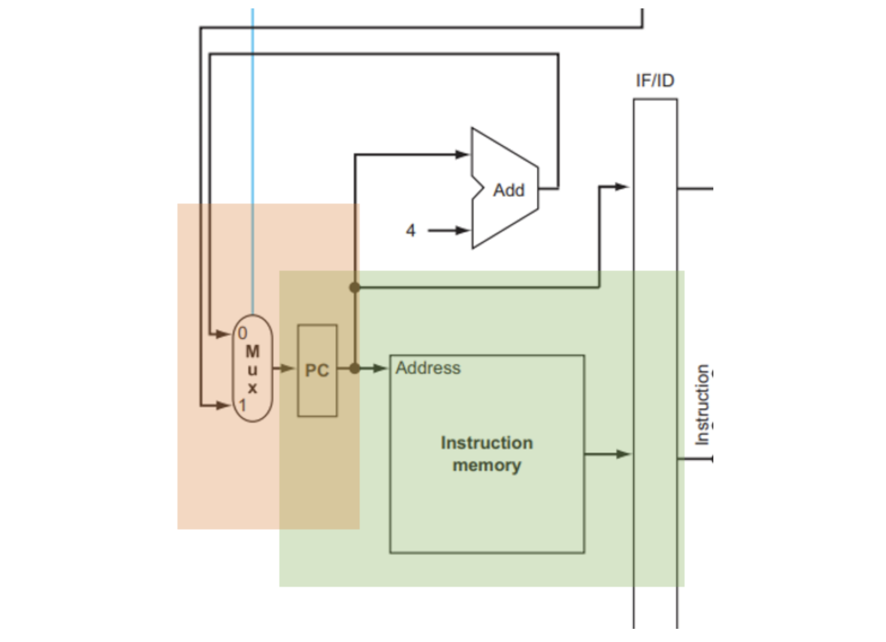
	
	如果  `PC`  在上升沿写入，也就是在上升沿更新到下一条指令的位置，那么在下降沿要将当前指令写入  `IF/ID`  的时候，从 inst mem 中读出的指令已经是下一条而不是当前指令了！所以我们必须让  `PC`  在下降沿写入，这样才能读取到正确的指令。
	
	**也就是说，Reg files 的写入均发生在上半周期，也就是上升沿；而 Pipeline registers 和  `PC`  的写入均发生在下半周期，也就是下降沿**。
	
	这也是图例中 reg file 用左半边为深色表示写入，右半边为深色表示读取的原因：写入发生在上半个周期，而使用读取的结果发生在下半个周期。

那么，如何解决 data hazard 呢？回顾刚刚的那张图：

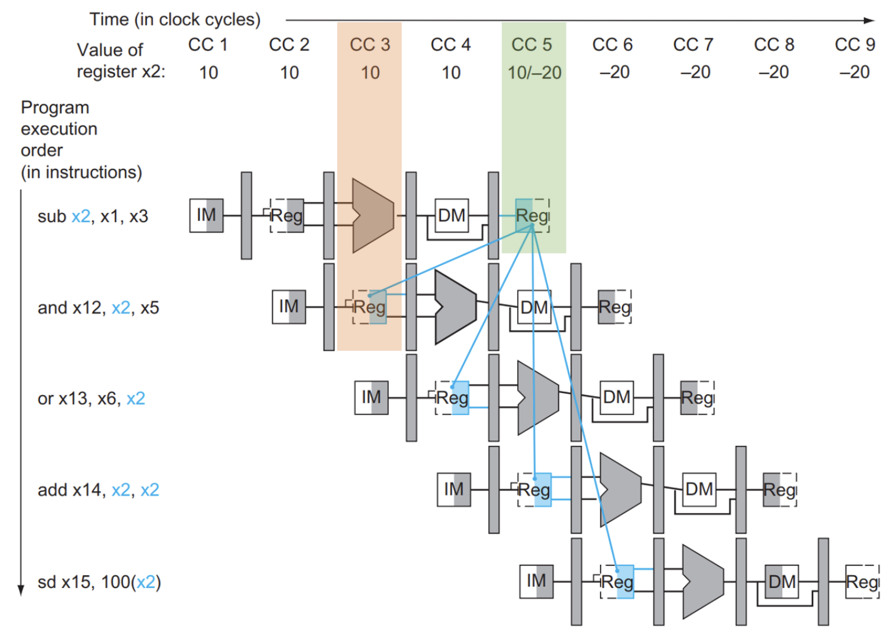

我们注意到，虽然  `sub x2, x1, x3`  在第 5 个时钟周期的  `WB`  阶段才将结果写回，但是在第 3 个时钟周期的  `EX`  阶段其实就算出来了！所以我们可以增加额外的硬件结构，使得 ALU 的输入不仅可以来源于寄存器中读出来的、放在  `ID/EX`  中的值，还可以来源于  `EX/MEM`  中或者  `MEM/WB`  中的值，它们分别对应前一条和再前一条指令的 ALU 的计算结果。如下图所示： 

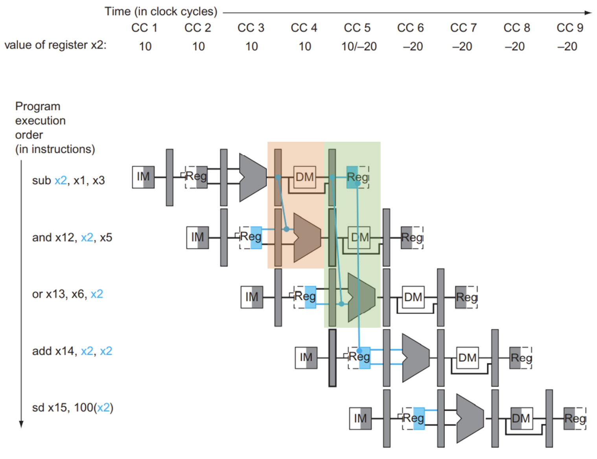

在第 3 个时钟周期，第一条指令的结果被算出并保存在  `EX/MEM`  

学不完了，暂时不详细写了，大意就是   `X = 1, 2 =	if (MEM.Rd != x0 && EX.RsX == MEM.Rd) ForwardX = 10; else if (WB.Rd != x0 && EX.RsX == WB.Rd) ForwardX = 01; else ForwardX = 00;`  ：

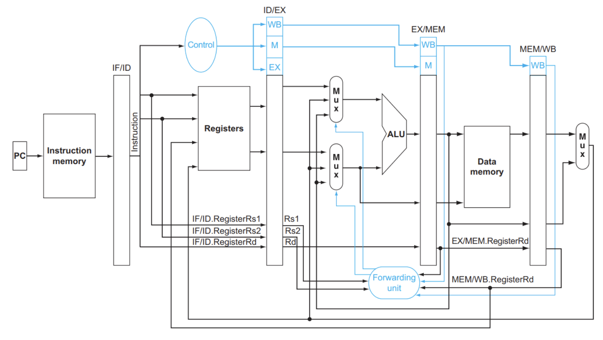

但是遇到 load 指令不得不 stall，刚刚可以是因为 EX 和 ID 就差了一轮，但是 load 的数据要到 MEM 才有，所以如果下一条指令要用，上一条也拿不出来，只能要 stall 等才行：

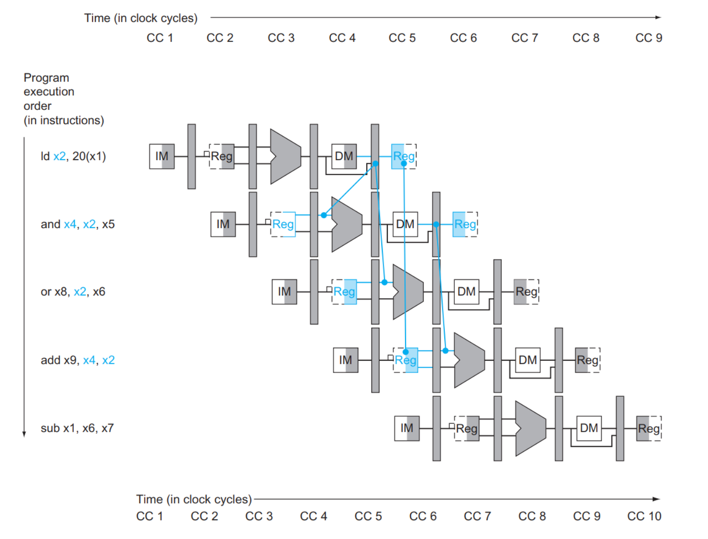

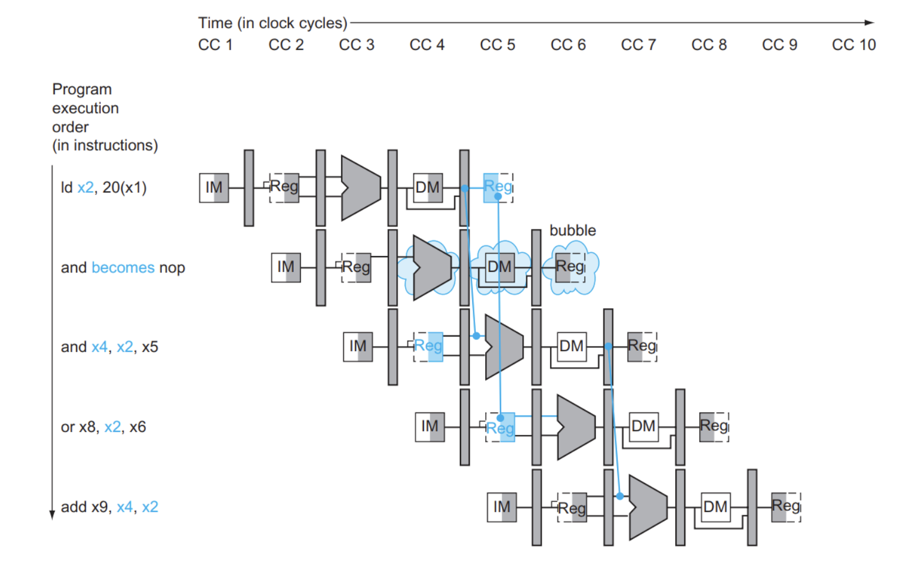

在 ID 阶段可以判定 hazard：  `if (EX.MemRead && EX.Rd == ID.RsX) Hazard();`  

如何 stall 呢？两个任务：让当前指令不要产生效果 (清空  `RegWrite`  和  `MemWrite`  )、让后面的语句不要受到影响 (保留  `PC`  和  `IF/ID`  一周期不改)：

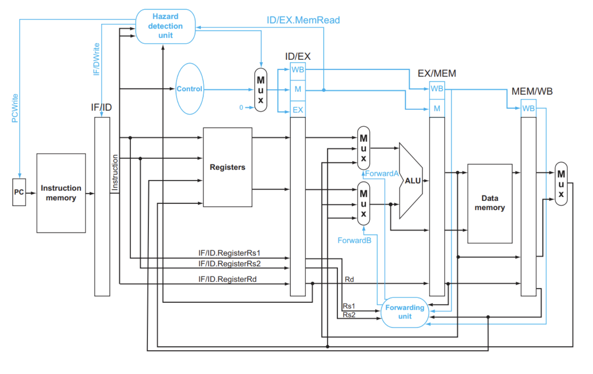

还有一种办法是对指令进行等价换序，让某些指令尽量晚一点执行，以避免数据竞争。这种方法叫 code scheduling。

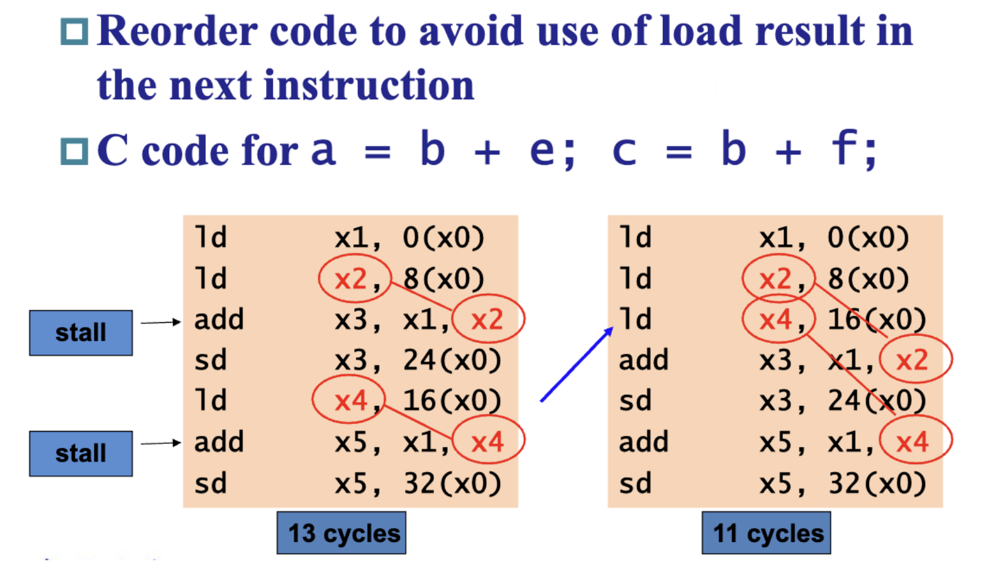

### 4.3.4 Control Hazards / Branch Hazards

!!! example "例题"
	下面一段代码在不考虑解决 hazard 的情况下的运行结果是什么？假设所有寄存器初始值为 0，Mem(1) = 0x99, Mem(8) = 0xaa, Mem(9) = 0xbb。
	
    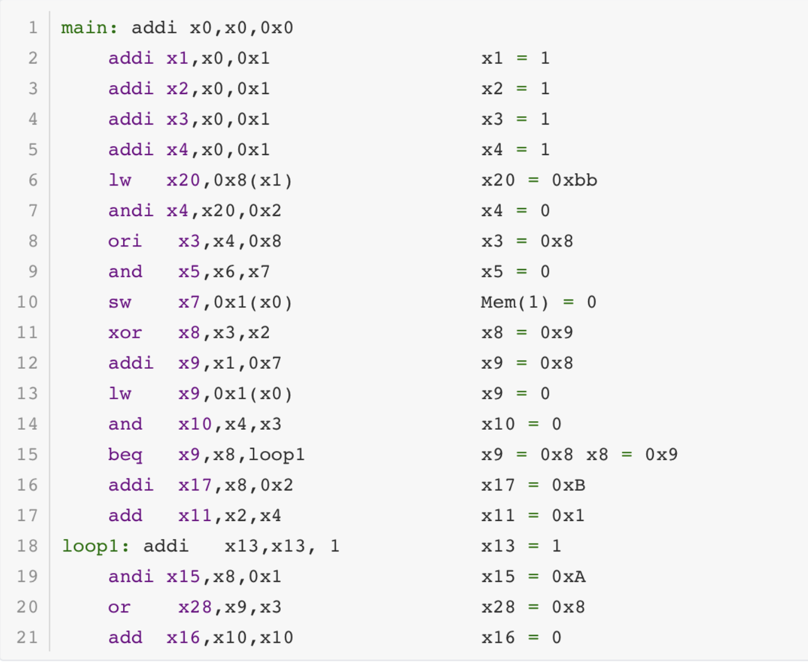
    
    ??? info "解答"
    
        我们可以模拟每条指令各阶段的执行情况：
        
        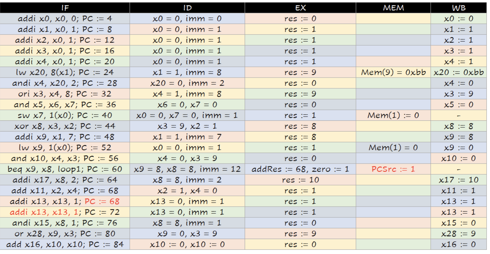
    
        从中我们也可以总结出规律（这和流水线的具体设计有关！），即：
    
        - 某条指令 (例如  `#10` )  `WB`  阶段做的寄存器更改，其之后第三条指令 ( `#13` ) 的  `ID`  阶段才能读出新的值；
        - 某条指令 (例如  `#10` )  `MEM`  阶段产生  `PCSrc = 1`  的信号，此时其之后第三条指令 ( `#13` ) 正在运行  `IF`  阶段，它运行结束后才会将  `PC`  置为实际上要跳转的指令，因此如果要跳转的话， `#11` ,  `#12` ,  `#13`  这三条语句是额外运行的；如果不用跳转就什么事都没有了；
        - 不存在其他影响结果的情况了！
        
        利用这些规律，我们可以简化我们的解题方式：
        
        Reg: 到哪一次执行的 ID 阶段开始，读出的 Reg 值会是该值
        PC: 到哪一次执行 **之后**，PC 的值会被改为该值
    
        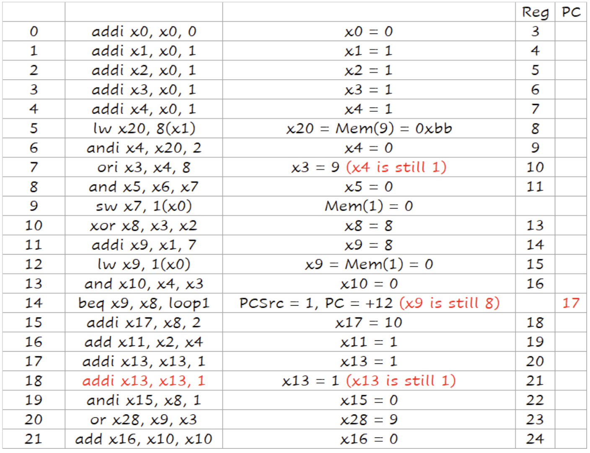

## 4.3 Exceptions
Exception 和 Interrupt 在很多地方是不作区分的，但是我们做一个简单的区分：

当 exception 发生时，在 **Supervisor Exception Program Counter, SEPC** 这个寄存器中保存发生 exception 的指令地址，然后将控制权交给操作系统。操作系统还必须知道发生 exception 的原因，RISC-V 中使用的方法是在 **Supervisor Exception Cause Register, SCAUSE** 这个寄存器中记录 exception 的原因。可以选择的另一种方法是 **vectored interrupt**，
