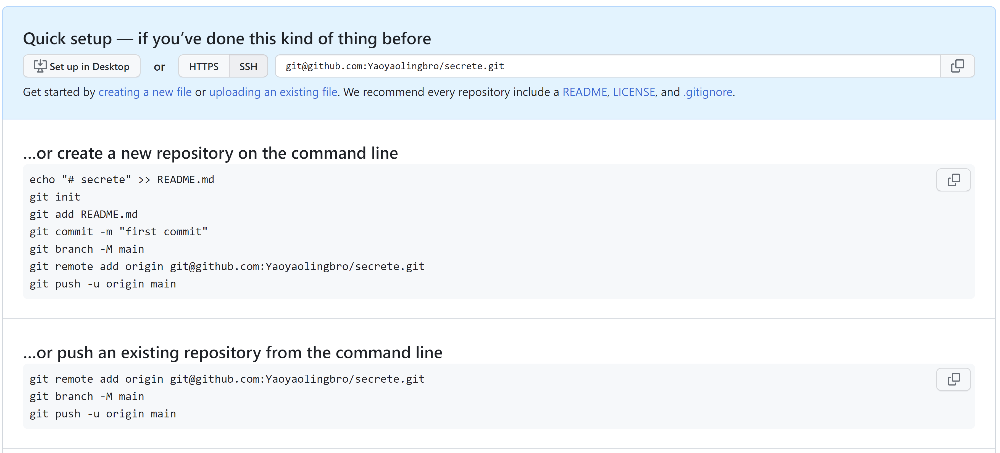

## 简介

<strong>Git</strong>是一个分布式版本控制软件，最初由林纳斯·托瓦兹创作，于2005年以GPL许可协议发布。最初目的是为了更好地管理Linux内核开发而设计。应注意的是，这与GNU Interactive Tools[4]（一个类似Norton Commander界面的文件管理器）不同。

---
## 安装方式
具体详情可以参考官网[git](https://git-scm.com/downloads)
`windows`
可直接点击[here](https://git-scm.com/download/win)，下载64位的`standalone`即可.
(至于standalone和portable的区别可以自己搜索)
`linux` or `mac`
使用自己系统上的包管理器就好了（本人目前无mac，有了的话会再更新）

---

## 使用手册
由于自己也是初学，我会先把自己使用到的介绍给大家。具体的可以参考[官网](https://git-scm.com/docs)或者看[pro_git](https://github.com/anzhihe/Free-Git-Books/blob/master/book/Professional%20Git.pdf)进行学习。

## 快速上手
### 下载别人Github上的项目

* 一定一定先去看别人仓库的README的提示和操作。可以有助于你了解别人项目的使用方法和一些区别的地方。
* 一般来说我们可以直接在本地输入`git clone`+`repository address`，如：
`git clone git@github.com:Yaoyaolingbro/notebook.git`

### Github上创建一个仓库（repository）
ps：任何东西一定都是以官方文档为准。我的记录只能用作参考。此外命令行上的提示或者`--help`也是个好东西哟！！！
* 首先我们需要建立自己本地的`SSH`的密钥。
`ssh-keygen -t rsa -C "youremail@example.com"`
  后面的 your_email@youremail.com 改为你在 Github 上注册的邮箱，之后会要求确认路径和输入密码，我们这使用默认的一路回车就行。
  成功的话会在` ~/ `或者`C:/user`下生成 .ssh 文件夹，进去，打开 id_rsa.pub，复制里面的 key。

* 回到 github 上，进入 `Account => Settings`（账户配置）。然后左边边框选择 `SSH and GPG keys`，然后点击 `New SSH key `按钮,`title` 设置标题，可以随便填，粘贴在你电脑上生成的 key。
  
* 为了验证是否成功，我们在本地输入：
```git
$ ssh -T git@github.com
The authenticity of host 'github.com (52.74.223.119)' can't be established.
RSA key fingerprint is SHA256:nThbg6kXUpJWGl7E1IGOCspRomTxdCARLviKw6E5SY8.
Are you sure you want to continue connecting (yes/no/[fingerprint])? yes                   # 输入 yes
Warning: Permanently added 'github.com,52.74.223.119' (RSA) to the list of known hosts.
Hi tianqixin! You've successfully authenticated, but GitHub does not provide shell access. # 成功信息
```

* 以上命令说明我们已经成功连接github了！
  
* 接下来在主界面上进入到`Your repositories`or`New repository`后创建新的仓库。如果想上传本地文档先<font color = red>不要勾选</font>`Initialize this repositories`这个选项。
  
* 创建成功后它会给你给出提示如下
  
* 在这之后，我们仍需要设置本地的`git`用户
```git
$ git config --global user.name "your name"
$ git config --global user.email "your_email@youremail.com"
```
  平时我们可以用`git config --list`来检查自己的用户设置。

---

### 常规四部曲
0. 初始化（initialize）
   第一次使用时你先需要建立分支。在命令行输入`git init --initial-branch=main`或者`git init`。有时`git init`之后会报错，你可以根据他的提示进行操作。
   此外你需要添加远程仓库的“地址”，这里我们建议添加你仓库的SSH密钥，例如`git remote add origin git@github.com:Yaoyaolingbro/secrete.git`
><strong>关于git remote </strong> 
>一般来说我们可以用`git remote -v`来检查我们当前的状态
>此外如果更改remote的URL的话我们也有两种方式
>`git remote set-url origin git://new.url.here`
>或者`git remote remove origin`后使用`git remote add origin yourRemoteUrl`都可以。


1. 添加项目
   然后添加你想要假如仓库的项目`git add ./project_name` 或者省事直接输入`git add .`
2. 查看状态
   在命令行输入`git status`
3. 提交项目
   在命令行输入`git commit -m "commit message"`
4. 将仓库推送到远程仓库（github等）
   第一次使用时输入`git push -u origin main`.之后再提交的话可以直接输入`git push`即可。

<strong>恭喜你！可以拥有自己的仓库啦！</strong>
 
## Git附注
1. 看看过去

你想查看一下到目前为止，都做了什么存档，使用 `git log` 即可，它会提供至今为止所有的 `commit` 信息（时间，提交者，描述，hashcode），为了通过`log`更好的查看工作，你也许需要写出更优秀的commit信息 ([angular规范](https://github.com/angular/angular/blob/22b96b9/CONTRIBUTING.md#-commit-message-guidelines))。

如果你想回到过去的某个 `commit`，可以使用 `git reset --hard <commit>`。需要注意的是，如果你使用了 `--hard`，在回到你指定的commit后，你将无法前往这个commit之后的任何一个commit，因此在操作前请慎重。